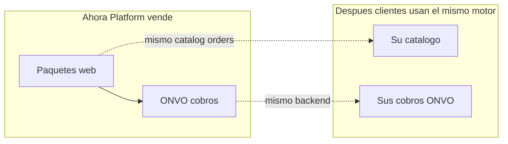
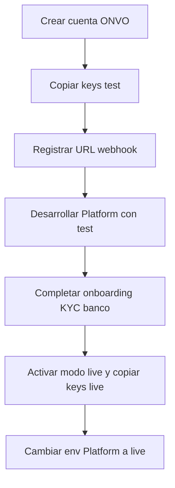
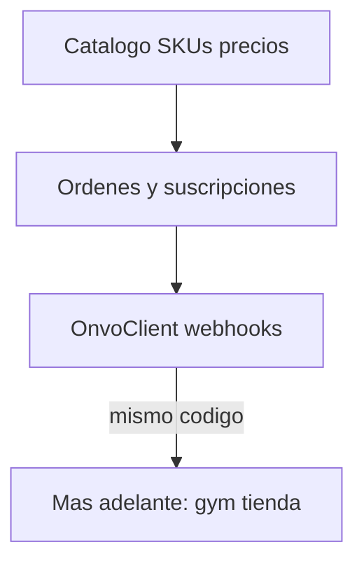

# Platform: paquetes web + ONVO (visión PO + backend general)

Documento para vos como **Product Owner**. Yo actúo como lead (backend/frontend/UI). Al aprobar, el siguiente paso de ejecución será guardar esto en `00-Planning/` (p. ej. `08-…` + `09-product-packages.md`); **este plan no escribe código**.

Referencias: [03-ONVO Pay/](03-ONVO%20Pay/), [07-payments-memberships.md](00-Planning/07-payments-memberships.md), plan marketplace previo, [ONVO pricing](https://onvopay.com/en/pricing), [dashboard ONVO](https://onvopay.com/dashboard).

---

## 1. Qué estás construyendo (en una frase)

**PlatformCR** vende **servicios profesionales de creación web** en forma de **paquetes claros** (pago único y/o membresía mensual), cobrados con **ONVO** (priorizando **SINPE Móvil**). El mismo motor de catálogo + intents + subscriptions + webhooks sirve después para que **tus clientes** vendan lo suyo (gym, tienda, etc.).

---

## 2. Qué es el dashboard de ONVO (para el PO)

[onvopay.com/dashboard](https://onvopay.com/dashboard) es el **panel operativo del comercio** (login, cobros, liquidaciones, llaves API test/live, webhooks). No es tu producto Platform.

| En ONVO Dashboard | En Platform (lo que construís) |
|-------------------|--------------------------------|
| Ver tx, liquidaciones, keys | Catálogo de paquetes, checkout UX, “mis pedidos”, estado de entrega del servicio |
| Configurar webhook URL | Endpoint que recibe eventos y marca orden `paid` |
| Modo test / live | Env `onvo_test_*` vs `onvo_live_*` |

**Publishable key** = front/SDK. **Secret key** = solo tu API. Test primero siempre.

Tu UI debe sentirse más “agencia / producto SaaS” (hero, paquetes, CTA, confianza), no un clon del login ONVO.

### 2.1 Playbook: qué hacer en el Dashboard ONVO para cada acción

Entrada: [https://onvopay.com/dashboard](https://onvopay.com/dashboard) (login con el correo de la cuenta comercio). Los nombres exactos de menú pueden variar ligeramente en español/inglés; buscá equivalentes **API / Developers / Webhooks / Marketplace / Cobros**.

#### A. Crear cuenta y entrar

| Paso | En Dashboard ONVO | Resultado |
|------|-------------------|-----------|
| 1 | [Signup](https://onvopay.com/signup) / login dashboard | Cuenta comercio PlatformCR |
| 2 | Confirmar email si lo pide | Acceso al panel |
| 3 | Revisar que estés en **modo prueba / test** al inicio | Keys `onvo_test_…` |

#### B. Obtener API keys (obligatorio antes de código)

| Acción Platform | Qué hacer en Dashboard |
|-----------------|------------------------|
| Guardar secret en `api/.env` | Ir a **Developers / API keys** (o similar) → copiar **Secret** de prueba → `ONVO_SECRET_KEY=onvo_test_secret_key_…` |
| Guardar publishable en `web/.env.local` | Misma pantalla → copiar **Publishable** → `VITE_ONVO_PUBLIC_KEY=onvo_test_publishable_key_…` / `ONVO_PUBLIC_KEY=…` |
| Rotar key filtrada | Crear/regenerar key en dashboard → actualizar env → **no** commitear |

Docs: al crear la cuenta ONVO genera keys de prueba; tras onboarding podés pasar a **live** y obtener `onvo_live_…`.

#### C. Configurar webhooks (obligatorio para saber “quién pagó”)

| Acción Platform | Qué hacer en Dashboard |
|-----------------|------------------------|
| Recibir `payment-intent.succeeded`, renovaciones, SINPE, etc. | **Developers → Webhooks** → Add endpoint |
| URL local (dev) | Usar túnel HTTPS (ngrok/cloudflared) apuntando a `https://TU_TUNEL/api/webhooks/onvo` — ONVO no llama a `localhost` |
| URL prod | `https://TU_API_RENDER/api/webhooks/onvo` |
| Guardar secret | Copiar **webhook secret** (`webhook_secret_…`) → `ONVO_WEBHOOK_SECRET` en env API |
| Verificar | Dashboard muestra deliveries; si fallan (no 2xx), revisá logs Platform |

Eventos a suscribir (mínimo): `payment-intent.succeeded`, `payment-intent.failed`, `payment-intent.deferred`, `subscription.renewal.succeeded`, `subscription.renewal.failed`, `checkout-session.succeeded`, `mobile-transfer.received`.

#### D. Cobros de prueba (validar integración)

| Acción | Dashboard | Código Platform |
|--------|-----------|-----------------|
| Ver intents/cobros de prueba | **Cobros / Payments / Activity** en modo test | Crear intent/subscription vía API |
| Simular tarjeta | Usar tarjetas de [testing ONVO](https://docs.onvopay.com/payments/testing) (no dinero real) | SDK con publishable test |
| Ver si webhook llegó | Log de entregas del webhook en Developers | Fila en `webhook_events` + orden `paid` |
| SINPE Móvil test | Seguir guía SINPE Móvil en docs; revisar intent `deferred` → `succeeded` | Preferir este método en UI |

#### E. Productos / precios / cupones (opcional en UI; API también puede crearlos)

Mucho del catálogo lo creará **Platform por API** (seed). El dashboard sirve para operar sin código:

| Acción | En Dashboard | Notas |
|--------|--------------|-------|
| Crear producto/precio manual | Catálogo / Products / Prices si existe en panel | O dejarlo 100% a `OnvoClient` |
| Ver IDs para pegar en seed | Abrir producto → copiar `id` de price | Guardar en `catalog_prices.onvo_price_id` |
| Cupón promo / BIN bank | **Descuentos / Coupons** → crear cupón | También `POST /v1/coupons`; mismo modo test/live |
| Link de pago one-time | Checkout / Payment links si está en panel | Útil para cotización custom por WhatsApp sin UI |

#### F. Suscripciones (membresías Presence / Growth / Commerce)

| Acción | Dashboard | Platform |
|--------|-----------|----------|
| Ver cargos recurrentes activos | Sección **Subscriptions / Cargos recurrentes** | Tabla `subscriptions` |
| Cancelar manual (soporte) | Cancelar en dashboard **o** API cancel | Preferir API desde “Mis servicios” |
| Fallo de renovación | Ver fallo en panel + webhook `subscription.renewal.failed` | Marcar `past_due` |

#### G. Liquidaciones y dinero real

| Acción | En Dashboard |
|--------|--------------|
| Completar KYC / datos bancarios IBAN | Flujo **Onboarding / Cuenta / Liquidaciones** (requerido antes de live útil) |
| Ver payouts | **Liquidaciones / Payouts** — fee ~US$3 por liquidación según pricing |
| Frecuencia de liquidación | Configurar según opciones del panel (diario/semanal/…) |

#### H. Pasar de test a producción (go-live)

| Paso | Dashboard | Platform |
|------|-----------|----------|
| 1 | Completar onboarding / cuenta activada | — |
| 2 | Cambiar a **modo en vivo** | — |
| 3 | Copiar `onvo_live_secret_key_…` y `onvo_live_publishable_key_…` | Env Render/Vercel (nunca git) |
| 4 | Crear **otro** webhook (o editar) con URL **prod** y secret live | `ONVO_WEBHOOK_SECRET` prod |
| 5 | Repetir smoke test con monto mínimo real | Confirmar orden `paid` |
| 6 | — | Quitar keys test del entorno prod |

**Regla:** no mezclar keys test con webhook live (ni al revés). El modo lo fija la key.

#### I. Marketplace multi-vendedor (fase posterior)

| Acción | En Dashboard | API |
|--------|--------------|-----|
| Crear vendedor | Sección **Marketplace** → connected account **o** API | `POST /v1/connected-accounts` |
| Onboarding vendedor | Entregar `onboardingUrl` (7 días; regenerar si expira) | `POST .../onboarding-link` |
| Comisión Platform | Set `marketplaceAppFee` (ej. 5%) al crear/actualizar | También desde API |
| Tarifa semanal fija | Config weekly fee en cuenta conectada | `POST .../weekly-fees` |
| Cobrar a nombre del vendedor | — | Payment intent con `onBehalfOf` |

#### J. Operación diaria PO / soporte

| Pregunta del cliente | Dónde mirar primero |
|----------------------|---------------------|
| “¿Me cobraron?” | Dashboard cobros **y** Platform “Mis servicios” |
| “No activó el plan” | Webhook deliveries (¿4xx/5xx?) → logs API |
| “Quiero reembolso” | Dashboard **Refund** o API refund → luego marcar orden en Platform |
| “Link para pagar el anticipo custom” | Payment link / Checkout session desde dashboard o admin Platform |

#### K. Checklist PO (imprimible)

- [ ] Cuenta ONVO creada y login OK  
- [ ] Keys **test** secret + publishable en `.env` local  
- [ ] Webhook test apuntando a túnel → `/api/webhooks/onvo`  
- [ ] Webhook secret en env  
- [ ] Smoke: 1 intent + 1 subscription en test visibles en dashboard y en Platform  
- [ ] Onboarding bancario completo  
- [ ] Keys **live** + webhook prod en Render  
- [ ] Smoke live controlado  
- [ ] (Luego) Marketplace connected accounts si aplica  

---

## 3. Investigación de mercado (ancla de precios 2026)

### Costa Rica (agencias / locales)

| Tipo | Rango mercado |
|------|----------------|
| Landing | ~**US$175–900** one-shot ([Hosting506](https://www.hosting506.com/design/websites/) desde $175; agencias ~$300–900) |
| Web corporativa | ~**US$800–2 500** |
| E-commerce | ~**US$2 000–10 000** |
| Sistema a medida | ~**US$3 500+** (escala por complejidad) |
| Web por suscripción CR | desde ~**₡29 000/mes** (~US$55–60) todo incluido ([Livinton](https://livinton.dev/)) |
| Mantenimiento suelto | ~**US$50–200/mes** |

### Modelo “Website-as-a-Service” (internacional)

Planes **US$99–299/mes** (sitio + hosting + ediciones) son estándar; **US$150/mes** es un sweet spot creíble si el paquete incluye **pagos / SINPE / panel**, no solo “una web bonita”.

### Conclusión de pricing

- One-shot CR: no compitas solo a $175 plantilla; diferenciá con **pagos + tracking**.  
- **US$150/mes** es viable y premium vs ₡29k si comunicás: web + setup + **cobros ONVO + panel SINPE Móvil**.  
- A medida: **nunca** precio fijo público; discovery + rango + SOW.

Precios abajo en **USD** (cobrar también CRC vía ONVO). IVA/impuestos: definir con contador; UI muestra “+ IVA si aplica”.

---

## 4. Catálogo de paquetes (producto)

### 4.1 Membresías mensuales (Subscriptions ONVO)

| Código | Nombre | Precio | Incluye (promesa) | Ideal para |
|--------|--------|--------|-------------------|------------|
| `presence` | **Web Presence** | **US$79/mes** | Landing o 1-pager, hosting, SSL, hasta 2 cambios de contenido/mes, formulario → WhatsApp/email | Profesionales que solo necesitan presencia |
| `growth` | **Web + Pay Track** | **US$150/mes** | Todo Presence ampliado a sitio hasta ~5 secciones **+** setup ONVO test/live **+** checkout SINPE Móvil/tarjeta **+** panel “pagos recibidos” en su sistema | PYME que cobra y quiere dejar de trackear por chat |
| `commerce` | **Sell Stack** | **US$249/mes** | Growth + catálogo simple (servicios/productos) + checkout embebido + estados de orden | Quien vende online sin armar Shopify |
| `care_only` | **Care Plan** | **US$49/mes** | Solo si ya compraron one-shot: hosting, SSL, 2 ediciones/mes, monitores uptime | Post-entrega one-shot |

Setup fee sugerido (one-time, Payment Intent):

- Presence: **US$99** (o $0 promo)  
- Growth: **US$199**  
- Commerce: **US$399**  

Contrato: mes a mes tras 3 meses mínimos (PO puede suavizar a cancel anytime).

### 4.2 Paquetes de pago único (Payment Intents / Checkout)

| Código | Nombre | Precio | Incluye |
|--------|--------|--------|---------|
| `landing_launch` | Landing Launch | **US$499** | Landing profesional, mobile, CTA, SEO base, 1 ronda de revisiones; Care opcional $49/mes |
| `business_site` | Business Site | **US$1 499** | Hasta ~7 secciones, formularios, analytics; Care opcional |
| `payments_addon` | Payments Add-on | **US$399** one-shot | Integrar ONVO + SINPE Móvil tracking en web existente (o sumar a Launch) |

### 4.3 A la medida (no es un SKU fijo)

| Código | Nombre | Precio |
|--------|--------|--------|
| `custom` | **Sistema 100% a medida** | **Cotización** |

Copy obligatorio en UI:

> El alcance y el precio dependen de la complejidad del proyecto (roles, módulos, integraciones, reportes, apps móviles, etc.). Incluye discovery; no hay precio único publicado.

Proceso:

1. Formulario / call discovery (**US$150** acreditables a proyecto, o gratis en promo).  
2. SOW con fases y rango (ej. **US$3 500 – 25 000+**).  
3. Anticipo 40–50% (Intent) + hitos + saldo.  
4. Opcional: retainer post-go-live (subscription Care o Growth).

### 4.4 Cómo se ve el dinero (ejemplo Growth US$150)

Cliente paga **US$150** por subscription. ONVO descuenta su fee (tarjeta ~3.9%+$0.35 o SINPE Móvil ~1.5%). El neto llega a tu liquidación. Vos asumís hosting/Vercel/tiempo; el margen es el diferencial vs costo operativo.

En checkout UX: **destacar SINPE Móvil** (“menor comisión / ideal CR”); tarjeta secundaria.

---

## 5. UI/UX de la web de venta (diseñador)

Una composición clara (no dashboard genérico):

1. **Hero:** marca Platform + una promesa (“Web profesional + cobros con SINPE Móvil”) + CTA “Ver paquetes”.  
2. **Paquetes:** 3 cards máximas en viewport (Presence / Growth destacado / Commerce) + link “A medida”.  
3. **Comparador** simple (filas: páginas, pagos, panel SINPE, ediciones/mes).  
4. **Cómo funciona:** 4 pasos (elegís → pagás → onboarding → publicamos).  
5. **Confianza:** ONVO, Vercel, tiempos de entrega.  
6. **Custom:** bloque aparte, tono consultivo, CTA “Agendar discovery”.  
7. **Checkout:** resumen orden → método (SINPE Móvil primero) → confirmación “activo cuando ONVO confirme”.

Motion: 2–3 (hero entrance, highlight Growth, scroll reveal paquetes). Evitar purple-AI genérico; identidad Platform oscura ya existente o evolución brand.

Flujos autenticados post-compra: “Mis servicios” (plan, próximo cobro, tickets de cambio, link panel pagos si aplica).

---

## 6. Backend general (reutilizable) — explicación PO

Pensalo como **tres capas**:

### Qué hace cada pieza ONVO (sin detalle de código)

| Concepto | En castellano PO | Uso Platform | Reuso clientes |
|----------|------------------|--------------|----------------|
| **Product / Price** | Ítem vendible y su precio en ONVO | Cada paquete tiene `onvo_price_id` | Sus planes de gym |
| **Customer** | Comprador en ONVO | User Platform logueado | Socio del gym |
| **Payment Intent** | Cobro de una vez | Setup fees, Landing Launch, anticipos custom | Matrícula / producto |
| **Checkout Session / SDK** | Pantalla o widget de pago | `/checkout` | Su tienda |
| **Subscription** | Cargo automático mensual | Growth / Commerce / Care | Membresía gym |
| **Webhook** | “ONVO avisa que pagó” | Orden `paid`, activa retainer | Activa membresía |
| **SINPE Móvil** | Transferencia al flujo ONVO | Método preferido en UI | Igual |
| **Connected accounts** | Otros vendedores | Fase 2 (freelancers) | Marketplace multi-vendor |

### Estados que el PO verá en admin

- Orden servicio: `awaiting_payment` → `paid` → `in_progress` → `delivered`  
- Suscripción: `pending` → `active` → `past_due` → `canceled`  
- Nunca marcar `paid` solo porque el browser dijo “éxito”.

### Módulos API (nombres para el backlog)

1. Catalog (packages + prices)  
2. Orders + checkout  
3. Subscriptions  
4. Webhooks ONVO  
5. Fulfillment admin (cambiar estado entrega)  
6. (Luego) Vendors / `onBehalfOf`

Env: `ONVO_SECRET_KEY`, `ONVO_PUBLIC_KEY`, `ONVO_WEBHOOK_SECRET` (+ `VITE_ONVO_PUBLIC_KEY`).

---

## 7. Roadmap paso a paso (como developer → PO)

### Fase 0 — Cimientos negocio (vos, humano) + Dashboard ONVO

1. Ejecutar playbook **§2.1 A–C**: cuenta, keys test, webhook (túnel).  
2. Decidir moneda principal (CRC vs USD) y texto IVA.  
3. Firmar copy legal básico de servicios (cancelación, qué incluye “2 cambios/mes”).  
4. Tener a mano checklist **§2.1 K** antes de pedir Fase 2 de código.

### Fase 1 — Docs en repo (planning deliverable)

4. Escribir `08-onvo-marketplace-backend.md` + `09-product-packages.md` (este contenido).  
5. Vincular desde MVP3 / 07-payments.

### Fase 2 — Backend cobros (reutilizable)

6. Flyway: catalog, orders, payments, subscriptions, webhook_events, onvo_customers.  
7. `OnvoClient` + webhook firmado.  
8. Seed SKUs Presence / Growth / Commerce / one-shots.  
9. Endpoints checkout intent + subscription.  
10. Probar en test: SINPE Móvil + tarjeta con montos chicos.

### Fase 3 — Frontend venta

11. Página `/pricing` o `/packages` (UI sección 5).  
12. Checkout embebido SDK; éxito solo tras poll/webhook.  
13. Área “Mis servicios”.

### Fase 4 — Operación

14. Admin fulfillment (marcar entregado).  
15. Playbook **§2.1 G–H**: onboarding banco + keys live + webhook prod; Google OAuth origins del dominio real.

### Fase 5 — Reuso para clientes

16. Multi-tenant o “proyecto cliente” que reusa Catalog/Orders/Billing.  
17. Primer vertical demo (ej. gym) usando el mismo motor.  
18. Opcional: ONVO Marketplaces (connected accounts).

---

## 8. Fuera de alcance ahora

- Datáfono/Zapp tracking en Platform (solo tras confirmar webhooks con ONVO).  
- Multi-vendedor freelancers.  
- Implementación de código (este plan es producto + arquitectura).  
- Facturación electrónica CR completa.

---

## 9. Resumen para el PO

- Vendés **paquetes web** con precios alineados a CR + WaaS global; **Growth US$150/mes** es el héroe (web + pagos + SINPE track).  
- **Custom** siempre por cotización/complejidad.  
- ONVO Dashboard = caja registradora/banco; Platform = tu tienda de servicios.  
- Cada acción de cobro tiene pasos explícitos en **§2.1** (keys, webhooks, test, live, marketplace, soporte).  
- Backend genérico (catálogo + intents + subscriptions + webhooks) = mismo corazón para vos y para clientes.  
- Siguiente decisión tuya: aprobar precios/copy y pedir **guardar docs** o **empezar Fase 2 código**.
