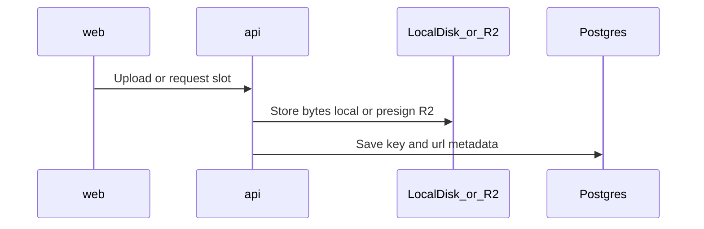

# 01 — General (platform, infra, media)

Living platform notes. English for code, columns, API, and UI.

## Monorepo layout

```
Platform/
  00-Planning/         # Plans by topic (this folder — first in the repo)
  01-Project Instructions/  # How to run / operate locally
  api/                 # Spring Boot REST API
  web/                 # React (Vite + TypeScript)
  data/uploads/        # Local media (gitignored files)
  docker-compose.yml   # Optional Postgres (local default is H2)
  README.md
```

- **`api`**: HTTP webservice (not a Thymeleaf/server-rendered app).
- **`web`**: SPA UI.
- **No `db/` app folder**: schema/migrations live in `api/` (Flyway). Postgres is infrastructure.

## Naming

- User personal ID: DB `personal_id`, Java/JSON `personalId`.
- Login accepts **personal ID or email** + password (request field `personalId` may hold either).
- Everything in English in code and default UI copy.

## Environments

| Concern | Local (default) | Cloud |
|---------|-----------------|--------|
| Database | **H2 file** (`data/h2/`) | **Neon** (Postgres) |
| API | Spring Boot on localhost | **Render** |
| Frontend | Vite `localhost:5173` | **Vercel** |
| Media files | **Local disk** `data/uploads/` | **Cloudflare R2** (later) |

Local: `mvn spring-boot:run` in `api/` — **H2**, no Docker. See [01-Project Instructions/HOW-TO-RUN.md](../01-Project%20Instructions/HOW-TO-RUN.md).

`docker-compose.yml` (Postgres) is optional for prod-like testing later.

Secrets: env vars / local overrides — never commit production credentials.

### Cost / free tiers (think early)

None of these are “unlimited free forever”. They are **free within quotas**, then paid — same idea for R2 as for Neon / Vercel / Render.

| Provider | Free-ish reality (check current docs; quotas change) |
|----------|------------------------------------------------------|
| **Neon** | Free project tier with storage/compute limits |
| **Vercel** | Hobby free tier with build/bandwidth limits |
| **Render** | Free web services often **sleep** and are weak for always-on API; plan on a small paid instance when the API must stay up |
| **Cloudflare R2** | **Yes, recurring free tier** (not a 12-month trial): roughly **10 GB** storage / month, **1M** Class A (writes/lists), **10M** Class B (reads), and **egress $0** (big win vs S3). Above that: pay for storage + operations; egress stays free |

**Why keep R2 for media:** for MVP / early Platform, 10 GB + free egress is enough for logos, avatars, light docs. It matches the “start free, grow later” model of Neon/Vercel better than AWS S3 (egress expensive) or DigitalOcean Spaces (often no real free tier / minimums).

**Practical note:** create a Cloudflare account and enable R2 when we implement uploads; stay on Standard storage to use the free allowance. Do not rely on Infrequent Access for the free tier.

## Media and assets

**Do not store file bytes in Postgres.** DB holds **metadata + reference** (object key / URL). Bytes live in object storage.

### Local development (MVP1)

- Path: `data/uploads/` at repo root (gitignored contents; keep folder via `.gitkeep`).
- Interface: `ObjectStorage` (store / resolve URL / delete).
- Impl: `LocalObjectStorage` — write files to disk; serve via API (e.g. `GET /media/**` or upload endpoint for multipart in dev).
- Same interface later swaps to **Cloudflare R2** without rewriting callers.

### Cloud (later — Next steps)

**Provider: Cloudflare R2** (S3-compatible). Presigned PUT from the browser; API stores metadata only.

1. Authenticated client asks the API for an upload slot.
2. API returns presigned PUT URL + `objectKey` (R2).
3. Browser uploads **directly to R2**.
4. Client confirms; API writes `assets` row.



Table sketch: `assets (id, object_key, url, content_type, size_bytes, uploaded_by, created_at)`.

**Practical note:** enable Cloudflare R2 when moving off local disk; stay on Standard storage for the free tier.

## Related docs

- API stack (profiles `local`/`prod`, best practices): [02-springboot.md](02-springboot.md)
- Auth / RBAC: [03-security.md](03-security.md)
- App UI (authenticated systems): [04-frontend.md](04-frontend.md)
- Marketing one-pagers (separate kit): [05-landing-pages.md](05-landing-pages.md)
- API call optimization (few round-trips): [06-api-optimization.md](06-api-optimization.md)
- What we build first: [MVP1.md](MVP1.md)
- MVP2 (register + Google SSO): [MVP2.md](MVP2.md)
- Next delivery (payments, memberships, backlog): [MVP3.md](MVP3.md)
- Payments research: [07-payments-memberships.md](07-payments-memberships.md)

> Repo folder name: `00-Planning/` so it appears first in the file tree.
