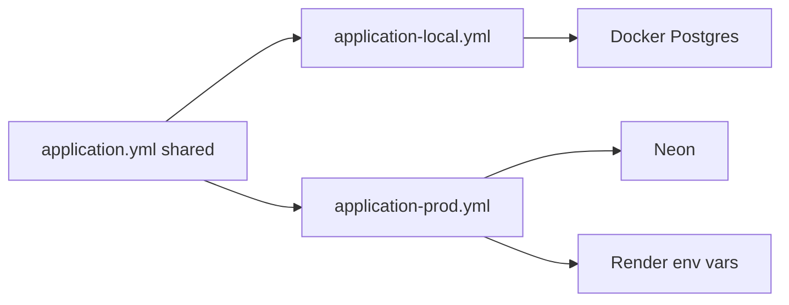

# 02 — Spring Boot (API)

REST API in `api/`. UI is React in `web/` — no server-side HTML (no Thymeleaf) for the product UI.

## Stack

- **Java 17** (runtime used in MVP1; 21 OK later), **Maven**, **Spring Boot 3.4.x**
- Base package e.g. `com.platform.api`
- Dependencies live in [`api/pom.xml`](../api/pom.xml) (grouped: web, security/JWT, data/Flyway, actuator/springdoc, test)

### Suggested package layout

- `config` — security config, CORS, OpenAPI, `@ConfigurationProperties`
- `security` — filters, JWT/session wiring
- `auth` — login/logout/register/me
- `user` — user persistence / domain
- `common` — exception handler, shared errors

Feature-oriented enough for MVP; split further when modules grow.

### Dependencies

| Dependency | Why |
|------------|-----|
| `spring-boot-starter-web` | REST, JSON, embedded Tomcat |
| `spring-boot-starter-validation` | `@Valid` on DTOs |
| `spring-boot-starter-security` | Auth filter chain, BCrypt, method security |
| `spring-boot-starter-data-jpa` | Entities / repositories |
| `spring-boot-starter-actuator` | Health/readiness (Render checks) |
| `postgresql` | JDBC driver (local Docker or Neon) |
| `flyway-core` | Versioned migrations (own the schema) |
| JJWT or Nimbus JOSE | Tokens bound to server sessions |
| `springdoc-openapi-starter-webmvc-ui` | Swagger UI + OpenAPI |
| `spring-boot-starter-test` + `spring-security-test` | Tests |
| `spring-boot-devtools` | Optional; **local profile only** |
| Lombok | Optional — team decision |

Testcontainers Postgres: later (see [MVP1.md](MVP1.md) Next steps).

Not in early MVP: Spring Session/Redis (use DB `sessions`), full OAuth2 SSO, Spring Cloud unless needed.

Authorization: Spring Security authorities — see [03-security.md](03-security.md). Enable `@EnableMethodSecurity` and `@PreAuthorize` / `hasAuthority(...)`.

---

## Profiles (`local` / `prod`)

Two profiles at the start (add `staging` later only if needed).

| Profile | When | DB | Swagger | Logging | CORS |
|---------|------|-----|---------|---------|------|
| `local` | Developer machine | Docker Postgres | ON | DEBUG/INFO, more verbose | `http://localhost:5173` |
| `prod` | Render | Neon via env JDBC / `DATABASE_URL` | OFF | INFO, no SQL spam | Vercel origin(s) from env |

Activation:

- Local: `SPRING_PROFILES_ACTIVE=local` (default in README / IDE run config)
- Render: `SPRING_PROFILES_ACTIVE=prod`

### Config files

- `application.yml` — shared: app name, JPA `ddl-auto: validate`, Flyway enabled, server port, Jackson defaults, placeholders for session TTL / app settings
- `application-local.yml` — Docker datasource (safe local defaults), Swagger on, Actuator useful for local health
- `application-prod.yml` — datasource from **environment variables**, Swagger off, Actuator limited to `health` / `info`

**Secrets:** never commit Neon/Render passwords or JWT secrets for prod. Prod = Render env vars. Local Docker credentials may live in `application-local.yml` as documented defaults only.

**Fail fast in `prod`:** required env missing (DB URL, JWT secret, CORS origins) → application should not start silently with insecure defaults.

Later (Next steps): `staging` profile cloning `prod` with a Neon branch / preview CORS origin.

---

## Best practices

### Config and DI

- **Constructor injection** only; no field `@Autowired`.
- Prefer **`@ConfigurationProperties`** for custom settings (JWT secret, CORS origins, session hours) instead of scattering many `@Value`s as the app grows.
- Keep profile-specific behavior in `application-*.yml` + small `@Profile`-annotated beans when needed (e.g. Swagger bean only on `local`).

### API quality

- **DTOs / records** for request and response — never expose JPA entities on the wire.
- **`@Valid`** on request bodies; map constraint violations into the same error format as other failures.
- **`@RestControllerAdvice`** + consistent errors; prefer Spring Boot 3 **Problem Details** (`ProblemDetail`) where practical.
- **Layers:** Controller → Service → Repository; thin security filters.
- **Fail closed:** protect `/api/**` by default; public only login (and register when enabled) + Swagger on `local`.

### Data

- **Flyway** owns schema; `ddl-auto: validate` (including local once migrations exist).
- **`@Transactional`** on service methods that write.
- **BCrypt** via `PasswordEncoder` for `password_hash`.
- Avoid N+1 queries when building aggregate responses (see API design mindset below).

### Security (profile-aware)

- Details in [03-security.md](03-security.md).
- JWT signing secret from env in `prod`; local-only default for development.
- Swagger exposed on `local` only.

### Observability

- **Actuator in `prod`:** expose `health` (and maybe `info`) for Render; do **not** expose env, beans, heapdump.
- Logging levels per profile; **never** log passwords, tokens, or full Authorization headers.
- Correlation / request IDs: plan later if tracing becomes painful.

### DX (local)

- `./mvnw spring-boot:run` with `local` profile + `docker compose up -d` for Postgres.
- Devtools only on `local` (optional).

### API call efficiency

Design endpoints so **one call carries what the screen needs**. Full rules: [06-api-optimization.md](06-api-optimization.md).

---

## OpenAPI / Swagger

Use **springdoc-openapi** so docs stay in sync with controllers.

**`local` only** (typical URLs):

- Swagger UI: `/swagger-ui.html` or `/swagger-ui/index.html`
- OpenAPI JSON: `/v3/api-docs`

Document **Bearer** auth for “Try it out”.

### Postman

Import OpenAPI from `/v3/api-docs` (URL or file). Source of truth = generated OpenAPI; optional committed Postman snapshot later.

---

## How to run (when `api/` exists)

1. `docker compose up -d`
2. `SPRING_PROFILES_ACTIVE=local ./mvnw spring-boot:run` (or IDE equivalent)
3. Open Swagger; hit health actuator

Render: set `SPRING_PROFILES_ACTIVE=prod` + DB/JWT/CORS env vars.

---

## Related

- Infra / Neon / R2: [01-general.md](01-general.md)
- Sessions, RBAC, auth endpoints: [03-security.md](03-security.md)
- API call optimization: [06-api-optimization.md](06-api-optimization.md)
- Delivery scope: [MVP1.md](MVP1.md)
