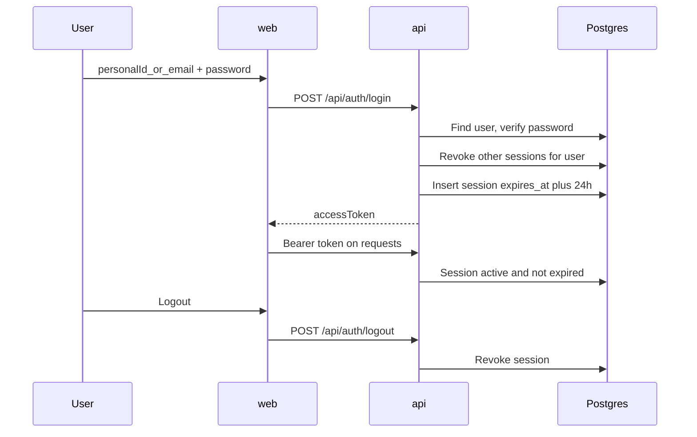
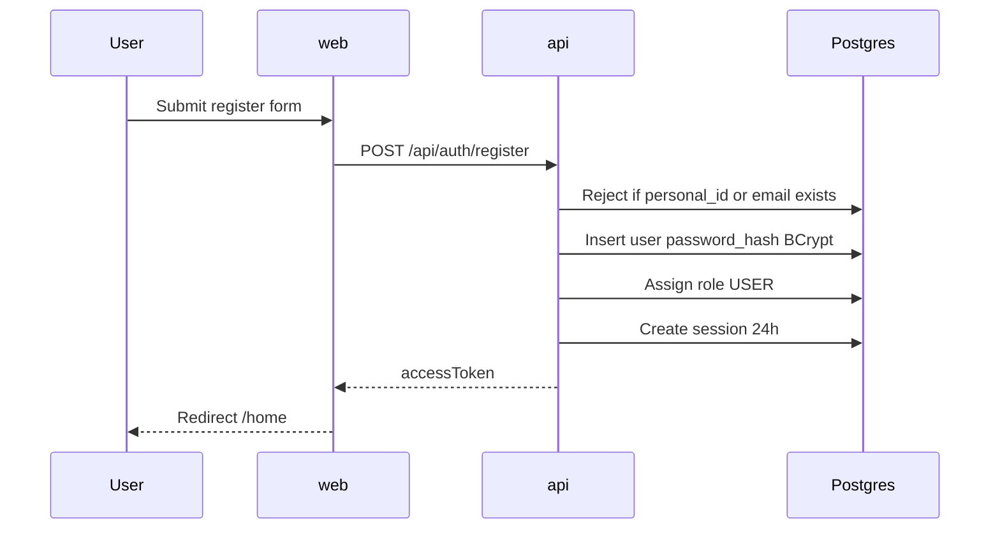
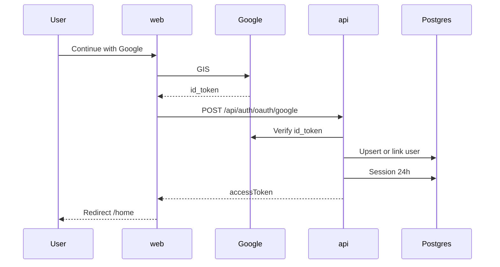

# 03 — Security (sessions, auth API, roles)

English naming. Personal ID field: `personalId` / `personal_id`.

## Goals

1. **Encrypted in transit** — HTTPS/TLS outside local. Local HTTP OK for first wiring; staging/prod must use TLS (e.g. Render/Vercel terminate TLS).
2. **Tokens + server sessions** — not JWT-only with no server memory.
3. **One active session per user** — new login revokes previous sessions.
4. **Lifetime** — **24 hours** or immediate **logout**.
5. **RBAC** — roles/permissions in DB; Spring Security authorities at runtime. Admin **GUI** to edit them comes later (MVP1 Next steps).

## Sessions + token flow

Why not JWT alone: hard to revoke on logout and hard to enforce a single session. Persist `sessions` and hash the token (`token_hash`); never store the raw token.

### Tables

`users`: `id`, `personal_id` (unique), `email` (unique), `password_hash`, `enabled`, `created_at`

`sessions`: `id`, `user_id`, `token_hash`, `expires_at`, `revoked_at`, `created_at` (optional `user_agent` / `ip` later)

### Behavior

- Login → validate → revoke others → create session → return token (client may use localStorage in MVP1; HttpOnly cookie later).
- Request → resolve token → session not revoked and not expired → load user + authorities.
- Logout → revoke session → client clears token.

## Roles and permissions (Spring Security)

Spring gives **runtime** checks (`GrantedAuthority`, `hasRole` / `hasAuthority`, `@PreAuthorize`). It does **not** ship an admin UI — we own tables (GUI later).

### Tables

- `roles` — `code` unique (`ADMIN`, `USER`), name, description  
- `permissions` — `code` unique (`users.read`, …), name, description  
- `role_permissions` — role ↔ permission  
- `user_roles` — user ↔ role  

Convention: store role codes without `ROLE_` prefix; map to Spring as needed. Prefer permission codes for fine checks (`hasAuthority('users.read')`).

### Runtime

After session validation, load roles → permissions → set `SecurityContext` authorities. Example: `@PreAuthorize("hasAuthority('users.read')")`.

### Seed (MVP1)

Local default admin (profile `local`, `DataSeeder`):

| Field | Value |
|-------|--------|
| Personal ID | `platformadmin` |
| Password | `platformadmin` |
| Email | `platformadmin@platform.local` |

Also seeds roles `ADMIN`, `USER` and a small permission set (Flyway + seeder). Login accepts personal ID **or** email.

`GET /api/auth/me` returns `roles` and `permissions` arrays (UI can ignore on blank home; ready for later GUI). Keep this **aggregate** (one call) — see [06-api-optimization.md](06-api-optimization.md).

## User registration (MVP2 phase A)

Self-service sign-up for new users. Complements login; does **not** replace admin/invite flows (those come later — [MVP2.md](MVP2.md) backlog).

Delivery tracked in **[MVP2.md](MVP2.md)** (phase A).

### Rules

- Public endpoint (no session required).
- Body: `personalId`, `email`, `password`, `confirmPassword` (all required).
- Validate: non-blank, email format, password strength (min length + basic policy), `password === confirmPassword`.
- `personal_id` and `email` must be **unique**; on conflict return a clear 409/400 (do not leak which field in a way that helps attackers more than necessary — generic “already registered” is OK, or field-specific if product prefers UX).
- Hash password with **BCrypt**; never store plain text.
- Create `users` row with `enabled = true` (email verification can gate `enabled` later).
- Assign default role **`USER`** via `user_roles` (never auto-grant `ADMIN`).
- After success: **auto-login** using the same session rules as login (revoke none yet — new user; create session 24h; return token). Same single-session policy applies on later logins.
- Rate-limit / basic abuse controls when exposed on the public internet (Render) — plan for it; implement with filter or gateway when deploying.

### API

- `POST /api/auth/register` — public  
  Request: `{ "personalId", "email", "password", "confirmPassword" }`  
  Response: same shape as login (token + basic user) **or** 201 + redirect-to-login if we later prefer no auto-login.

### Web

- Route `/register` — form fields matching the API; link from `/login` (“Create account”).
- On success: store token and go to `/home` (if auto-login).
- Responsive; same auth layout as login (no app sidebar). Footer OK. Dark UI (MVP1 visual).

### Explicitly later (not MVP2 phase A registration)

- [ ] Email verification before `enabled = true`
- [ ] Invite-only registration (token in link)
- [ ] Admin creates user in GUI
- [ ] CAPTCHA / stronger bot protection
- [ ] Terms acceptance checkbox if legal requires it

### Flow

## Google SSO (MVP2 phase A)

Google **OIDC** via ID token. Does **not** replace Platform sessions — after verify, create the same opaque-token session as password login.

Delivery tracked in **[MVP2.md](MVP2.md)** (phase A).

### Rules

- Front: Google Identity Services → ID token (`credential`).
- API: `POST /api/auth/oauth/google` with `{ "idToken" }` (public).
- Verify server-side: audience = configured client id, issuer Google, `email_verified`, not expired.
- User resolution: by `google_sub`; else link existing user with same verified email; else create user with role `USER`, `password_hash` null, store `google_sub`.
- Then: revoke other sessions for that user → create session 24h → return same login response shape.
- Never auto-grant `ADMIN`.
- Env: `GOOGLE_CLIENT_ID` (API); `VITE_GOOGLE_CLIENT_ID` (web). No client secret required for pure ID-token verify with Google’s JWKS (if later using auth-code exchange, secret stays server-only).

### Schema (with registration)

- `users.google_sub` — unique, nullable
- `users.password_hash` — nullable (Google-only accounts)

### API

- `POST /api/auth/oauth/google` — public  
  Request: `{ "idToken" }`  
  Response: same as login (`accessToken` + user)

### Web

- “Continue with Google” on `/login` (and optionally `/register`).
- On success: store token → `/home`; errors via toast.

### Explicitly later

- [ ] Other OIDC providers / SAML
- [ ] Force account-link confirmation UI when email collision is ambiguous
- [ ] “Set password” for Google-only users

### Flow

## Auth API

- `POST /api/auth/login` — `{ "personalId": "...", "password": "..." }` (`personalId` = personal ID **or** email)
- `POST /api/auth/register` — public; see **User registration** (MVP2)
- `POST /api/auth/oauth/google` — public; see **Google SSO** (MVP2)
- `POST /api/auth/logout` — authenticated; revoke session
- `GET /api/auth/me` — authenticated; user profile + roles + permissions

Public: login, register, Google oauth (+ Swagger in local/dev). All other `/api/**` protected. CORS to Vite origin in local.

## Related

- Spring deps / Swagger: [02-springboot.md](02-springboot.md)
- Frontend auth client: [04-frontend.md](04-frontend.md)
- API call optimization: [06-api-optimization.md](06-api-optimization.md)
- MVP1 baseline: [MVP1.md](MVP1.md)
- MVP2 delivery (register + Google SSO + backlog): [MVP2.md](MVP2.md)
