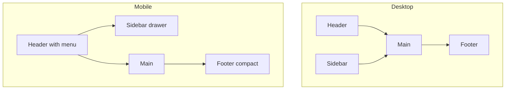

# 04 — Frontend (React, layout, UX)

Folder: `web/` — Vite + TypeScript + React. UI copy in **English** for MVP1 (i18n later).

## Responsive (required)

The product must work on **desktop and mobile** (100% responsive). Mobile-first layout, usable touch targets, no horizontal scroll for core flows.

## App chrome: header + sidebar + footer

For an authenticated platform, use **both header and sidebar**, plus a **footer from day one**.

| Piece | Role |
|-------|------|
| **Header** | Dark; **Platform** in **white**; mobile: hamburger |
| **Sidebar** | Dark; collapsible on desktop via **edge toggle** (`×` / `›`). Mobile: drawer. User block at **bottom**: GymPlatform-style menu |
| **Footer** | Dark; at document end — visible only after scrolling to the bottom |
| **Main** | Dark content area |

**Login page:** no sidebar; full dark (page + sign-in card); dark header + footer; purple primary button.

**Authenticated pages:** full dark shell; MVP1 `/home` blank inside main.

### Footer content (plan from the start)

- **Platform:** product name, optional version/env, placeholder legal/links.
- **Client:** client display name / logo slot (stub via config/env later; static placeholder OK in MVP1).

## Visual look (MVP1)

Until a Theme feature exists, the **whole app UI is dark mode only** (login, shell, pages, toasts).

| Rule | Detail |
|------|--------|
| Mode | Dark only — no light theme switch yet |
| Chrome / main / login | Dark (`#0f1117` / `#1a1d2b`) |
| Brand word **Platform** | White (`#ffffff`) on header |
| Login card | Dark surface, muted labels, dark inputs, purple primary |
| Primary action | Purple `#5b5ef0` (white label) |
| Sidebar user | Bottom: GymPlatform-style menu (avatar + id + role + chevron; Logout in dropdown) |
| Sidebar toggle | Desktop edge button (`×` / `›`); `localStorage` `platform.sidebarCollapsed` |
| Toasts | GymPlatform dark tint + icon (`✓` / `!` / `i`); success `#22c55e`, error `#ef4444` |

CSS variables live in `web/src/index.css`.

**Later:** implement a **Theme** feature (light / dark / system). Until then, hardcode dark; do not build a theme switcher early.

## Toasts (feedback)

Transient messages (login errors, signed in/out, later API failures) use a shared toast stack — not inline form banners.

| Concern | Desktop | Mobile |
|---------|---------|--------|
| Position | **Bottom-right** | **Bottom**, full width with side margins (`left`/`right` gutters) |
| Stack | Newest closest to the bottom; older stack upward | Same |
| Width | Max ~22rem | Fluid: `100%` of area between gutters |
| Safe area | Normal viewport padding | Respect `env(safe-area-inset-bottom)` (home indicator) |
| Touch | Click optional dismiss later | Same; min height ~44px for readability / tap |
| Duration | ~4s auto-dismiss | Same (no longer on mobile) |
| Tones | GymPlatform dark style: tinted surface + icon badge; success `#22c55e`, error `#ef4444` | Same |
| a11y | `role="alert"` for errors; `aria-live="polite"` on stack | Same |
| Overlay | Above shell chrome (`z-index` high); must not sit under the mobile drawer when drawer is closed | When drawer is open, toasts remain visible above backdrop or wait until drawer closes — prefer **above** drawer for auth errors |

Implementation: `web/src/ui/ToastContext.tsx` + `.toast-stack` / `.toast` in `index.css`.

**Later (optional):** swipe-to-dismiss, action button on toast, queue limit (e.g. max 3).

## UX / UI principles (lightweight)

- One clear primary action per view (e.g. Sign in).
- Consistent spacing and typography; avoid clutter on login and home.
- Accessible basics: labels on inputs, focus states, sufficient contrast (on dark surfaces).
- Sidebar nav items will eventually respect permissions from `/me` (not required to hide items in MVP1 beyond auth gate).

## Routes (MVP1 + MVP2 phase A)

- `/login` — "Personal ID or email" + "Password" + "Sign in"; **Continue with Google** (MVP2)
- `/home` — blank main area, protected, inside shell
- `/` — session/token → `/home`, else → `/login`
- `/register` — MVP2; see [03-security.md](03-security.md) / [MVP2.md](MVP2.md)

## Auth client

- Store token (localStorage OK for MVP1; HttpOnly cookie later — see MVP1 Next steps).
- Send `Authorization: Bearer <token>`.
- Logout: call `POST /api/auth/logout` and clear client token.
- Unauthenticated access to protected routes → `/login`.

## Related

- Deploy / media: [01-general.md](01-general.md)
- Auth API / RBAC: [03-security.md](03-security.md)
- Prefer few API round-trips: [06-api-optimization.md](06-api-optimization.md)
- Delivery: [MVP1.md](MVP1.md)
