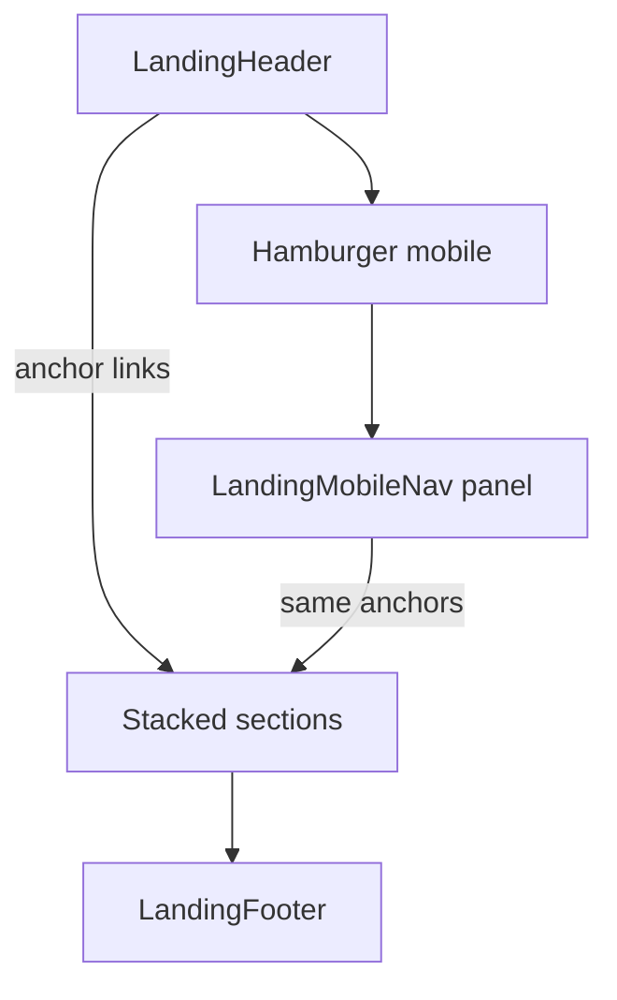

# 05 — Landing pages (one-page marketing sites)

**Separate from the authenticated app.**  
Do **not** mix this with [04-frontend.md](04-frontend.md) (login, sidebar app shell, user systems).

This doc is only for **single-page / landing** sites: long vertical scroll, section anchors, marketing feel — same idea as [platform-cr.vercel.app](https://platform-cr.vercel.app/).

When you say “reuse the landing header / hamburger / footer”, this is the kit to build and reuse.

## Goal

A small set of **reusable landing components** so future one-pagers share the same chrome and scroll behavior, without pulling in app-shell patterns (user menu, auth sidebar, etc.).

## Page model

- **One route / one page** (or a few static routes), content as stacked **sections**.
- **Scroll down** is the main navigation; header links **smooth-scroll** to section ids (`#about`, `#contact`, …).
- **100% responsive**; mobile uses hamburger → overlay/drawer **nav panel** (not the logged-in app sidebar).

## Planned reusable components

| Component | Purpose |
|-----------|---------|
| `LandingHeader` | Brand/logo, desktop section links, CTA optional (e.g. “Contact”); sticky or solid on scroll |
| `LandingHamburger` | Mobile control that opens/closes the mobile nav |
| `LandingMobileNav` | Full-height or slide-over panel with the same section links + close; locks body scroll while open |
| `LandingFooter` | Platform + client/legal/links — marketing footer (can share *content slots* with app footer later, but **separate component**) |
| `LandingSection` | Wrapper: `id`, padding, max-width, optional background variant |
| `LandingHero` | First viewport: brand/title, short support line, CTA(s); full-bleed visual if needed |
| `SmoothScroll` / hook | Consistent smooth scroll to anchors (respect `prefers-reduced-motion`) |

Optional later (same kit, not required on day one): `LandingFeatureGrid`, `LandingCTA`, `LandingLogoStrip`.

**No** landing `Sidebar` as a persistent left rail — that belongs to the **app** ([04-frontend.md](04-frontend.md)). On landings, “sidebar-like” behavior = **`LandingMobileNav`** drawer only.

## Behavior rules

- Header links and mobile nav links use in-page anchors; close mobile nav after navigate.
- Active section highlighting in header (Intersection Observer) — nice-to-have.
- Footer always present on landings (Platform info + client/company info).
- English copy by default; i18n can wrap the same components later.

## Where it lives in the repo (when we build it)

Suggestion only (implement later): e.g. `web/src/landing/components/…` or a small `web/src/components/landing/…` package folder — **isolated** from `components/app/` (header/sidebar used after login).

MVP1 auth app does **not** depend on this kit. Landings can be added as a separate page/route or even a separate Vite entry later if needed.

## Explicit non-goals

- Does not replace or redefine the authenticated shell in [04-frontend.md](04-frontend.md).
- No login/session requirements on these pages.
- No RBAC-driven menus.

## Related

- App (users/systems) UI: [04-frontend.md](04-frontend.md)
- Delivery slice: [MVP1.md](MVP1.md) — landings are **not** MVP1 scope unless we add them under Next steps when ready
