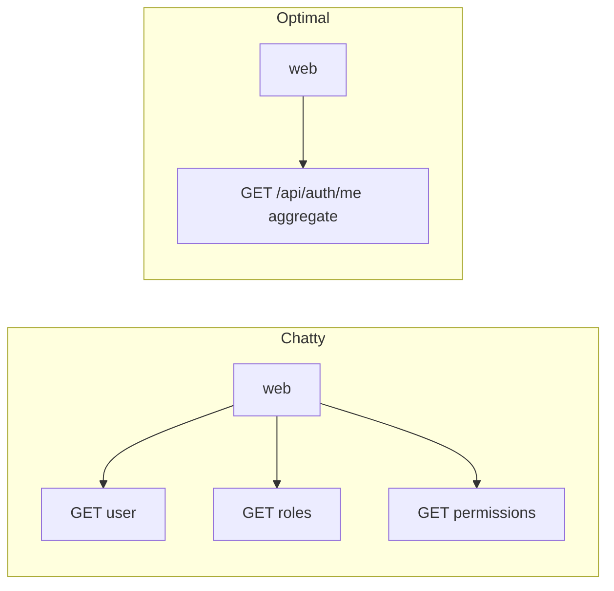

# 06 — API call optimization

Keep **HTTP chatter low**. Each API call should deliver what the client needs for that step so we do not burn Render/Neon/Vercel quotas (and latency) on cascades of tiny requests.

Applies to backend design **and** how the frontend consumes the API.

## Principles

1. **One call, one screen (or one step)** — Prefer coarse-grained endpoints whose response is enough for the view or next UI action.
2. **No N+1 over HTTP** — Do not design “list ids → then N detail calls” when one list (or one aggregate) can include the needed fields.
3. **No N+1 in SQL either** — When building an aggregate DTO, load associations in one go (join fetch / entity graph), not lazy trips per row.
4. **Ask before adding a new route** — “Can an existing endpoint return this?” or “Should this be one new composite endpoint?” beat three micro-endpoints.
5. **Enough, not everything** — Aggregate what the screen needs; do not dump the whole database “just in case.”

## Patterns we use

| Pattern | Use |
|---------|-----|
| **Composite / aggregate DTO** | e.g. `GET /api/auth/me` → user + `roles` + `permissions` in one response ([03-security.md](03-security.md)) |
| **Rich login/register response** | Return token **and** the same profile payload the shell needs so the client does not immediately call `/me` unless refreshing |
| **Pagination + filters** | Lists: page/size/filter on the server; never “fetch all, filter in the browser” for growing data |
| **Batch only when justified** | Many independent ids at once → one batch endpoint; do not invent batch for a single id |
| **Bootstrap endpoint (later)** | If the authenticated shell grows (nav, branding, flags), prefer one `GET /api/.../bootstrap` over many small calls |

## Anti-patterns

- Frontend waterfalls: call A, wait, call B, wait, call C when one aggregate could replace them.
- Backend “resource dust”: APIs so fine-grained the client must orchestrate business assembly.
- Refetching `/me` (or equivalents) on every route change without a session-scoped client cache.
- Over-fetching huge graphs unused by the UI.

## Frontend responsibility

- Design screens around **one primary fetch** when possible; parallelize only independent calls that cannot be merged server-side.
- Keep shell auth profile in memory after login/`me`; refresh deliberately (focus, logout/login, explicit reload).
- Prefer expanding an existing contract (with the API team) over adding a second round-trip.

## Backend responsibility

- Shape responses for real UI use cases, not only for table rows.
- Use `@Transactional(readOnly = true)` on read aggregates; fetch graphs deliberately.
- When reviewing PRs / new features: count round-trips for the happy path (login → home should be minimal).

## MVP1 baseline (already aligned)

- Login → token (+ prefer including user summary).
- `/me` → user + roles + permissions (single call for shell/guards).
- Do not add separate “get roles” / “get permissions” calls for the same purpose.

## Checklist for new endpoints

- [ ] What screen/step is this for?
- [ ] Can login, `/me`, or an existing resource include these fields?
- [ ] If list: pagination/filter defined?
- [ ] Will the front need a second call immediately after? If yes, merge.
- [ ] SQL/fetch plan won’t N+1?

## Related

- Spring practices: [02-springboot.md](02-springboot.md)
- Auth aggregates: [03-security.md](03-security.md)
- Web client: [04-frontend.md](04-frontend.md)
- Delivery: [MVP1.md](MVP1.md)
