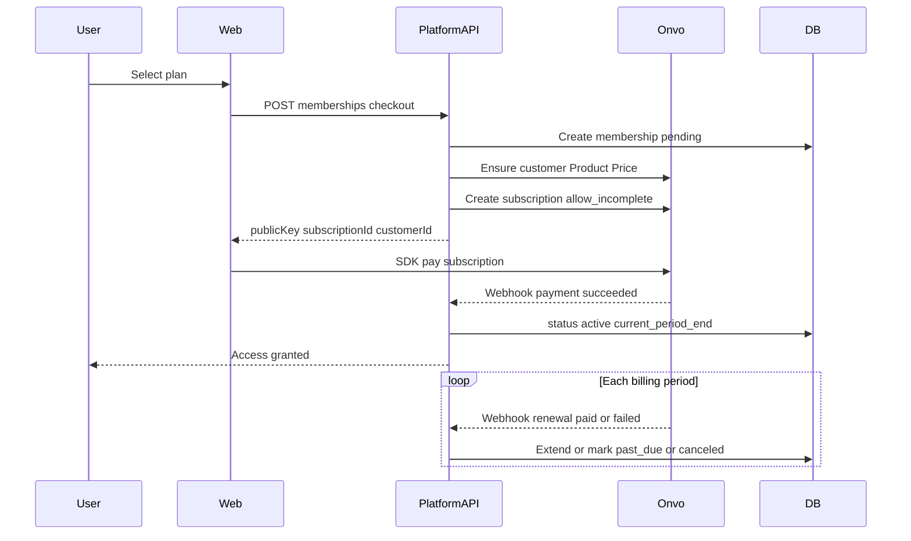

# Payments & memberships (MVP3)

Research and design for Costa Rica–oriented billing. Planning only — no production integration required to accept this doc.

Related: [MVP3.md](MVP3.md) · ONVO docs cache: [../03-ONVO Pay/](../03-ONVO%20Pay/) ([llms.txt](../03-ONVO%20Pay/llms.txt) index, [llms-full.md](../03-ONVO%20Pay/llms-full.md) full) · live [docs.onvopay.com](https://docs.onvopay.com/)

---

## 1. Goals

- Provider with **little or no monthly platform fee**; cost mainly **per successful transaction**.  
- **National** payments in Costa Rica (cards + local rails if possible).  
- Prefer **international** card acceptance when available.  
- Support **memberships** with **automatic recurring charges**.  
- Fit a **Costa Rica–based** merchant (PlatformCR).

---

## 2. Provider comparison

### 2.1 Onvo Pay ([onvopay.com](https://onvopay.com))

| Aspect | Notes |
|--------|--------|
| Markets | Costa Rica, Guatemala, Peru (country-specific pricing) |
| CR currencies | CRC and USD |
| Cost model | Base ecommerce: **no setup fee**; pay per successful transaction |
| CR card fee (published) | **3.9% + $0.35** per successful card tx |
| Local rails | SINPE (~2.5%, min ~$0.50), SINPE Móvil (~1.5%) |
| Settlement | Daily / weekly / bi-weekly / monthly to local bank; **~$3 per payout** |
| Recurring | First-class **subscriptions / cargos recurrentes** API + web SDK |
| Docs | [docs.onvopay.com](https://docs.onvopay.com) — products, prices, customers, subscriptions, webhooks |

Public messaging and press: affiliation without membership fee; % of transaction. Advanced channels (terminals / Zapp) may add small monthly fees — keep ecommerce base for MVP.

### 2.2 Stripe ([stripe.com](https://stripe.com))

| Aspect | Notes |
|--------|--------|
| Billing / Subscriptions | Excellent (Products, Prices, Subscriptions, Customer Portal, webhooks) |
| CR as merchant country | **Not directly supported** for CR business + local bank payouts |
| Workarounds | Incorporate in a Stripe-supported country (extra legal/cost overhead) |
| International | Strong when the merchant entity is in a supported country |

Stripe Tax can calculate VAT for **remote sellers** into CR; that does **not** unlock Stripe as a CR merchant account.

### 2.3 Decision (provisional)

**Choose Onvo Pay for MVP3.**

Reasons:

1. Aligns with **CR national** collection (cards + SINPE).  
2. Matches “**free platform / pay per tx**” preference for the base plan.  
3. Documents **recurring charges** needed for memberships.  
4. Avoids Stripe’s **merchant-country blocker** for a CR entity.

Revisit Stripe only if Platform creates a foreign legal entity or Stripe adds CR merchant support.

---

## 3. Memberships architecture

### 3.1 Ownership split

| Concern | Owner |
|---------|--------|
| Plan catalog (display name, features) | Platform DB |
| List prices / intervals mirrored to PSP | Platform + Onvo `Product` / `Price` |
| Card vault / PAN | Onvo (never store raw cards in Platform) |
| Creating renewals / charging | Onvo |
| Who may use paid features | Platform (`membership` status + period end) |
| Source of truth for “paid this period” | Onvo webhooks → Platform updates |

### 3.2 Checkout + renewals

Onvo flow (from their docs): create **product** → **price** with `type: "recurring"` → **payment method** on **customer** → **subscription** → listen to **webhooks** for first charge and renewals. SDK can render with `paymentType: "subscription"`.

### 3.3 Suggested Platform schema (phase B)

Not implemented in phase A — design only:

- `plans` — `id`, `code`, `name`, `interval`, `amount_cents`, `currency`, `onvo_price_id`, `active`  
- `payment_customers` — `user_id`, `onvo_customer_id`  
- `memberships` — `user_id`, `plan_id`, `status`, `onvo_subscription_id`, `current_period_start`, `current_period_end`, `canceled_at`  
- Optional `membership_events` — audit of webhook payloads (id, type, processed_at)

Default rule: **at most one `active`/`past_due` membership** per user for the core product.

### 3.4 Status machine

- `pending` — checkout started, no successful first payment yet  
- `active` — paid for current period; grant access  
- `past_due` — renewal failed; optional grace period then restrict  
- `canceled` — user or admin canceled; access until `current_period_end` or immediate (product choice)  
- `expired` — period ended without renewal  

### 3.5 Security

- Verify webhook signatures with Onvo secret.  
- Idempotent webhook handlers (store event id).  
- Never trust browser-only success callbacks for entitlement.  
- Env: `ONVO_PUBLIC_KEY`, `ONVO_SECRET_KEY`, `ONVO_WEBHOOK_SECRET` (gitignored).  

### 3.6 Access control options (phase B pick one)

1. **Permission** e.g. `membership.active` granted while status is `active` (fits existing `/me` permissions model).  
2. **Dedicated field** on `/me` e.g. `membership: { plan, status, periodEnd }`.  
3. Both: permission for coarse gates + object for UI.

Recommendation: **(3)** — UI needs plan name/dates; APIs can use a single permission or service check.

---

## 4. Phase B implementation sketch (after sign-off)

1. Merchant: create Onvo sandbox account; copy keys.  
2. Flyway: tables above.  
3. Seed one plan (e.g. monthly CRC).  
4. `POST /api/memberships/checkout` (auth required).  
5. `POST /api/webhooks/onvo` (public, signature verified).  
6. Web: `/plans` + embed Onvo SDK.  
7. Gate a sample feature (or whole app beyond `/home`) by membership.  
8. Cancel endpoint → cancel Onvo subscription + update DB.

---

## 5. Open questions (product)

- Trial days?  
- Grace days on `past_due`?  
- Cancel at period end vs immediate?  
- Multiple products/plans per user later?  
- Who issues fiscal invoices (Onvo vs Platform)?  

Record answers in MVP3 checklist before coding phase B.

---

## 6. Sources

- Local cache: [../03-ONVO Pay/](../03-ONVO%20Pay/) ([llms.txt](../03-ONVO%20Pay/llms.txt), [llms-full.md](../03-ONVO%20Pay/llms-full.md))  
- [ONVO docs](https://docs.onvopay.com/)  
- [ONVO pricing by country](https://onvopay.com/en/pricing)  
- [ONVO subscriptions / cargos recurrentes](https://docs.onvopay.com/payments/subscriptions)  
- [ONVO web SDK](https://docs.onvopay.com/integrations/sdk)  
- Stripe country support / CR merchant limitations (Stripe docs + industry guides; CR not a supported merchant country as of research date)
