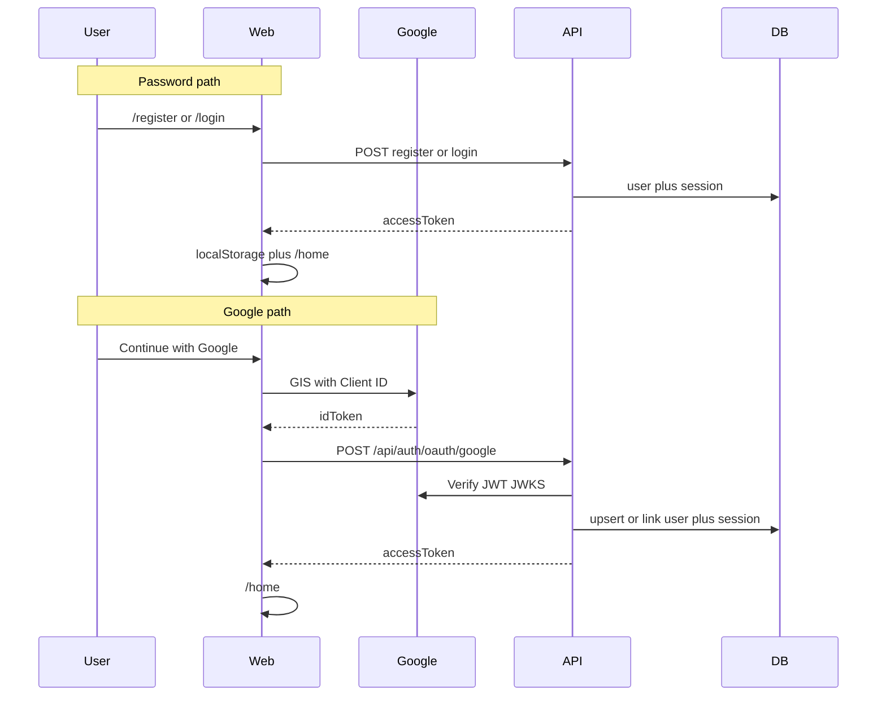

# MVP2 implementation — registration + Google SSO

**Status: phase A done** (GitHub issues #8–#14 closed). Delivery tracked in [MVP2.md](MVP2.md). Backlog remains in #15.

## Goal

Phase A: public registration + Google SSO (OIDC ID token). Same Platform session model as password login.

## Flow

## Backend

1. Flyway `V3`: `google_sub`, nullable `password_hash`
2. `POST /api/auth/register` — USER role, auto-login
3. `POST /api/auth/oauth/google` — verify ID token, link/create user, session
4. Env: `GOOGLE_CLIENT_ID` / `app.google.client-id`

## Frontend

1. `/register` + link from login
2. `VITE_GOOGLE_CLIENT_ID` + GIS button
3. `register` / `loginWithGoogle` in auth client

## Order

| Step | Issue |
|------|-------|
| Schema | #8 |
| Register API | #9 |
| Register UI | #10 |
| Google config | #11 |
| Google API | #12 |
| GIS UI | #13 |
| Docs | #14 |

## Related

- [MVP2.md](MVP2.md)
- [GOOGLE-SSO-SETUP.md](../01-Project%20Instructions/GOOGLE-SSO-SETUP.md)
- [03-security.md](03-security.md)
