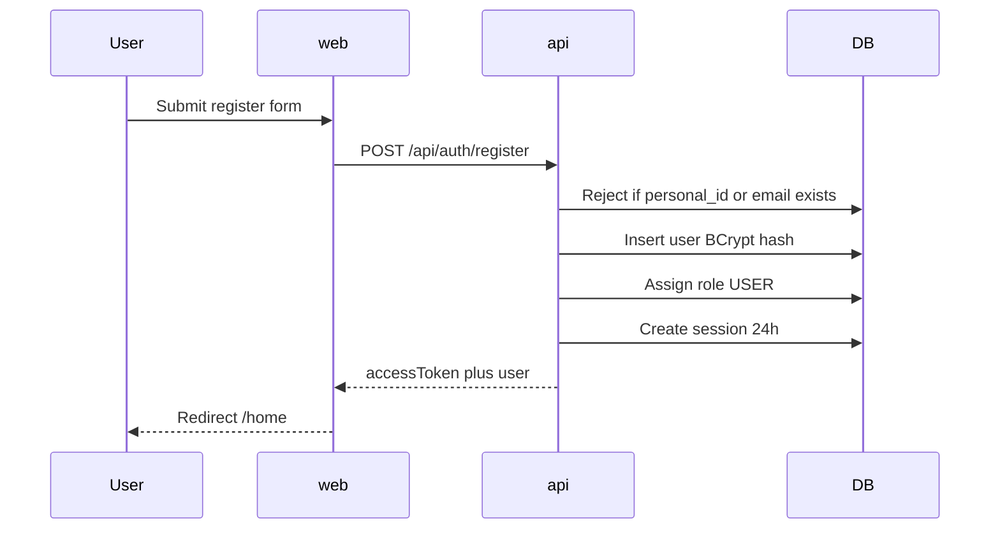
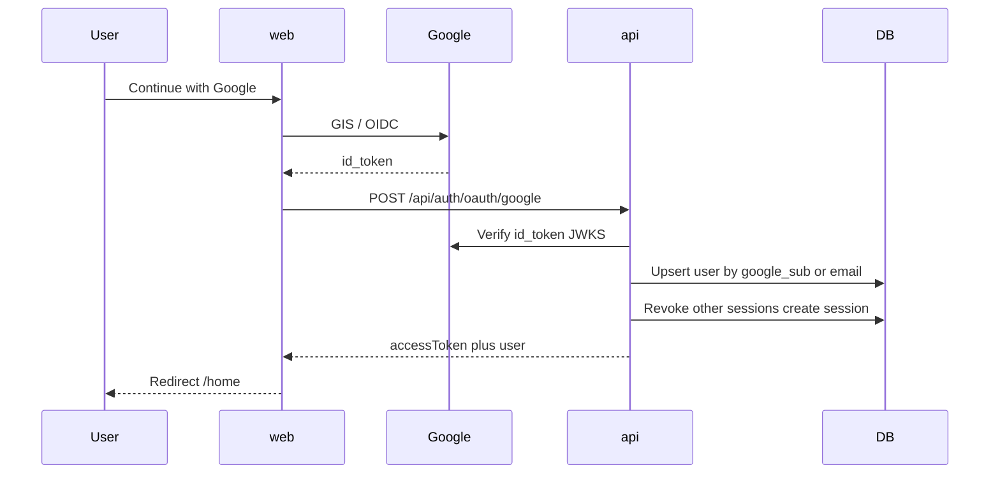

# MVP2

Folder: [`00-Planning/`](../00-Planning/). Builds on **[MVP1](MVP1.md)** (auth base, shell, H2/local, sessions).

**GitHub:** [Project board](https://github.com/users/PlatformCR/projects/1) · [Milestone MVP2](https://github.com/PlatformCR/Platform/milestone/2)

Implementation notes: [MVP2-IMPLEMENTATION.md](MVP2-IMPLEMENTATION.md)

**How to read this file (top → bottom):**

1. Scope — what MVP2 phase A includes / excludes  
2. Phase A detail — registration + Google SSO  
3. Work order — steps in sequence  
4. Checklist — mark done as we go  
5. Topic docs  
6. Backlog — rest of former MVP1 next steps (after phase A)

---

## 1. Scope

### In (phase A — start here)

- **User registration** — public self-signup; details in [03-security.md](03-security.md)
- **Google SSO (OIDC)** — ID token from Google Identity Services → API verifies → same Platform session as password login
- Schema: `google_sub` (unique, nullable), `password_hash` nullable for Google-only users
- Web: `/register` + “Continue with Google” on `/login`
- Keep existing session rules: opaque token, `token_hash`, one active session per user, 24h / logout

### Out of phase A (see section 6 — Backlog)

- Email verification, invite-only, admin-created users
- Forgot / reset password; HttpOnly cookies / refresh tokens
- SAML or non-Google IdPs
- Roles admin GUI, theme switcher, i18n, landing kit, R2, etc.

---

## 2. Phase A — Registration + Google SSO

### 2.1 Registration

Already specified in [03-security.md](03-security.md) (**User registration**). Summary:

| Item | Decision |
|------|----------|
| Endpoint | `POST /api/auth/register` (public) |
| Body | `personalId`, `email`, `password`, `confirmPassword` |
| Role | Default `USER` only |
| After success | Auto-login → same `LoginResponse` shape as login |
| Web | `/register`; link from `/login` (“Create account”) |
| Not yet | Email verify, invite-only, CAPTCHA |

### 2.2 Google SSO

| Item | Decision |
|------|----------|
| Provider | Google only (OIDC / ID token) |
| Front | Google Identity Services → `credential` (ID token) |
| API | `POST /api/auth/oauth/google` `{ "idToken": "..." }` |
| Verify | `aud` = client id, `iss` Google, email verified, not expired |
| User | Find by `google_sub`; else by verified email (link); else create with role `USER`, no password |
| Session | Same as password login (revoke others → new session → opaque token) |
| Env | `GOOGLE_CLIENT_ID` (API + `VITE_GOOGLE_CLIENT_ID` on web) |

### 2.3 Identity / linking rules

- Prefer stable key **`google_sub`** over email alone.
- If email already has a password account → **link** `google_sub` on that row (same user, can use either login).
- Google-only users: `password_hash` null; password login rejected with clear message (or “set password later” — backlog).
- Never auto-grant `ADMIN` on register or Google signup.

### 2.4 Google Cloud (when implementing)

Step-by-step Console guide (project, consent screen, Web client ID, cost notes, local env):

→ **[01-Project Instructions/GOOGLE-SSO-SETUP.md](../01-Project%20Instructions/GOOGLE-SSO-SETUP.md)**

- OAuth client type **Web application**.
- Authorized JavaScript origins: `http://localhost:5173` (+ prod URL later).
- Never commit Client ID/secret to git.

---

## 3. Work order (phase A)

| Step | What | Status |
|------|------|--------|
| 1 | Flyway: `google_sub` unique nullable; `password_hash` nullable; entity/repo updates | **done** |
| 2 | `POST /api/auth/register` + permitAll + validation + USER role + auto session | **done** |
| 3 | Web: `/register` form + link from `/login` + toasts | **done** |
| 4 | Config: `GOOGLE_CLIENT_ID` / `VITE_GOOGLE_CLIENT_ID` (local docs) | **done** |
| 5 | `POST /api/auth/oauth/google` + ID token verifier + upsert/link user + session | **done** |
| 6 | Web: Continue with Google on `/login` (and optionally `/register`) | **done** |
| 7 | HOW-TO-RUN + OpenAPI notes for register + Google | **done** |

---

## 4. Checklist (phase A)

### Step 1 — Schema
- [x] Migration: `users.google_sub` (unique, nullable)
- [x] Migration: `users.password_hash` nullable
- [x] JPA `User` + repository lookups by `google_sub` / email

### Step 2 — Register API
- [x] `POST /api/auth/register`
- [x] Validation (email, password policy, confirm match)
- [x] Unique personalId/email handling
- [x] BCrypt + role `USER` + auto-login session
- [x] Security: permit register path

### Step 3 — Register UI
- [x] Route `/register`
- [x] Form + link from `/login`
- [x] Success → token → `/home`; errors via toast

### Steps 4–6 — Google SSO
- [x] Env / config for Google client id
- [x] `POST /api/auth/oauth/google`
- [x] Verify Google ID token server-side
- [x] Create / link user + session
- [x] GIS button on login (dark UI)
- [x] Security: permit oauth path

### Step 7 — Docs
- [x] [HOW-TO-RUN.md](../01-Project%20Instructions/HOW-TO-RUN.md) — register + Google setup
- [x] Swagger shows new endpoints on `local`

---

## 5. Topic docs

[01-general.md](01-general.md) · [02-springboot.md](02-springboot.md) · [03-security.md](03-security.md) · [04-frontend.md](04-frontend.md) · [05-landing-pages.md](05-landing-pages.md) · [06-api-optimization.md](06-api-optimization.md) · [MVP1.md](MVP1.md)

Auth detail for register + Google SSO: **[03-security.md](03-security.md)**.

---

## 6. Backlog (after phase A → plan later / MVP3)

Pulled from [MVP1.md](MVP1.md) §7 Next steps (items not in phase A).

### Auth and security
- [ ] Email verification / invite-only / admin-created users
- [ ] SSO beyond Google (other OIDC / SAML) if needed
- [ ] Forgot / reset password
- [ ] HttpOnly cookies and/or refresh tokens
- [ ] Stricter TLS/HSTS for shared environments
- [ ] Redis / Spring Session only if DB sessions are not enough
- [ ] Rate-limit / CAPTCHA on public register & OAuth when on the public internet

### Roles admin GUI
- [ ] CRUD roles and permissions in UI
- [ ] Assign permissions to roles / roles to users
- [ ] Gate admin with `roles.manage`
- [ ] Optional: menus driven by `/me` permissions

### Product / UX
- [ ] Theme feature (light / dark / system) — until then UI is dark-only; brand **Platform** white — [04-frontend.md](04-frontend.md)
- [ ] i18n (ES / EN)
- [ ] Rich homepage
- [ ] Client branding in footer from config
- [ ] Landing-page component kit — [05-landing-pages.md](05-landing-pages.md)

### Media and platform
- [ ] Swap local storage → Cloudflare R2 + presigned uploads
- [ ] Postman collection snapshot (optional)
- [ ] Testcontainers Postgres
- [ ] Lombok yes/no team-wide
