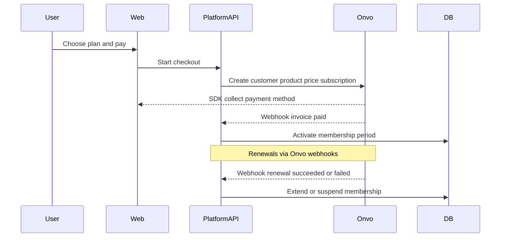

# MVP3 implementation plan — backlog + payments + memberships

Saved from the Cursor plan (`mvp3_payments_memberships`). **Status: phase A planning delivered.**

Delivery tracked in [MVP3.md](MVP3.md) and [07-payments-memberships.md](07-payments-memberships.md).  
GitHub: [Milestone MVP3](https://github.com/PlatformCR/Platform/milestone/3) · issues #16–#18 (#15 closed / moved).

## Overview

Crear MVP3.md moviendo el backlog pendiente de MVP2, añadir investigación/decisión de pasarela (Onvo vs Stripe) orientada a CR, y documentar el diseño de membresías con cargos automáticos vía el proveedor.

## Context

- Repo **PlatformCR** → operación **Costa Rica** (nacional primero; internacional si el proveedor lo permite).
- **Hallazgo clave:** Stripe **no soporta cuentas de negocio en Costa Rica** de forma directa. Onvo Pay sí: plan base sin mensualidad de plataforma, cobro por transacción, CRC/USD, tarjetas + SINPE/SINPE Móvil, API de cargos recurrentes ([docs.onvopay.com/payments/subscriptions](https://docs.onvopay.com/payments/subscriptions)).

## Provider decision (provisional)

**Onvo Pay** as primary for MVP3.

| Criterion | Onvo Pay | Stripe |
|-----------|----------|--------|
| Free / per-tx only | Yes (base ecommerce; ~$3 per payout) | N/A if CR merchant cannot affiliate |
| National CR | Yes (cards, SINPE, SINPE Móvil) | No for CR merchant |
| International | Intl cards via Onvo; Onvo also GT/PE | Strong globally; needs supported-country entity |
| Memberships | Product + recurring price + subscription + webhooks | Stripe Billing (blocked by merchant country) |

Reference CR fees (Onvo published): card **3.9% + $0.35**; SINPE Móvil **1.5%**; bank settlement **$3**.

## Work completed (phase A docs)

1. [MVP3.md](MVP3.md) — objectives, scope, work order, checklist, backlog  
2. [MVP2.md](MVP2.md) §6 → points to MVP3  
3. [07-payments-memberships.md](07-payments-memberships.md) — comparison + membership design  
4. GitHub milestone + issues #16 (provider), #17 (memberships), #18 (backlog)  
5. Links from [README.md](../README.md) and [01-general.md](01-general.md)

## Membership flow (design)

Suggested entities (phase B): `plans`, `memberships`, `payment_customers` (+ Onvo ids). Activate access only after verified webhooks.

## Out of scope (this planning delivery)

- Onvo SDK integration in `api/` / `web/` (phase B)
- Business plan prices
- Implementing migrated backlog (roles GUI, i18n, R2, etc.)

## Done criteria

- [x] `MVP3.md` with phase A checklist  
- [x] MVP2 backlog moved / redirected  
- [x] `07-payments-memberships.md` with Onvo decision + recurring design  
- [x] GitHub milestone/issues aligned  
- [x] This plan saved in-repo  
