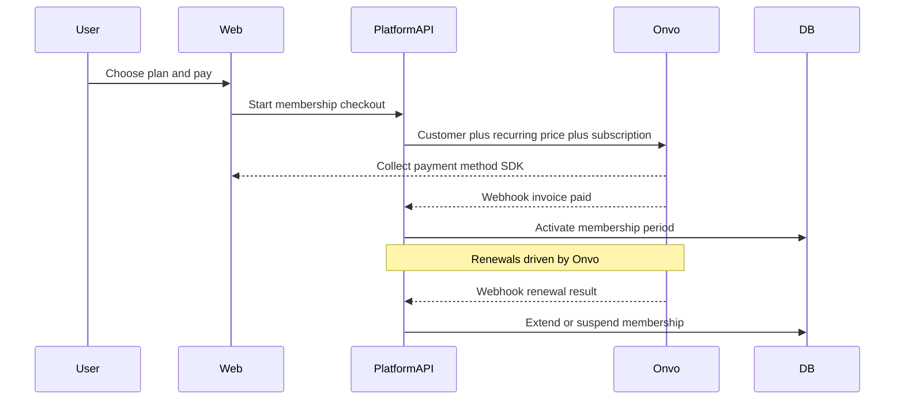

# MVP3

Folder: [`00-Planning/`](../00-Planning/). Builds on **[MVP2](MVP2.md)** (registration + Google SSO).

**GitHub:** [Project board](https://github.com/users/PlatformCR/projects/1) · [Milestone MVP3](https://github.com/PlatformCR/Platform/milestone/3)

Issues: [#16 provider decision](https://github.com/PlatformCR/Platform/issues/16) · [#17 memberships design](https://github.com/PlatformCR/Platform/issues/17) · [#18 backlog](https://github.com/PlatformCR/Platform/issues/18)

Payments & memberships research: **[07-payments-memberships.md](07-payments-memberships.md)**  
Implementation plan (from Cursor): **[MVP3-IMPLEMENTATION.md](MVP3-IMPLEMENTATION.md)**  
ONVO official docs (cached): **[../03-ONVO Pay/](../03-ONVO%20Pay/)** · live [docs.onvopay.com](https://docs.onvopay.com/)  
**Learning path (springs, full-stack):** **[../04-Learning Path/](../04-Learning%20Path/)** — guided curriculum backend + frontend + DB + tests

**How to read this file (top → bottom):**

1. Objectives — what MVP3 is for  
2. Scope — phase A (docs / decisions) vs later  
3. Phase A detail — payments provider + memberships design  
4. Work order + checklist  
5. Topic docs  
6. Backlog — former MVP2 §6 + payments implementation follow-ups  

---

## 1. Objectives

MVP3 turns Platform from “auth + shell” into a product that can **monetize access** in Costa Rica (and grow internationally later).

### Primary objectives (phase A — this milestone’s planning)

1. **Choose a payment provider** that fits PlatformCR: no platform monthly fee if possible, pay mainly **per transaction**, strong **national (CR)** coverage, and ideally paths for **cross-border** card payments.
2. **Design a memberships system** with **automatic recurring charges** (subscriptions), owned by Platform for access control and by the provider for charging/renewals.
3. **Capture the decision and design in docs** so implementation (phase B) is unambiguous.

### Secondary objectives (backlog — after phase A docs)

- Harden auth (email verify, reset password, rate limits, etc.)
- Roles admin GUI and permission-driven menus
- Product UX (theme, i18n, rich home, landing kit, footer branding)
- Media/platform (R2, Testcontainers, optional Postman/Lombok)

### Success criteria (phase A)

- [ ] Documented **provider decision** (Onvo vs Stripe vs others) with pricing and CR constraints  
- [ ] Documented **membership domain** (plans, status, webhooks, env secrets)  
- [ ] Backlog from MVP2 §6 **moved here** and tracked on GitHub  
- [ ] Clear **phase B** work order for first billing integration (not required to ship code in phase A)

---

## 2. Scope

### In (phase A — planning / ADR)

- Payment provider comparison for **Costa Rica–based** operation  
- Provisional choice: **Onvo Pay** (see [07-payments-memberships.md](07-payments-memberships.md))  
- Memberships + recurring charges design (entities, flows, webhooks)  
- Migrate open backlog from MVP2 into this file  

### Out of phase A (implementation later / backlog)

- Live Onvo (or other) SDK integration in `api/` + `web/`  
- Production KYC / merchant onboarding with the provider  
- Full dunning, invoices UI, tax engine, multi-tenant billing  
- Items listed in §6 Backlog  

---

## 3. Phase A — Payments + memberships (planning)

### 3.1 Payment provider (decision)

| Goal | Preference |
|------|------------|
| Cost model | Free / no monthly platform fee; charge mainly per successful transaction |
| Geography | National CR first; international cards if available |
| Recurring | Native subscriptions / cargos recurrentes API |
| Fit for PlatformCR | Merchant account possible for a CR entity |

**Provisional decision: Onvo Pay** — CR-native, per-tx pricing, SINPE + cards, documented recurring charges.  
**Stripe:** excellent Billing product, but **not directly available** for CR-registered businesses without a foreign legal entity — keep as future option only.

Full comparison and sources: **[07-payments-memberships.md](07-payments-memberships.md)**.

### 3.2 Memberships with automatic charges

**Principle:** Platform owns *who has access*; the PSP owns *charging and card vaulting*.

High-level product rules (to refine in phase B):

- Catalog of **plans** (name, interval, amount, currency CRC/USD).  
- One **active membership** per user per product line (default: one active plan).  
- Statuses: `trialing` | `active` | `past_due` | `canceled`.  
- Grant/revoke product access **only after verified webhooks**, not only client `onSuccess`.  
- Secrets: `ONVO_PUBLIC_KEY`, `ONVO_SECRET_KEY`, webhook signing secret — never commit.

Details: **[07-payments-memberships.md](07-payments-memberships.md)**.

---

## 4. Work order (phase A)

| Step | What | Status |
|------|------|--------|
| 1 | Create MVP3 planning doc + objectives | **done** (this file) |
| 2 | Write payments + memberships research/design | **done** → [07-payments-memberships.md](07-payments-memberships.md) |
| 3 | Move MVP2 §6 backlog into MVP3 §6 | **done** |
| 4 | GitHub milestone MVP3 + issues for phase A | **done** (#16–#18; #15 closed) |
| 5 | Confirm Onvo merchant sandbox account (human) | pending |
| 6 | Phase B kickoff: implement checkout + webhooks (code) | pending (after phase A sign-off) |

---

## 5. Checklist (phase A)

### Planning
- [x] MVP3 objectives and scope written  
- [x] Provider comparison + provisional decision (Onvo)  
- [x] Memberships / recurring design documented  
- [x] MVP2 backlog relocated here  
- [x] GitHub milestone + phase A issues  
- [ ] Team sign-off on provider choice  

### Phase B preview (not phase A)
- [ ] Flyway tables for plans / memberships / PSP customer ids  
- [ ] API: create checkout / subscription + webhook endpoint  
- [ ] Web: plans page + Onvo SDK pay UI  
- [ ] Gate features by active membership (permission or flag)  

---

## 6. Backlog (after phase A)

Moved from [MVP2.md](MVP2.md) §6 (former MVP1 next steps). Track on GitHub under MVP3.

### Payments / memberships (implementation)
- [ ] Onvo sandbox + production merchant onboarding  
- [ ] Schema + API + webhooks for subscriptions  
- [ ] Customer portal: cancel / change plan  
- [ ] Failed payment / past_due handling (dunning)  
- [ ] Optional: second PSP or Stripe via foreign entity (only if needed)

### Auth and security
- [ ] Email verification / invite-only / admin-created users  
- [ ] SSO beyond Google (other OIDC / SAML) if needed  
- [ ] Forgot / reset password  
- [ ] Set password for Google-only accounts  
- [ ] HttpOnly cookies and/or refresh tokens  
- [ ] Stricter TLS/HSTS for shared environments  
- [ ] Redis / Spring Session only if DB sessions are not enough  
- [ ] Rate-limit / CAPTCHA on public register & OAuth when on the public internet  

### Roles admin GUI
- [ ] CRUD roles and permissions in UI  
- [ ] Assign permissions to roles / roles to users  
- [ ] Gate admin with `roles.manage`  
- [ ] Optional: menus driven by `/me` permissions  

### Product / UX
- [ ] Theme feature (light / dark / system) — until then UI is dark-only; brand **Platform** white — [04-frontend.md](04-frontend.md)  
- [ ] i18n (ES / EN)  
- [ ] Rich homepage  
- [ ] Client branding in footer from config  
- [ ] Landing-page component kit — [05-landing-pages.md](05-landing-pages.md)  

### Media and platform
- [ ] Swap local storage → Cloudflare R2 + presigned uploads  
- [ ] Postman collection snapshot (optional)  
- [ ] Testcontainers Postgres  
- [ ] Lombok yes/no team-wide  

---

## 7. Topic docs

[01-general.md](01-general.md) · [02-springboot.md](02-springboot.md) · [03-security.md](03-security.md) · [04-frontend.md](04-frontend.md) · [05-landing-pages.md](05-landing-pages.md) · [06-api-optimization.md](06-api-optimization.md) · **[07-payments-memberships.md](07-payments-memberships.md)** · [MVP1.md](MVP1.md) · [MVP2.md](MVP2.md) · ONVO: [../03-ONVO Pay/](../03-ONVO%20Pay/)
