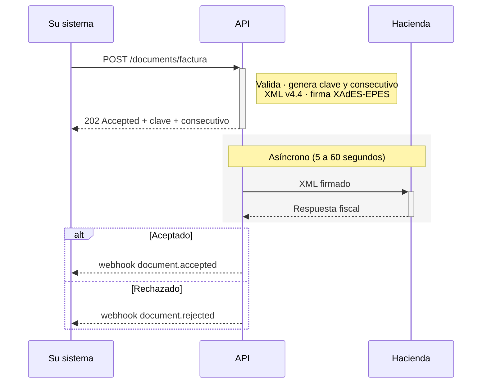
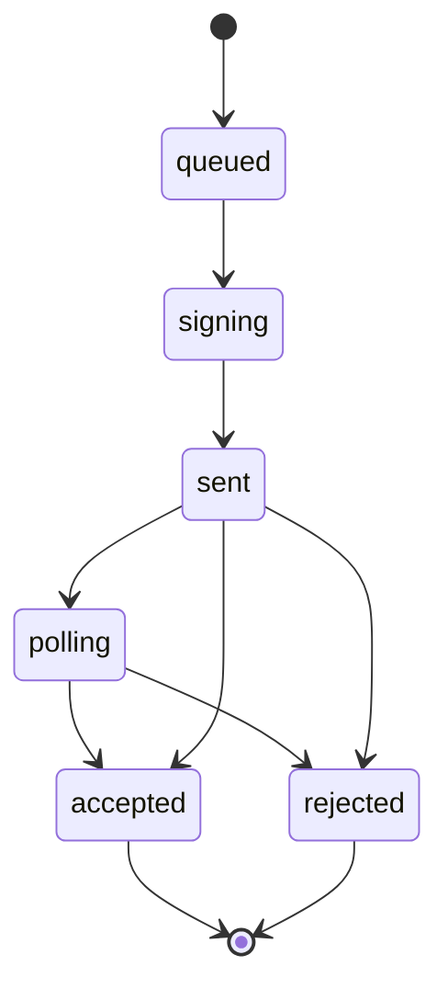

## Bienvenido a la API de Facturación Electrónica de Costa Rica

Esta API le permite emitir comprobantes electrónicos ante el Ministerio de Hacienda desde
cualquier sistema: un ERP, un punto de venta, un e-commerce o un script. Usted envía JSON
plano; nosotros generamos el XML v4.4, lo validamos contra los esquemas oficiales, lo
firmamos con XAdES-EPES, lo enviamos a Hacienda, guardamos la respuesta durante los cinco
años que exige la ley y le avisamos por webhook cuando haya veredicto.

**No necesita conocer el XSD, ni la especificación de firma digital, ni la API del ATV.**
Necesita saber qué está vendiendo y a quién.

#### Qué cubre

Los ocho tipos de comprobante del reglamento vigente, más el Mensaje Receptor:

| Tipo | Comprobante | Endpoint |
|---|---|---|
| `01` | Factura Electrónica | `POST /documents/factura` |
| `02` | Nota de Débito | `POST /documents/nota-debito` |
| `03` | Nota de Crédito | `POST /documents/nota-credito` |
| `04` | Tiquete Electrónico | `POST /documents/tiquete` |
| `05` `06` `07` | Mensaje Receptor (aceptación / parcial / rechazo) | `POST /documents/mensaje-receptor` |
| `08` | Factura Electrónica de Compra | `POST /documents/factura-compra` |
| `09` | Factura Electrónica de Exportación | `POST /documents/factura-exportacion` |
| `10` | Recibo Electrónico de Pago | `POST /documents/recibo-pago` |

#### Cumplimiento normativo

La plataforma implementa la **versión 4.4** de los comprobantes electrónicos, obligatoria
desde el 1.º de septiembre de 2025:

- Reglamento de Comprobantes Electrónicos — Decreto Ejecutivo **N.º 41820-H**
- Resolución **MH-DGT-RES-0027-2024** y Decreto **N.º 44739-H**
- **Anexos y Estructuras v4.4** de la Dirección General de Tributación
- Esquemas **XSD v4.4** oficiales publicados por la DGT

Los catálogos que aparecen en esta guía (impuestos, tarifas, condición de venta, medios de
pago, referencias, exoneraciones, otros cargos) son los del anexo oficial, **corregidos
contra el comportamiento real del validador de Hacienda**. Donde el XSD publicado y la
emisión real no coinciden, esta guía documenta la emisión real y lo señala explícitamente.

---

---

### Primeros pasos

Cuatro pasos desde cero hasta su primera factura aceptada.

#### Paso 1 — Cree su cuenta de integrador

Regístrese en el portal (`/portal/signup`). La cuenta queda activa de inmediato en modo
**trial**, con acceso completo a sandbox.

#### Paso 2 — Genere su API Key

Desde el portal, cree una llave. Recibirá **dos** valores:

```
X-API-Key:    efk_EJEMPLO7NO7USAR7EN7PRODUCCION
X-API-Secret: efs_EjemploNoUsarEnProduccion-SuValorRealEsDistinto
```

El **secret se muestra una sola vez**. Guárdelo en su gestor de secretos: no hay forma de
recuperarlo, solo de rotar la llave.

Verifique que funciona antes de seguir:

```bash
curl -X POST https://api.facturaencr.com/v2/efactura/auth/verify \
  -H "X-API-Key: $EFACTURA_KEY" \
  -H "X-API-Secret: $EFACTURA_SECRET"
```

```json
{
  "ok": true,
  "integrator": { "id": "6a12352db0dcdddbf99c91f9", "name": "Su Empresa S.A.", "status": "trial", "defaultEnvironment": "sandbox" },
  "apiKey": {
    "keyId": "efk_EJEMPLO7NO7USAR7EN7PRODUCCION",
    "alias": "produccion-erp",
    "scopes": ["documents:write", "documents:read", "certificates:manage", "webhooks:manage", "account:read"],
    "environment": "sandbox",
    "expiresAt": null
  }
}
```

Fíjese en `apiKey.environment`: **ese** campo decide si sus comprobantes tienen valor
fiscal. Vea [Ambientes](#ambientes).

#### Paso 3 — Suba el certificado del comercio

Cada comercio que factura necesita su certificado `.p12` emitido por el BCCR, más el PIN
que usa para entrar al ATV:

```bash
curl -X POST https://api.facturaencr.com/v2/efactura/certificates \
  -H "X-API-Key: $EFACTURA_KEY" \
  -H "X-API-Secret: $EFACTURA_SECRET" \
  -F "file=@/ruta/certificado.p12" \
  -F "pin=1234" \
  -F "alias=Panadería Undamo (producción)" \
  -F "environment=production" \
  -F 'emisor={"tipoIdentificacion":"02","numeroIdentificacion":"3101678166","nombre":"UNDAMO DE ALAJUELA SOCIEDAD ANONIMA","codigoActividad":["1071.9"],"correoElectronico":"facturacion@undamo.cr","telefono":{"codigoPais":"506","numTelefono":"71725455"},"ubicacion":{"provincia":"2","canton":"01","distrito":"01","otrasSenas":"Guadalupe, contiguo a la pulpería"}}'
```

La llave privada se cifra en reposo y **no se devuelve por ningún endpoint**.

> **La ubicación tiene que coincidir con el padrón.** `provincia`, `canton` y `distrito`
> deben ser exactamente los que el contribuyente tiene registrados en Tributación. Si no,
> Hacienda rechaza **todos** sus comprobantes con **-37**, aunque el resto esté perfecto.
> Es el error de configuración más común y el más difícil de diagnosticar, porque el
> comprobante se ve bien.

#### Paso 4 — Emita

```bash
curl -X POST https://api.facturaencr.com/v2/efactura/documents/factura \
  -H "X-API-Key: $EFACTURA_KEY" \
  -H "X-API-Secret: $EFACTURA_SECRET" \
  -H "Content-Type: application/json" \
  -H "Idempotency-Key: pedido-2026-07-000123" \
  -d '{
    "emisorLegalId": "3101678166",
    "condicionVenta": "01",
    "medioPago": ["01"],
    "receptor": {
      "tipoIdentificacion": "01",
      "numeroIdentificacion": "112340567",
      "nombre": "Juan Pérez",
      "correoElectronico": "juan@cliente.com"
    },
    "detalle": [
      {
        "cantidad": 1,
        "unidadMedida": "Unid",
        "codigoCabys": "2349002011500",
        "detalle": "Pan pita 400g",
        "precioUnitario": 1000,
        "impuesto": [ { "codigo": "01", "codigoTarifa": "08", "tarifa": 13 } ]
      }
    ]
  }'
```

```json
{
  "documentId": "6a640c68a06e822633e9db71",
  "clave": "50624072600310167816600100001010000000866142351111",
  "consecutivo": "00100001010000000866",
  "status": "queued",
  "environment": "sandbox",
  "estimatedReadyAt": "2026-07-25T01:07:58.112Z"
}
```

Listo. El envío a Hacienda sigue en segundo plano; el veredicto llega por webhook o
consultando `GET /documents/{documentId}`.

---

---

### Autenticación

Todas las peticiones llevan **dos cabeceras, ambas obligatorias**:

```
X-API-Key:    efk_...
X-API-Secret: efs_...
```

No se usa `Authorization: Bearer`. Si falta cualquiera de las dos, la respuesta es
`401 unauthorized`.

#### Scopes

Cada llave lleva permisos explícitos. Un endpoint invocado sin el scope necesario devuelve
`403 forbidden_scope`.

| Scope | Habilita |
|---|---|
| `documents:write` | Emitir comprobantes, reenviar, refrescar estado |
| `documents:read` | Consultar documentos, descargar XML/PDF, buscar en CABYS |
| `certificates:manage` | Subir, listar, probar y eliminar certificados |
| `webhooks:manage` | Crear, editar y probar endpoints de webhook |
| `account:read` | Consultar la cuenta y el consumo |

Cree llaves con el mínimo necesario: la del servidor de facturación no necesita
`certificates:manage`.

#### Aislamiento de datos

Cada llave pertenece a un integrador y solo ve los recursos de ese integrador. No existe
forma de leer documentos, certificados ni webhooks de otra cuenta; el filtro se aplica en
todos los endpoints sin excepción.

#### Rotación

1. Cree la llave nueva desde el portal.
2. Despliéguela a sus servidores.
3. Confirme con `POST /auth/verify` que responde `ok: true`.
4. Espere 24–48 h a que no queden peticiones en vuelo con la vieja.
5. Revoque la vieja.

Si un secret se filtró, revoque **primero** y reponga después: un secret comprometido puede
emitir comprobantes fiscales a nombre de sus comercios.

---

---

### Formato de respuestas

Las respuestas exitosas devuelven el recurso directamente, sin envoltorio:

```json
{
  "documentId": "6a640c68a06e822633e9db71",
  "clave": "50624072600310167816600100001010000000866142351111",
  "status": "queued"
}
```

Los listados devuelven `items` más la paginación:

```json
{
  "items": [ { "documentId": "..." } ],
  "page": 1,
  "limit": 50,
  "total": 1835
}
```

#### Errores

Todos los errores comparten forma:

```json
{
  "error": "validation_error",
  "message": "Payload de Factura inválido",
  "details": [
    {
      "path": "detalle.0",
      "msg": "La exoneración excede el IVA de la línea...",
      "message": "La exoneración excede el IVA de la línea..."
    }
  ],
  "requestId": "req_01HZY8Q4X2K7"
}
```

**Programe contra `error`, nunca contra `message`.** El texto de `message` está pensado
para humanos y puede cambiar sin aviso; el código es estable.

Tres detalles que conviene saber de entrada:

1. **`path` usa notación de puntos con índice numérico** — `detalle.0.impuesto.1`, no
   `detalle[0].impuesto[1]`. Viene vacío (`""`) cuando la regla que falló es transversal y
   no pertenece a un campo puntual.
2. **`msg` y `message` traen el mismo texto**, duplicado por compatibilidad histórica. Lea
   `message`.
3. **Hay dos convenciones de código de error.** Las validaciones de esquema devuelven
   `validation_error` en minúscula con `details`; las reglas de negocio devuelven un código
   propio en mayúscula y **sin** `details`, por ejemplo:

   ```json
   {
     "error": "MEDIO_PAGO_SUMA_INVALIDA",
     "message": "La suma de los montos por medio de pago (150.00) no coincide con el total del comprobante (1130.00)."
   }
   ```

   Su manejador debe contemplar ambas: `details` puede no existir.

Incluya siempre el `requestId` cuando abra un ticket: con él ubicamos la petición exacta.

---

---

### Emisión de comprobantes

#### El flujo asíncrono

Los `POST /documents/*` responden **`202 Accepted`** en **1 a 3 segundos** —el tiempo de
validar, generar el XML y firmarlo— y el envío a Hacienda sigue en segundo plano.

> El veredicto de Hacienda tarda de **5 a 60 segundos** más. Esa es la diferencia que hace
> útil el modelo asíncrono: usted no espera por Hacienda, espera por la firma.



> **`202` no significa «aceptado por Hacienda».** Significa que recibimos su petición, la
> validamos, generamos el comprobante y lo firmamos. El veredicto fiscal llega después.
> No entregue mercadería ni cierre la venta contra un `202`: hágalo contra
> `status: "accepted"`.

##### Estados



| Estado | Significado | ¿Qué hago? |
|---|---|---|
| `pending` | Registrado, aún sin procesar | Esperar |
| `queued` | En cola de emisión | Esperar |
| `signing` | Generando el XML y firmándolo | Esperar |
| `sent` | Entregado a Hacienda, sin veredicto | Esperar |
| `polling` | Consultando el veredicto a Hacienda | Esperar |
| `accepted` | **Aceptado.** Tiene valor fiscal | Entregar, cobrar, archivar |
| `rejected` | **Rechazado.** No tiene valor fiscal | Leer `haciendaMessage`, corregir y emitir uno nuevo |

> **Solo `accepted` y `rejected` son finales.** Todo lo demás significa «en vuelo». Escriba
> su máquina de estados con esa regla —final contra no final— y no con una lista cerrada:
> si aparece un estado nuevo, su código lo tratará como no final en vez de romperse.

Un `rejected` **no se corrige**: el consecutivo se consumió. Se emite un comprobante nuevo
con los datos corregidos.

##### Punto de venta: no bloquee la caja esperando a Hacienda

El error de diseño más común en un POS es emitir de forma síncrona y dejar al cajero —y a
la fila— esperando el veredicto. Hacienda tarda entre 5 y 60 segundos, y si su conexión se
cae, espera para siempre.

**No hace falta.** El `202` ya le devuelve la **`clave` y el `consecutivo`**, que es todo lo
que el tiquete físico necesita llevar impreso. El veredicto fiscal llega después y no
cambia esos dos valores.

Tiene **tres formas** de conseguir el número, de más rápida a más simple. Elija según cuánto
pueda esperar la caja:

**A · Numeración propia — 0 ms, sin llamar a nadie.**
Si el emisor está en `consecutivoMode: "integrator"`, el consecutivo lo lleva **usted**: ya
sabe cuál sigue sin preguntarnos nada. Imprime al instante y encola la emisión en su propio
sistema para enviarla cuando quiera.

```jsonc
// usted decide el número y lo manda en el payload
{ "consecutivoNumero": "0000004471", "branchCode": "002", "terminalCode": "00007", … }
// → consecutivo 00200007040000004471
```

Es la opción de menor latencia y la natural si viene de un sistema con numeración propia.
A cambio, **usted responde por que no haya saltos ni repeticiones**, incluso con varias
cajas a la vez. Se activa con `PATCH /emisores/{legalId}/config`.

**B · Reservar por adelantado — una llamada, sin firmar.**

```
POST /clave/reserve
→ { "clave": "…", "consecutivo": "…", "codigoSeguridad": "…", "expiresAt": "…" }
```

Saca el número del **mismo contador** que la emisión normal —así no se producen huecos ni
choques al mezclar reservadas con directas—, arma la clave de 50 completa y la guarda con
un TTL de **24 horas**. No toca Hacienda, no firma y **no cobra**. Al emitir, mande esa
`clave` en el payload: el comprobante sale con ella y el contador **no vuelve a avanzar**.

Cada reserva se consume **una sola vez**; reusarla devuelve
`409 reserved_clave_already_consumed`.

> **Reserve de a uno, justo antes de usarlo — no en lote.** El contador avanza **al
> reservar**, no al emitir. Un número reservado que no se use es un **hueco en su
> numeración** que después hay que justificar, y la reserva caduca a las 24 horas. Pedir
> cien claves al abrir caja y usar sesenta deja cuarenta huecos.

**C · Emitir y usar lo que devuelve el 202 — lo más simple.**

```
1. Cobrar
2. POST /documents/tiquete          → 202 con clave y consecutivo
3. Imprimir el tiquete con esa clave y ese consecutivo
4. Despedir al cliente
5. …el webhook document.accepted llega después, en segundo plano
```

En cualquiera de las tres, **lo que se imprime no cambia después**: la clave y el consecutivo
quedan fijos desde el principio y el veredicto de Hacienda no los toca.

> **Qué hacer si el webhook dice `rejected`.** La venta ya ocurrió y el tiquete ya se
> imprimió; eso no se deshace. Se corrige emitiendo de nuevo, y por eso conviene registrar
> el `documentId` junto a la venta en su base: es lo que le permite reconciliar al día
> siguiente qué se aceptó y qué no. Un rechazo en caja es raro —la mayoría son de
> configuración del emisor, no de la venta— pero su sistema tiene que tener una respuesta.

#### Anatomía de una emisión

Todos los comprobantes comparten la misma estructura de raíz.

```jsonc
{
  // ── Quién firma. Exactamente UNO de los dos ──
  "emisorLegalId": "3101678166",   // cédula del comercio (recomendado)
  // "certificateId": "6a4d7b00899e08b9a0d4011f",

  // ── Condiciones comerciales ──
  "condicionVenta": "01",           // 01 = contado
  "medioPago": ["01"],              // 01 = efectivo
  "currency": "CRC",

  // ── A quién ──
  "receptor": { "tipoIdentificacion": "01", "numeroIdentificacion": "112340567", "nombre": "Juan Pérez" },

  // ── Qué ──
  "detalle": [ /* líneas */ ],

  // ── Opcionales ──
  "otrosCargos": [],
  "observaciones": "Pedido #4471"
}
```

Tres cosas que **no** se envían nunca:

- **El emisor.** Se resuelve del certificado. Enviarlo no tiene efecto.
- **Los totales del resumen.** `TotalVentaNeta`, `TotalImpuesto`, `TotalComprobante` y los
  subtotales por naturaleza los calcula la plataforma a partir de las líneas. Si los manda,
  se ignoran. Esto es deliberado: los totales son la causa número uno de rechazo por
  descuadre, y no hay ninguna razón para que los calcule usted.
- **La clave y el consecutivo.** Se generan solos, salvo que use reserva previa o el modo
  `integrator` (vea [Consecutivos](#consecutivos-y-numeración)).

##### `emisorLegalId` frente a `certificateId`

| | Cuándo usarlo |
|---|---|
| `emisorLegalId` | Casi siempre. Usa el certificado activo más reciente de esa cédula. Si el comercio renueva el `.p12`, su código no cambia. |
| `certificateId` | Cuando necesita fijar un certificado concreto — por ejemplo, un comercio con certificados de sandbox y producción cargados a la vez. |

Enviar los dos, o ninguno, es `400`.


#### Cuál necesito

| Situación | Comprobante |
|---|---|
| Venta con cliente identificado | **Factura** (01) |
| Venta a consumidor final que no pide factura | **Tiquete** (04) |
| Devolver, anular o corregir a la baja | **Nota de crédito** (03) |
| Cobrar de más, intereses o un cargo omitido | **Nota de débito** (02) |
| Le compro a alguien no inscrito | **Factura de compra** (08) |
| Vendo fuera de Costa Rica | **Factura de exportación** (09) |
| Me pagan una factura a crédito con IVA diferido | **Recibo de pago** (10) |
| Responder a una factura que me emitieron | **Mensaje receptor** (05/06/07) |

#### El payload completo, campo por campo

Los ejemplos de cada endpoint son escenarios reales y compactos. Este es lo contrario: **todo
lo que se puede enviar en una factura**, para que vea el mapa completo. Casi nada de esto es
obligatorio.

```jsonc
{
  // ── Quién firma — exactamente UNO de los dos ──────────────────────────────
  "emisorLegalId": "3101678166",   // cédula del comercio (recomendado)
  "certificateId": "6a4d7b00…",    // o el id de un certificado concreto
  "environment": "production",     // opcional: fuerza el ambiente del certificado

  // ── Numeración — opcional; la plataforma la administra ────────────────────
  "clave": "506…",                 // clave pre-reservada (POST /clave/reserve)
  "branchCode": "001",             // sucursal  (default: la del emisor)
  "terminalCode": "00001",         // caja      (default: la del emisor)
  "consecutivoNumero": "0000000866", // sólo en consecutivoMode = 'integrator'

  // ── Contingencia — opcional; sólo si la venta fue offline ─────────────────
  "fechaEmision": "2026-07-20T09:00:00-06:00",
  "situacion": "3",                // 1 normal · 2 contingencia · 3 sin internet

  // ── Actividad económica ───────────────────────────────────────────────────
  "codigoActividad": "1071.9",         // del emisor (default: su principal)
  "codigoActividadReceptor": "960113", // alternativa a receptor.codigoActividad

  // ── Condiciones comerciales ───────────────────────────────────────────────
  "condicionVenta": "02",
  "condicionVentaOtros": "Permuta de mercadería",  // obligatorio si es 99
  "plazoCredito": "30",                             // STRING, en días; si es 02
  "medioPago": [{ "tipo": "01", "monto": 6000 }, { "tipo": "02", "monto": 4170 }],
  "currency": "USD",
  "exchangeRate": 512.5,           // obligatorio si currency ≠ CRC

  // ── A quién ───────────────────────────────────────────────────────────────
  "receptor": {
    "tipoIdentificacion": "02",
    "numeroIdentificacion": "3101456789",
    "nombre": "Comercial XYZ S.A.",
    "nombreComercial": "Comercial XYZ",
    "codigoActividad": "960113",
    "correoElectronico": "facturacion@comercialxyz.com",
    "telefono": { "codigoPais": "506", "numTelefono": "22221111" },
    "ubicacion": {
      "provincia": "1", "canton": "01", "distrito": "01",
      "barrio": "San Rafael",              // v4.4: el NOMBRE, no el código
      "otrasSenas": "Edificio Plaza, oficina 5"
    },
    "otrasSenasExtranjero": "…"            // en vez de ubicacion, si es tipo 05
  },

  // ── Qué se vende ──────────────────────────────────────────────────────────
  "detalle": [
    {
      "codigoCabys": "2341000000100",      // 13 dígitos, obligatorio
      "cantidad": 3,
      "unidadMedida": "Unid",
      "unidadMedidaComercial": "Caja 12u",
      "detalle": "Pan tostado 200g",
      "precioUnitario": 1200,              // SIN IVA
      "codigoComercial": [{ "tipo": "01", "codigo": "SKU-4471" }],
      "tipoTransaccion": "01",             // v4.4; default venta normal
      "ivaCobradoFabrica": "01",           // sólo casos de fábrica/mayorista

      "descuento": [{
        "montoDescuento": 1000,
        "codigoDescuento": "02",
        "codigoDescuentoOtro": "…",        // si es 99
        "naturalezaDescuento": "Promoción de temporada"
      }],

      "impuesto": [
        { "codigo": "01", "codigoTarifa": "08", "tarifa": 13,
          "exoneracion": {
            "tipoDocumento": "01",
            "numeroDocumento": "AL-2026-00123",
            "fechaEmision": "2026-01-10T10:00:00-06:00",
            "nombreInstitucion": "01",     // el CÓDIGO, no el nombre
            "porcentajeExoneracion": 100,
            "montoExoneracion": 1300,      // monto de IVA, no porcentaje
            "articulo": 8, "inciso": 2     // si tipoDocumento ∈ 02/03/06/07/08
          }
        },
        { "codigo": "04",                  // específico, ADEMÁS del IVA
          "datosImpuestoEspecifico": {
            "cantidadUnidadMedida": 350,
            "porcentaje": 5,
            "impuestoUnidad": 2,
            "volumenUnidadConsumo": 350    // requerido para el código 05
          }
        }
      ]
      // montoTotal, subtotal, baseImponible, impuestoNeto y montoTotalLinea
      // se CALCULAN: no los envíe.
    }
  ],

  // ── Cargos, referencias y extras ──────────────────────────────────────────
  "otrosCargos": [{
    "tipoDocumento": "06", "detalle": "Impuesto de servicio",
    "porcentaje": 10, "montoCargo": 1130,
    "tipoIdentidadTercero": "02",          // si tipoDocumento = 04
    "numeroIdentidadTercero": "3101456789",
    "nombreTercero": "Transportes Unidos S.A."
  }],
  "referencia": [{                          // obligatoria en NC, ND y FEC
    "tipoDocumento": "01",
    "numero": "506…",                       // clave de 50
    "fechaEmision": "2026-07-25T01:07:52-06:00",
    "codigo": "01",
    "razon": "Anulación por devolución total"
  }],
  "observaciones": "Pedido #4471",
  "pdfBase64": "JVBERi0x…"                  // su propio PDF para el correo
}
```

Lo que **nunca** se envía: el emisor (sale del certificado) y los totales del resumen
(`TotalVentaNeta`, `TotalImpuesto`, `TotalComprobante` y los subtotales por naturaleza), que
la plataforma calcula desde las líneas.

#### Factura Electrónica · tipo 01

Para ventas a un receptor identificado. **El receptor es obligatorio.**

```
POST /documents/factura
```

#### Tiquete Electrónico · tipo 04

Para venta a consumidor final. **El receptor es opcional**: si el cliente no pide factura,
omítalo por completo.

```
POST /documents/tiquete
```

> **El tiquete no da crédito fiscal al comprador.** Si un cliente contribuyente pide
> factura después de haber recibido un tiquete, no se «convierte»: se emite una nota de
> crédito que anula el tiquete y luego una factura nueva.

#### Nota de Crédito · tipo 03

Resta de un comprobante anterior: devoluciones, anulaciones, correcciones a la baja.
**`referencia` es obligatoria.**

```
POST /documents/nota-credito
```

Para una **devolución parcial**, incluya solo las líneas devueltas y use `codigo: "02"`
(corrige monto).

El `receptor` es opcional en NC/ND: una nota sobre un tiquete no lo lleva.

#### Nota de Débito · tipo 02

Suma a un comprobante anterior: intereses, cargos omitidos, correcciones al alza. Misma
estructura que la nota de crédito.

```
POST /documents/nota-debito
```

#### Códigos de referencia

| Código | Motivo |
|---|---|
| `01` | Anula documento de referencia |
| `02` | Corrige monto |
| `04` | Referencia a otro documento |
| `05` | Sustituye comprobante provisional por contingencia |
| `06` | Sustituye comprobante provisional |
| `07` | Comprobante emitido en contingencia |
| `08` | Comprobante por venta a crédito |
| `09` | Comprobante de pago |
| `10` | Devolución de mercadería |
| `11` | Sustituye comprobante rechazado |
| `12` | Sustituye comprobante con error |
| `13` | Descuento aplicado |
| `14` | Anulación parcial |
| `15` | Ajuste de precio |
| `16` | Ajuste de cantidad |
| `17` | Pago a comprobante electrónico *(usado por el REP)* |
| `99` | Otros — requiere `codigoReferenciaOTRO` |

> **No existe el código `03`.**
>
> Y una advertencia práctica: **Hacienda no valida el contenido de
> `InformacionReferencia`.** Puede referenciar una clave inexistente y el comprobante se
> acepta igual. La consistencia es responsabilidad suya; la plataforma reconcilia la
> factura original cuando la nota se acepta.

#### Factura Electrónica de Compra · tipo 08

Para comprarle a un proveedor **no inscrito** como contribuyente. Aquí **los roles se
invierten**: usted emite el comprobante de una compra suya, y el `receptor` del payload es
el **vendedor**.

```
POST /documents/factura-compra
```

Dos particularidades:

- **`receptor.codigoActividad` es obligatorio** (el del vendedor).
- **`referencia` es obligatoria**, pero a diferencia de NC/ND, `numero` no tiene que ser una
  clave de 50: puede ser el número físico del documento del proveedor.

> La FEC está **excluida del envío automático de correo**: el receptor tiene que firmarla,
> y mandarla antes genera confusión. El reenvío manual sigue disponible.

#### Factura Electrónica de Exportación · tipo 09

Para ventas fuera de Costa Rica. Receptor opcional; cada línea admite
`partidaArancelaria` de exactamente 12 dígitos.

```
POST /documents/factura-exportacion
```

Una exportación es **exenta**: use `codigoTarifa: "10"`. Si envía receptor extranjero, su
dirección va en `otrasSenasExtranjero`, no en `ubicacion`.

#### Recibo Electrónico de Pago · tipo 10

Documenta el **pago** de una factura a crédito con IVA diferido. Su estructura es
**reducida**: no lleva `codigoActividad`, el receptor es obligatorio y las líneas no llevan
CABYS ni unidad de medida.

```
POST /documents/recibo-pago
```

**`condicionVenta` solo admite `09` u `11`** en el REP. Cualquier otro valor es `400`.

En la referencia, `codigo` y `razon` son obligatorios de hecho —Hacienda rechaza con
**-131** si faltan—, pero la API los deriva por usted: `codigo → "17"`,
`razon → "Pago a comprobante electrónico"`.

#### Mensaje Receptor · tipos 05, 06, 07

Su respuesta como **receptor** a una factura que le emitieron. Es lo que determina si puede
acreditar el IVA de esa compra.

```
POST /documents/mensaje-receptor
```

| `mensaje` | Significado | Reglas |
|---|---|---|
| `05` | Aceptación | `detalleMensaje` opcional |
| `06` | Aceptación parcial | `detalleMensaje` **obligatorio**; exige `montoTotalImpuesto` y que `impuestoAcreditar + gastoCosto = montoTotalImpuesto` |
| `07` | Rechazo | `detalleMensaje` **obligatorio**; `montoTotalImpuesto` **prohibido** |

`condicionImpuesto` (catálogo oficial v4.4, nota 18) define el destino del IVA soportado:

| Código | Condición |
|---|---|
| `01` | Genera crédito IVA — se acredita en su totalidad |
| `02` | Genera crédito parcial |
| `03` | Bienes de capital |
| `04` | Gasto corriente — no genera crédito |
| `05` | Proporcionalidad (prorrata) |

> Un Mensaje Receptor solo se envía **una vez** por comprobante. Un segundo intento devuelve
> `409 mr_already_sent`.

---

---

### Impuestos y cálculo de totales

Esta es la sección que decide si sus comprobantes se aceptan. Léala completa antes de
emitir en producción.

#### La regla de oro

**Toda línea debe declarar un impuesto de la familia IVA — códigos `01`, `07` u `08` —
incluso si el producto es exento, no sujeto o de tarifa cero.**

Un producto exento no es «una línea sin impuesto»: es una línea con IVA de tarifa exenta.

```jsonc
// Exento: SÍ lleva impuesto, con codigoTarifa 10
"impuesto": [ { "codigo": "01", "codigoTarifa": "10", "tarifa": 0 } ]
```

Cómo se comporta la API según lo que mande:

| Lo que envía | Qué pasa |
|---|---|
| `impuesto` con IVA (`01`/`07`/`08`) | Correcto |
| `impuesto` con impuestos pero **ninguno** de la familia IVA | **`400` antes de emitir.** No se consume consecutivo. |
| `impuesto: []` | **Pasa el filtro** y Hacienda lo rechaza con **`-1`** (violación del XSD). Consecutivo consumido. |
| Sin la clave `impuesto` | Igual que el anterior: **`-1`** y consecutivo consumido. |

Las dos últimas filas son una fuga real: la validación local solo revisa arrays que traen
algo. **Si su código construye líneas dinámicamente, asegúrese de que nunca emita un
`impuesto` vacío**, porque eso quema numeración.

#### Estructura del impuesto por línea

Una línea lleva **dos cosas distintas**:

1. **El IVA** — siempre, sin excepción.
2. **Un impuesto adicional** — opcional: combustible, licor, tabaco, cemento, selectivo.

El adicional **no reemplaza** al IVA: lo acompaña como otro elemento del array.

```jsonc
"impuesto": [
  { "codigo": "01", "codigoTarifa": "08", "tarifa": 13 },   // IVA
  { "codigo": "02", "tarifa": 10 }                           // ISC, ad-valorem
]
```

#### Catálogo de impuestos

| Código | Impuesto | Familia | Cómo se calcula |
|---|---|---|---|
| `01` | Impuesto al Valor Agregado | **IVA** | Base imponible × tarifa |
| `02` | Selectivo de Consumo (ISC) | ad-valorem | Subtotal × tarifa |
| `03` | Único a los Combustibles | por unidad · **asumido** | ₡ por litro |
| `04` | Específico de Bebidas Alcohólicas | por unidad · **asumido** | ₡ por mL de alcohol absoluto |
| `05` | Bebidas envasadas sin alcohol y jabones | por unidad · **asumido** | ₡ por unidad de consumo |
| `06` | Productos de Tabaco | por unidad · **se cobra** | ₡ por unidad |
| `07` | IVA (cálculo especial) | **IVA** | Base imponible × tarifa |
| `08` | IVA Régimen de Bienes Usados (Factor) | **IVA** | Requiere `factorIVA` |
| `12` | Específico al Cemento | por unidad · **asumido** | ₡ por saco · `tarifa` obligatoria = 5 |
| `99` | Otros | ad-valorem | Requiere `codigoTarifaOtro` |

> **No existen los códigos `09`, `10` ni `11`.** Aparecen en documentación de terceros
> pero no en el catálogo vigente.

#### Códigos de tarifa del IVA

Obligatorio para la familia IVA (`01`, `07`, `08`).

| Código | Tarifa | Nota |
|---|---|---|
| `01` | 0 % | Artículo 32, num. 1, RLIVA |
| `02` | 1 % | Reducida |
| `03` | 2 % | Reducida |
| `04` | 4 % | Reducida |
| `05` | 0 % | **Transitorio — solo NC/ND** |
| `06` | 4 % | **Transitorio — solo NC/ND** |
| `07` | 8 % | **Transitorio — solo NC/ND** |
| `08` | 13 % | **General** |
| `09` | 0,5 % | Reducida |
| `10` | — | **Exenta** |
| `11` | 0 % | Sin derecho a crédito (no sujeta) |

> **Las tarifas transitorias `05`, `06` y `07` solo valen en notas de crédito y débito.**
> En una factura o tiquete son rechazo seguro de Hacienda (**-505**). La API las bloquea
> antes con `400`, así que no gasta consecutivo — pero conviene saber por qué: para un 8 %
> en una factura **no hay código vigente**.

#### Base imponible

El IVA no se calcula sobre el subtotal, sino sobre la **base imponible**:

```
BaseImponible = SubTotal
              + ISC (02)
              + Bebidas Alcohólicas (04)
              + Bebidas Envasadas (05)
              + Cemento (12)
```

El **combustible (`03`) y el tabaco (`06`) NO engrosan la base.** Equivocarse acá produce
un rechazo **-454**.

#### Cobrado frente a asumido

Este es el concepto que más sorprende y el que más rechazos causa.

Los impuestos por unidad de códigos **`03`, `04`, `05` y `12`** ya los pagó el productor o
el importador y **viajan dentro del precio**. El comercio **no se los vuelve a cobrar** al
cliente: se declaran para trazabilidad, pero **no suman al total** ni aparecen en el
desglose de impuestos.

El **tabaco (`06`) es la excepción: sí se cobra** y sí suma al total, aunque también sea
por unidad.

| Código | Por unidad | ¿Suma al total? |
|---|---|---|
| `03` combustible | Sí | No — asumido |
| `04` alcohol | Sí | No — asumido |
| `05` bebidas envasadas | Sí | No — asumido |
| `06` tabaco | Sí | **Sí — se cobra** |
| `12` cemento | Sí | No — asumido |

#### Fórmulas de los impuestos por unidad

Se declaran en `datosImpuestoEspecifico`:

| Código | Fórmula |
|---|---|
| `03` combustible | `cantidadUnidadMedida × impuestoUnidad` |
| `04` alcohol | `proporcion = cantidadUnidadMedida × porcentaje / 100`, luego `cantidad × proporcion × impuestoUnidad` |
| `05` bebidas envasadas | `cantidad × cantidadUnidadMedida × (impuestoUnidad / volumenUnidadConsumo)` |
| `06` tabaco | `cantidad × cantidadUnidadMedida × impuestoUnidad` |
| `12` cemento | `cantidadUnidadMedida × impuestoUnidad` |

Sobre el código `04`: grava el **alcohol absoluto**, no el líquido. Una botella de 750 mL a
12° tiene 90 mL de alcohol puro (`750 × 12 / 100`). **Sí se divide entre 100**; no hacerlo
produce **-471** o **-473**. Además el emisor debe tener cargado su `registroFiscal8707`
(Ley 8707).

Sobre el código `05`: exige `volumenUnidadConsumo` (los mL del envase). Sin él, **-459**.

#### Ejemplos resueltos

##### 1 · Servicio gravado al 13 %

```json
{
  "cantidad": 1,
  "unidadMedida": "Sp",
  "codigoCabys": "8511100000000",
  "detalle": "Servicio de reclutamiento ejecutivo",
  "precioUnitario": 100000,
  "impuesto": [ { "codigo": "01", "codigoTarifa": "08", "tarifa": 13 } ]
}
```

`Subtotal 100 000 → IVA 13 000 → Total línea 113 000`

##### 2 · Mercancía gravada al 13 %

```json
{
  "cantidad": 3,
  "unidadMedida": "Unid",
  "codigoCabys": "2341000000100",
  "detalle": "Pan tostado 200g",
  "precioUnitario": 1200,
  "impuesto": [ { "codigo": "01", "codigoTarifa": "08", "tarifa": 13 } ]
}
```

`Subtotal 3 600 → IVA 468 → Total línea 4 068`

##### 3 · Canasta básica al 1 %

```json
{
  "cantidad": 2,
  "unidadMedida": "Unid",
  "codigoCabys": "2349002011500",
  "detalle": "Pan pita 400g",
  "precioUnitario": 1000,
  "impuesto": [ { "codigo": "01", "codigoTarifa": "02", "tarifa": 1 } ]
}
```

`Subtotal 2 000 → IVA 20 → Total línea 2 020`

La tarifa correcta de cada producto la sugiere el propio catálogo CABYS: el buscador
devuelve el campo `impuesto` con la tarifa asociada.

##### 4 · Producto exento

```json
{
  "cantidad": 1,
  "unidadMedida": "Unid",
  "codigoCabys": "2349002020800",
  "detalle": "Producto exento",
  "precioUnitario": 5000,
  "impuesto": [ { "codigo": "01", "codigoTarifa": "10", "tarifa": 0 } ]
}
```

`Subtotal 5 000 → IVA 0 → Total línea 5 000`. El monto se declara en `TotalExento`, no en
`TotalGravado`.

##### 5 · Línea con descuento

```json
{
  "cantidad": 1,
  "unidadMedida": "Unid",
  "codigoCabys": "2341000000100",
  "detalle": "Pan tostado 200g",
  "precioUnitario": 10000,
  "descuento": [ { "montoDescuento": 1000, "codigoDescuento": "02" } ],
  "impuesto": [ { "codigo": "01", "codigoTarifa": "08", "tarifa": 13 } ]
}
```

El descuento baja la base: `10 000 − 1 000 = 9 000 → IVA 1 170 → Total línea 10 170`.

> Los códigos de descuento `01` (Regalía) y `03` (Bonificación) exigen que el descuento sea
> el **100 % de la línea** —el bien se entrega gratis— y el **emisor asume el IVA**. Un
> «descuento parcial con código 01» no existe: use `02` (Promoción) o el que corresponda.

##### 6 · Bebida alcohólica

Cerveza de 350 mL a 5°, dos unidades, con impuesto específico de ₡2 por mL de alcohol
absoluto:

```json
{
  "cantidad": 2,
  "unidadMedida": "Unid",
  "codigoCabys": "2431001000000",
  "detalle": "Cerveza 350ml",
  "precioUnitario": 1500,
  "impuesto": [
    { "codigo": "01", "codigoTarifa": "08", "tarifa": 13 },
    {
      "codigo": "04",
      "datosImpuestoEspecifico": {
        "cantidadUnidadMedida": 350,
        "porcentaje": 5,
        "impuestoUnidad": 2
      }
    }
  ]
}
```

`proporcion = 350 × 5 / 100 = 17,5 mL` → `monto = 2 × 17,5 × 2 = ₡70`. Ese específico
**engrosa la base del IVA** pero **no se le cobra al cliente**.

#### Exoneración

`TarifaExonerada` **no es «el porcentaje de la exoneración»**: es **la tarifa que se está
exonerando**. Hacienda valida:

```
MontoExoneracion = BaseImponible × TarifaExonerada / 100
```

Exonerar el 100 % de un IVA del 13 % sobre ₡10 000 son **13** de tarifa y **₡1 300** de
monto — *no* 100. La API deriva la tarifa del `montoExoneracion` que envíe, así que basta
con que el monto cuadre. Si no cuadra: **-190**.

La API además rechaza con `400` cualquier exoneración que **supere el IVA que la línea
genera**, con un mensaje que le dice el máximo exacto:

```
La exoneración excede el IVA de la línea: montoExoneracion=9999 pero el IVA (13%)
sobre la base 1000.00 es 130.00 como máximo.
```

Una exoneración **parcial** parte la base: exonerar la mitad de un IVA del 13 % sobre
₡10 000 declara ₡5 000 gravados y ₡5 000 exonerados.

#### Régimen del emisor

**Este apartado cambia los números que usted envía. Léalo.**

Cada certificado trae un `emisor.regimen` detectado automáticamente:

| Régimen | Comportamiento |
|---|---|
| `tradicional` | El IVA que envía es el que se emite. |
| `simplificado` | **La plataforma reescribe el IVA de todas las líneas a exento.** |

Un emisor de régimen simplificado no traslada IVA. Si le envía una línea al 13 %, el
comprobante sale con `codigoTarifa: 10`, `tarifa: 0`, y el monto completo va a
`TotalExento`:

```jsonc
// Lo que envía                          // Lo que se emite
{ "codigo": "01",                        <CodigoTarifaIVA>10</CodigoTarifaIVA>
  "codigoTarifa": "08",                  <Tarifa>0.00</Tarifa>
  "tarifa": 13 }                         <Monto>0.00000</Monto>
                                         <TotalExento>1000.00000</TotalExento>
```

Es fiscalmente correcto, pero **es silencioso**: la respuesta no trae ninguna entrada en
`warnings`, y `total` viene sin IVA (`1000`, no `1130`).

> **Si su sistema concilia lo que envió contra lo que devolvió la API, consulte
> `GET /certificates` y lea `emisor.regimen` antes de emitir.** Para un emisor
> simplificado, espere `totalImpuesto: 0`. De lo contrario su conciliación va a marcar
> diferencias todos los días.

Los emisores simplificados tampoco pueden exonerar: la API responde
`422 exoneracion_no_aplica_simplificado`.

---

---

### Consulta y descargas

Los endpoints y la respuesta completa están en **Emisión de comprobantes**, más abajo. Acá
va solo lo que hay que decidir.

#### Qué archivar

> **El PDF no es el documento legal.** El comprobante fiscal es el **XML firmado**; el PDF
> es una representación gráfica de cortesía que se genera al vuelo y no se almacena.
> Archive el XML —y la respuesta de Hacienda— por su cuenta, aunque nosotros los
> custodiemos cinco años.

#### Polling, si no puede usar webhooks

Espere entre 5 y 60 segundos y aplique backoff. No consulte en bucle cerrado:

```
+10 s → +20 s → +40 s → +60 s → cada 5 min hasta 30 min
```

Si a los 30 minutos sigue en `sent`, use `POST /documents/{id}/refresh` para forzar una
reconsulta contra Hacienda.

---

---

### Más allá de emitir

Emitir el XML es el mínimo. Estas piezas son las que normalmente hay que construir aparte
—y mantener— cuando se integra facturación electrónica; acá vienen resueltas.

#### Correo al receptor, sin montar un servidor de email

Costa Rica no obliga a enviarle el comprobante al receptor: Hacienda ya custodia el XML.
Pero en la práctica todos lo esperan. Montarlo por su cuenta significa SMTP, plantillas,
reputación de dominio, rebotes, reintentos y anti-spam.

El **add-on de email** lo hace por usted: al aceptarse el comprobante, se envía
automáticamente al correo del receptor con el **XML firmado, la respuesta de Hacienda y el
PDF** adjuntos. Se activa una vez, a nivel de cuenta, desde el portal
(*Facturación → Envío de comprobante por email*).

Para que un correo salga se necesitan cuatro cosas: add-on activo, cuenta no suspendida,
documento **aceptado** y correo de receptor en el XML.

> La **Factura de Compra (08) está excluida** del envío automático: la firma el receptor, y
> mandarla antes genera confusión. El reenvío manual sí funciona.

#### Reenvío idempotente

```
POST /documents/{id}/reenviar-email
```

El cliente dice que no le llegó. Usted reenvía. El cliente vuelve a escribir. Usted reenvía
otra vez. En un servicio facturado por envío, eso es dinero.

Por eso el reenvío **deduplica solo**: si ya se envió **ese comprobante a ese correo** en
los últimos 5 minutos, responde `200` con `deduped: true`, **no reenvía y no cobra**.

```json
{ "id": "...", "status": "sent", "recipientEmail": "juan@cliente.com",
  "deduped": true, "billed": false, "lastSentAt": "2026-07-25T01:10:00.000Z" }
```

La ventana es por par *(documento, correo)*: enviar a otra dirección nunca se deduplica.
Si de verdad quiere reenviar dentro de la ventana —y cobrarlo—, mande `force: true`.

También acepta `email` para mandarlo a una dirección alterna sin tocar el XML.

#### El PDF: nuestro, o el suyo

Cada comprobante tiene un PDF de cortesía que se genera **al vuelo** desde el XML firmado.
No se almacena, así que nunca queda desincronizado del documento legal.

Tiene dos formas de personalizarlo:

**1 · Branding por emisor.** Configure una vez el aspecto del PDF de cada comercio:

```
PUT /emisores/{legalId}/branding
```

```json
{
  "logo": "data:image/png;base64,iVBORw0KGgo...",
  "accentColor": "#7C3AED",
  "paymentInfo": "Cuenta IBAN CR05015202001026284066 (BAC, colones)\nSINPE Móvil 8888-8888",
  "thankYouMessage": "¡Gracias por su compra!",
  "contactPhone": "2222-1111",
  "contactEmail": "facturacion@comercialxyz.com",
  "contactAddress": "San José, Catedral, Edificio Plaza, oficina 5",
  "website": "https://comercialxyz.com"
}
```

Es un **merge parcial**: mande solo lo que quiere cambiar; un string vacío (`""`) limpia el
campo. El logo se guarda en almacenamiento de objetos y se inyecta al generar el PDF —las
respuestas devuelven `hasLogo`, no el binario, así que listar emisores sigue siendo barato.

Esto importa si usted es un integrador con muchos comercios: **cada uno recibe su propio
PDF con su marca**, sin que usted genere PDFs.

**2 · Su propio PDF.** Si ya tiene una representación gráfica que le gusta, mándela en
`pdfBase64` al emitir (o al reenviar) y **esa** se adjunta al correo en lugar de la nuestra.
Debe empezar con `%PDF-` y pesar 15 MB o menos.

#### Saldo del comprobante ya reconciliado

Cuando una nota de crédito o débito que referencia un comprobante es **aceptada**, el
documento original se actualiza solo:

```json
"credito": {
  "acreditado": 0, "impuestoAcreditado": 0, "debitado": 0,
  "saldo": 1130, "anulado": false, "anuladoEn": null, "notas": []
}
```

No tiene que cruzar notas contra facturas por su cuenta: `saldo` y `anulado` ya vienen
calculados, con la lista de notas que afectaron el documento.

#### La respuesta del receptor, sin buzón propio

Cuando alguien acepta o rechaza un comprobante suyo, lo sabrá:

- `receiverMRStatus` — `pending`, `received`, `no_response` o `not_applicable`.
- `GET /documents/{id}/receiver-mr` — la respuesta estructurada.
- `GET /documents/{id}/receiver-mr/xml` — el XML firmado del receptor.
- Webhook `document.receiver_mr_received` en cuanto llega.

Eso le dice si su cliente acreditó el IVA de la factura que usted emitió.

#### Clave por adelantado

```
POST /clave/reserve
```

Devuelve una `clave` y un `consecutivo` **antes** de emitir. Sirve cuando necesita imprimir
o mostrar el número antes de tener el comprobante —tiquetes de caja, órdenes—. Después
envía esa `clave` en el payload y el comprobante usa la reservada.

#### Numeración propia, si ya la tiene

Por defecto la plataforma numera de forma atómica y usted se olvida del tema. Pero si viene
de un sistema con su propia numeración y necesita preservarla, el modo `integrator` le
permite mandar `consecutivoNumero` en cada emisión. Vea
[Consecutivos](#consecutivos-y-numeración).

#### Custodia de cinco años

Los XML firmados y las respuestas de Hacienda se conservan el plazo legal completo. Cada
documento expone su `retentionUntil`. Aun así, archive sus propios XML: son la prueba
fiscal de sus operaciones.

---

---

### Catálogos oficiales v4.4

#### Condición de venta

| Código | Condición |
|---|---|
| `01` | Contado |
| `02` | Crédito — **exige `plazoCredito`** |
| `03` | Consignación |
| `04` | Apartado |
| `05` | Arrendamiento con opción de compra |
| `06` | Arrendamiento en función financiera |
| `07` | Cobro a favor de un tercero |
| `08` | Servicios prestados al Estado a crédito |
| `10` | Venta a crédito en IVA hasta 90 días (art. 27, LIVA) |
| `12` | Venta de mercancía no nacionalizada |
| `13` | Venta de bienes usados no contribuyente |
| `14` | Arrendamiento operativo |
| `15` | Arrendamiento financiero |
| `99` | Otros — **exige `condicionVentaOtros`** |

> **Los códigos `09` y `11` no existen para estos comprobantes.** Son exclusivos del Recibo
> Electrónico de Pago. Si los envía en una factura, la API responde `400`; si lograran
> pasar, Hacienda rechazaría con `-1` y el consecutivo se perdería.

Dos campos condicionales que conviene no olvidar:

- **`plazoCredito` es un `string`, no un número.** Va en **días** (v4.4 cambió la unidad;
  antes eran meses). `"30"`, `"60"`, `"90"`. Enviar `30` sin comillas devuelve
  `400 · "plazoCredito" must be a string`.
- **`condicionVentaOtros`** (5–100 caracteres) es obligatorio con `condicionVenta: "99"`.
  La API lo exige antes de emitir, así que no se gasta consecutivo.

#### Medios de pago

| Código | Medio |
|---|---|
| `01` | Efectivo |
| `02` | Tarjeta |
| `03` | Cheque |
| `04` | Transferencia o depósito bancario |
| `05` | Recaudado por terceros |
| `06` | SINPE Móvil *(nuevo en v4.4)* |
| `07` | Plataforma digital *(nuevo en v4.4)* |
| `99` | Otros — requiere `otros` |

De uno a cuatro medios. Dos formas de enviarlos:

```jsonc
"medioPago": ["01"]                                          // simple

"medioPago": [                                               // mixto
  { "tipo": "01", "monto": 3000 },
  { "tipo": "02", "monto": 2000 }
]
```

Con **más de un medio**, cada objeto exige `monto` y **la suma debe igualar el total del
comprobante** — total que incluye impuestos y otros cargos. Si no cuadra:

```json
{
  "error": "MEDIO_PAGO_SUMA_INVALIDA",
  "message": "La suma de los montos por medio de pago (150.00) no coincide con el total del comprobante (1130.00)."
}
```

Como el total lo calcula la plataforma, conviene calcular el reparto **después** de conocer
el total, o usar un solo medio.

> El código `08` no existe en v4.4. La API lo rechaza con `400`.

#### Tipos de identificación

| Código | Tipo | Longitud | ¿Emisor? | ¿Receptor? |
|---|---|---|---|---|
| `01` | Física | 9 | Sí | Sí |
| `02` | Jurídica | 10 | Sí | Sí |
| `03` | DIMEX | 11–12 | Sí | Sí |
| `04` | NITE | 10 | Sí | Sí |
| `05` | Extranjero no domiciliado | 1–20, admite letras | **No** | Sí |
| `06` | No contribuyente | — | **No** | Solo en REP |

Para un receptor extranjero: `tipoIdentificacion: "05"`, el identificador (pasaporte, tax
ID) en `numeroIdentificacion`, y la dirección en `otrasSenasExtranjero` en lugar de
`ubicacion`.

> Hacienda valida DIMEX y NITE contra su padrón: un número con formato válido pero
> inexistente se rechaza con **-38**.

#### Unidades de medida

`unidadMedida` acepta los códigos del catálogo oficial: `Unid`, `Sp` (servicios
profesionales), `kg`, `g`, `L`, `mL`, `m`, `cm`, `m2`, `m3`, `h`, `d`, `Al` (alquiler),
`Os` (otros servicios), entre otros.

> **La API no valida este campo contra el catálogo** — solo el largo (máximo 15
> caracteres). Un typo o una mayúscula equivocada viaja tal cual al XML. Use exactamente
> los códigos oficiales y trátelos como sensibles a mayúsculas.

Regla práctica: `Sp` para servicios, `Unid` para mercancías que se cuentan, y la unidad
física real (`kg`, `L`, `m`) cuando se venda a granel.

#### Otros cargos

Hasta 15 por comprobante.

| Código | Tipo de cargo |
|---|---|
| `01` | Contribución parafiscal |
| `02` | Timbre de la Cruz Roja |
| `03` | Timbre del Benemérito Cuerpo de Bomberos |
| `04` | Cobro de un tercero — **exige los datos del tercero** |
| `05` | Costos de exportación |
| `06` | Impuesto de servicio 10 % |
| `07` | Timbre de Colegios Profesionales |
| `08` | Depósitos de garantía |
| `09` | Multas o penalizaciones |
| `10` | Intereses moratorios |
| `99` | Otros — requiere `tipoDocumentoOtros` |

El caso `06` (servicio 10 %) es el más frecuente en restaurantes:

```json
"otrosCargos": [
  { "tipoDocumento": "06", "detalle": "Impuesto de servicio", "porcentaje": 10, "montoCargo": 1130 }
]
```

#### Códigos de descuento

| Código | Naturaleza |
|---|---|
| `01` | Regalía — **100 % de la línea** |
| `02` | Promoción |
| `03` | Bonificación — **100 % de la línea** |
| `04` | Descuento por pronto pago |
| `05` | Descuento por volumen |
| `06` | Descuento estacional |
| `07` | Descuento por cupón |
| `08` | Costo financiero |
| `09` | Descuento por fidelización |
| `99` | Otros — requiere `codigoDescuentoOtro` y `naturalezaDescuento` |

`codigoDescuento` es obligatorio siempre que exista un descuento. Sin él, Hacienda rechaza
con **-41**.

#### Instituciones de exoneración

| Código | Institución |
|---|---|
| `01` | Ministerio de Hacienda |
| `02` | Ministerio de Relaciones Exteriores y Culto |
| `03` | Ministerio de Agricultura y Ganadería |
| `04` | Ministerio de Economía, Industria y Comercio |
| `05` | Cruz Roja Costarricense |
| `06` | Benemérito Cuerpo de Bomberos |
| `07` | Asociación Obras del Espíritu Santo |
| `08` | Fecrunapa |
| `09` | EARTH |
| `10` | INCAE |
| `11` | Junta de Protección Social |
| `12` | Aresep |
| `99` | Otros — requiere `nombreInstitucionOtros` |

> `nombreInstitucion` espera el **código**, no el nombre escrito.

#### Tipos de documento de exoneración

| Código | Tipo |
|---|---|
| `01` | Compras autorizadas DGH |
| `02` | Ventas exentas a diplomáticos |
| `03` | Autorizado por Ley especial |
| `04` | Exenciones DGH autorización especial |
| `05` | Transitorio V — servicios de ingeniería y arquitectura |
| `06` | Transitorio IX — turismo |
| `07` | Transitorio XVII |
| `08` | Exoneración a Zona Franca |
| `09` | Exoneración a servicios complementarios |
| `10` | Órdenes especiales |
| `11` | Régimen de turismo (Ley 6990) |
| `99` | Otros — requiere `tipoDocumentoOTRO` |

Los tipos `02`, `03`, `06`, `07` y `08` exigen además `articulo` e `inciso`. Sin ellos:
**-478**.

#### Tipo de transacción

Nuevo en v4.4. Si se omite, se asume venta normal.

| Código | Tipo |
|---|---|
| `01` | Venta normal de bienes y servicios |
| `02` | Mercancía de autoconsumo exento |
| `03` | Mercancía de autoconsumo gravado |
| `04` | Servicio de autoconsumo exento |
| `05` | Servicio de autoconsumo gravado |
| `06` | Cuota de afiliación |
| `07` | Cuota de afiliación exenta |
| `08` | Bienes de capital para el emisor |
| `09` | Bienes de capital para el receptor |
| `10` | Bienes de capital para emisor y receptor |
| `11` | Bienes de capital de autoconsumo exento para el emisor |
| `12` | Bienes de capital sin contraprestación a terceros exento para el emisor |
| `13` | Sin contraprestación a terceros |

> Los tipos `08`, `09` y `10` determinan el **crédito de IVA de su cliente**. Marcar mal una
> venta de bienes de capital le cuesta dinero al comprador.

#### CABYS

Cada línea exige un **código CABYS de 13 dígitos** del Catálogo de Bienes y Servicios del
BCCR. El CABYS hace dos cosas:

1. **Clasifica la línea.** El primer dígito determina si es bien o servicio: **1–5 =
   mercancía**, **6–9 = servicio**. De ahí sale si el monto suma a `TotalMercanciasGravadas`
   o a `TotalServGravados`. Hacienda **re-deriva** esta clasificación del CABYS: si su
   `tipoVenta` la contradice, gana el CABYS.
2. **Sugiere la tarifa de IVA** que le corresponde al producto.

##### Buscador

```bash
curl "https://api.facturaencr.com/v2/efactura/catalogs/cabys?q=pan%20pita&top=5" \
  -H "X-API-Key: $EFACTURA_KEY" -H "X-API-Secret: $EFACTURA_SECRET"
```

```json
{
  "items": [
    { "codigo": "2349002011500", "descripcion": "Pan pita o pan árabe, sin congelar", "impuesto": 1 },
    { "codigo": "2349002020800", "descripcion": "Pan pita o pan árabe, congelado", "impuesto": 1 }
  ]
}
```

- `q` — texto **o código**, mínimo 3 caracteres. Menos de 3: `400 query_too_short`.
- `top` — máximo de resultados, 1 a 50 (por defecto 30). El parámetro es `top`, **no
  `limit`**: `limit` se ignora en silencio.
- `impuesto` — tarifa de IVA asociada al código, en porcentaje.

Buscar por código exacto devuelve cero o un resultado; sirve como **validador**.

> ### Verifique sus códigos antes de facturar
>
> **La API no valida el CABYS contra el catálogo: solo comprueba que sean 13 dígitos.** Un
> código bien formado pero inexistente pasa la validación local, consume consecutivo y lo
> rechaza Hacienda con **-400**:
>
> ```
> -400  En la línea (1) el código indicado en el campo 'Código de Producto/Servicio'
>       no se encuentra en el Catálogo de Bienes y Servicios CAByS
> ```
>
> Si carga productos desde un maestro propio, páselo una vez por
> `GET /catalogs/cabys?q={codigo}` y marque los que devuelvan `items: []`. Es la causa más
> común de rechazo en una integración nueva, y no se detecta en pruebas si sus datos de
> prueba usan códigos válidos.

---

---

### Contingencia: cuando se cae el internet

La venta ocurre el lunes con el sistema caído. Usted la transmite el miércoles. ¿Qué fecha
lleva el comprobante?

**La del lunes.** La `FechaEmision` es la de la **operación**, no la de la transmisión, y
determina el período tributario: fecharla el miércoles mete la venta en el mes equivocado
del D-104. Y no se puede corregir después — habría que anularla con una nota de crédito y
volver a emitir.

Para eso existen dos campos:

```jsonc
{
  "fechaEmision": "2026-07-20T09:00:00-06:00",  // cuándo ocurrió la venta
  "situacion": "3"                               // por qué se transmite tarde
}
```

| `situacion` | Significado |
|---|---|
| `1` | Normal — emisión y transmisión en línea. **Es el default; no lo envíe.** |
| `2` | Contingencia — falló su sistema |
| `3` | Sin internet — falló la conectividad |

Ambos campos son opcionales y en el flujo normal **no se envían**: la plataforma pone la
hora del servidor y situación `1`.

#### Las dos salvaguardas

**La fecha no puede ser futura.** Hacienda rechaza el comprobante, así que la API lo corta
antes con `400`.

**Retrofechar más de 15 minutos exige `situacion` 2 o 3.** Si manda una fecha vieja con
situación normal, la respuesta es `400`:

```
fechaEmision está 2880 minutos en el pasado pero situacion es "1" (normal).
Retrofechar un comprobante requiere declarar la contingencia: usá situacion "2"
(contingencia) o "3" (sin internet).
```

Puede parecer molesto, pero protege del error más caro: un reloj mal configurado emitiendo
comprobantes con fecha equivocada y situación normal. Ese comprobante es válido para
Hacienda y ya no se corrige. Los 15 minutos de tolerancia absorben el desfase normal entre
su reloj y el nuestro.

> **Los consecutivos siguen su orden normal.** La contingencia cambia la fecha y el dígito
> de situación de la clave, no la numeración: emita en el orden en que va transmitiendo.

---

---

### Cédulas alfanuméricas

Desde la v4.4 —oficio DGL-195-2026, Decreto 44648-MJP— las cédulas **jurídicas y físicas
pueden contener letras** una vez agotado el consecutivo numérico. La longitud no cambia;
solo el conjunto de caracteres.

| Tipo | Longitud | Ejemplo válido |
|---|---|---|
| `01` Física | 9 | `1A234B567` |
| `02` Jurídica | 10 | `310123A456` |
| `03` DIMEX | 11–12 | `12345678901` |
| `04` NITE | 10 | `1234567890` |
| `05` Extranjero | 1–20 | `X-9912345` |

Esto rompe tres suposiciones que casi todo sistema viejo tiene:

1. **No valide con `^\d+$`.** El patrón correcto es `[0-9A-Za-z]` con la longitud del tipo.
2. **No guarde la cédula como número.** Un `INT` o un `parseInt` destruye las letras y, de
   paso, los ceros a la izquierda.
3. **No normalice a mayúsculas ni minúsculas por su cuenta.** Envíela tal como está inscrita.

El consecutivo (`consecutivoNumero`, 10 caracteres) admite el mismo juego alfanumérico por
la misma razón.

> La cédula del emisor se rellena con ceros a la izquierda hasta 12 caracteres dentro de la
> clave de 50. El relleno respeta las letras: `310123A456` → `00310123A456`.

---

---

### Consecutivos y numeración

El consecutivo tiene 20 dígitos y lo genera la plataforma:

```
001 00001 01 0000000866
 │    │    │      └── número secuencial (10)
 │    │    └───────── tipo de comprobante (2)
 │    └────────────── terminal / caja (5)
 └─────────────────── sucursal (3)
```

Dos modos, configurables por emisor:

| Modo | Quién numera | Cuándo usarlo |
|---|---|---|
| `platform` *(por defecto)* | La plataforma, de forma atómica | Casi siempre |
| `integrator` | Usted, enviando `consecutivoNumero` | Solo si ya tiene numeración propia que debe preservar |

En modo `platform`, `branchCode` y `terminalCode` son opcionales: se usan los del emisor.
Enviar `consecutivoNumero` en modo `platform` devuelve `400`.

En modo `integrator` **usted es responsable de que no haya saltos ni repeticiones**, incluso
con concurrencia. Un consecutivo repetido se rechaza; uno saltado hay que justificarlo.

#### Reserva previa de clave

Si necesita imprimir o mostrar la clave **antes** de emitir:

```
POST /clave/reserve   →  { "clave": "...", "consecutivo": "..." }
```

Luego envíe esa `clave` en el payload de emisión. El comprobante usará la reservada en vez
de generar una nueva.

---

---

### Idempotencia

Los `POST` de emisión **exigen** la cabecera `Idempotency-Key`:

```
Idempotency-Key: pedido-2026-07-000123
```

| Situación | Resultado |
|---|---|
| Misma clave, mismo body | Devuelve el resultado original. **No se emite de nuevo.** |
| Misma clave, body distinto | `409 idempotency_conflict` |
| Clave nueva | Emisión nueva |

La ventana es de **24 horas**.

> **Derive la clave de su dominio, no de su reintento.** Use `pedido-4471`,
> `orden-2026-07-000123`: algo que identifique *la venta*. Si genera un UUID nuevo en cada
> intento, la idempotencia no lo protege de nada — que es justamente el escenario que la
> hace necesaria: su proceso envía la factura, se cae antes de guardar la respuesta y
> reintenta. Con una clave estable, el reintento devuelve la factura que ya existe. Sin
> ella, factura dos veces al mismo cliente.

Los `429` y los `5xx` son seguros de reintentar con la misma clave: si la petición no llegó
a emitir, no consumió consecutivo.

---

---

### Ambientes

Hay **una sola URL base**:

```
https://api.facturaencr.com/v2/efactura
```

El ambiente **no se elige por subdominio ni por parámetro**: lo determina el campo
`environment` de la API Key que usa (y, en su defecto, el del certificado).

| | Sandbox | Producción |
|---|---|---|
| Destino | Sandbox oficial de Hacienda | Hacienda producción |
| Valor fiscal | Ninguno | **Sí, es una factura real** |
| Certificado | `.p12` de sandbox del BCCR | `.p12` de producción |
| Cobro | Progresión propia, separada | Tramos de producción |

Esto significa que **la misma petición, con otra llave, emite de verdad**. Antes de mover
algo a producción, confirme con `POST /auth/verify` qué llave tiene cargada su aplicación.

Un certificado de sandbox no puede emitir en producción ni al revés: la combinación se
valida antes de firmar.

---

---

### Límites

- **Rate limiting** por API key. Al excederlo: `429` con `Retry-After`. Respételo; no
  reintente de inmediato.
- **Aplane las ráfagas.** Si tiene que emitir mil comprobantes, distribúyalos en el tiempo
  en lugar de dispararlos en paralelo. Hacienda responde `202` sin cabeceras de rate limit,
  así que su límite real es de comportamiento: quien ráfaguea termina bloqueado.
- **Máximo 1 000 líneas** por comprobante, 15 otros cargos, 5 impuestos por línea, 4 medios
  de pago, 10 referencias.
- **PDF adjunto** máximo 15 MB.

---

---

### Retención y disponibilidad

Los XML firmados y las respuestas de Hacienda se conservan **cinco años**, como exige la
normativa. Cada documento expone su `retentionUntil`.

Aun así, **archive sus propios XML**. Son la prueba fiscal de sus operaciones y no conviene
que su única copia viva en un tercero.

---

---

### La clave de 50 dígitos

Identifica el comprobante ante Hacienda de forma única y permanente.

```
506 240726 003101678166 00100001010000000866 1 42351111
 │     │         │               │            │     └── código de seguridad (8)
 │     │         │               │            └──────── situación: 1 normal, 2 contingencia, 3 sin internet
 │     │         │               └───────────────────── consecutivo (20)
 │     │         └───────────────────────────────────── cédula del emisor, 12 con ceros a la izquierda
 │     └─────────────────────────────────────────────── fecha DDMMAA
 └───────────────────────────────────────────────────── código de país
```

Guárdela: es la llave para consultar (`GET /documents/clave/{clave}`), para referenciar en
notas de crédito y débito, y para responder con un Mensaje Receptor.

---

---

### Códigos de error

#### HTTP

| Código | Significado | Acción |
|---|---|---|
| `200` / `201` | OK | — |
| `202` | Aceptado y encolado | Esperar veredicto |
| `400` | Payload inválido o regla de negocio | Corregir y reenviar. **No consumió consecutivo.** |
| `401` | Credenciales ausentes o inválidas | Revisar cabeceras |
| `403` | Scope insuficiente, cuenta suspendida o plan sin API | Revisar scopes y estado |
| `404` | No existe en su cuenta | Revisar el id |
| `409` | `Idempotency-Key` reusada con otro cuerpo, o MR ya enviado | Cambiar la clave |
| `413` | PDF adjunto de más de 15 MB | Reducir el PDF |
| `422` | Regla fiscal incumplible | Leer el mensaje |
| `429` | Rate limit | Respetar `Retry-After` y reintentar con la misma clave |
| `500` / `503` | Fallo nuestro | Reintentar con backoff |

#### Errores de Hacienda

Aparecen en `haciendaMessage` cuando `status` es `rejected`. Los que más se ven:

| Código | Qué pasó | Cómo se arregla |
|---|---|---|
| **-1** | Violación del esquema XSD | Casi siempre una línea sin impuesto o un enum inválido |
| **-37** | Provincia/cantón/distrito del emisor no coinciden con el padrón | Corregir la ubicación del certificado |
| **-38** | DIMEX o NITE inexistente | Verificar la cédula del receptor |
| **-41** | Descuento sin `codigoDescuento` | Añadirlo |
| **-45** | Monto de impuesto por línea mal calculado | Revisar base × tarifa |
| **-111** | Clasificación bien/servicio inconsistente | Hacienda la re-deriva del CABYS |
| **-125** | Exoneración inválida | Revisar documento y montos |
| **-131** | REP sin `codigo` o `razon` en la referencia | La API los deriva |
| **-190** | `MontoExoneracion` no cuadra con `TarifaExonerada` | Recalcular |
| **-400** | **CABYS inexistente** | Validar contra `GET /catalogs/cabys` |
| **-451** | `ivaCobradoFabrica: "02"` sin tarifa exenta | Usar `codigoTarifa: "10"` |
| **-454** | Base imponible mal armada | Revisar qué impuestos engrosan la base |
| **-459** | Código 05 sin `volumenUnidadConsumo` | Añadirlo |
| **-471** / **-473** | Alcohol absoluto mal calculado | Dividir entre 100 |
| **-478** | Exoneración sin `articulo` / `inciso` | Añadirlos |
| **-505** | Tarifa transitoria en factura o tiquete | Solo valen en NC/ND |
| **-508** | El receptor no coincide con el del documento referenciado | En un REP, todas las referencias deben ser de comprobantes del mismo cliente |
| **-509** | CABYS de la NC/ND ausente en el documento referenciado | Use los mismos CABYS; para algo nuevo, emita una factura aparte |
| **-58** | Estructura inválida del plazo de crédito | Con `condicionVenta: "02"`, `plazoCredito` es obligatorio y es un string |
| **-513** | Línea sin impuesto de la familia IVA | Declarar IVA aunque sea exento |

Un `rejected` no se corrige ni se reintenta: **emita un comprobante nuevo** con los datos
arreglados. El consecutivo rechazado queda registrado como tal.

---

---

### Antes de pasar a producción

- [ ] `POST /auth/verify` devuelve la llave **de producción** que espera.
- [ ] El certificado `.p12` es el de producción y no vence pronto (`notAfter`).
- [ ] `provincia`, `canton` y `distrito` del emisor coinciden con el padrón de Tributación
      — de lo contrario, **-37** en todo.
- [ ] Todos los CABYS de su maestro de productos devuelven resultado en
      `GET /catalogs/cabys`.
- [ ] Ninguna línea puede salir con `impuesto` vacío o ausente.
- [ ] `Idempotency-Key` derivada de su número de pedido, no de un UUID por reintento.
- [ ] Webhook registrado, firma verificada y handler idempotente.
- [ ] Si algún emisor es de **régimen simplificado**, su conciliación espera
      `totalImpuesto: 0`.
- [ ] Sabe qué hace su sistema ante un `rejected`.
- [ ] Guarda `documentId`, `clave` y `consecutivo` de cada emisión.

---

---

### Soporte

Al reportar un problema, incluya el **`requestId`** de la respuesta y, si aplica, la
**`clave`** del comprobante. Con eso ubicamos la petición exacta y su traza completa.

- Correo: **soporte@facturaencr.com**
- Especificación en crudo: `GET /docs/openapi.yaml` · `GET /docs/openapi.json`
- Colección Postman lista para importar: `GET /docs/postman.json`
- Esta guía en Markdown: `GET /docs/guia.md`
- Todo junto en un ZIP: `GET /docs/bundle.zip`
