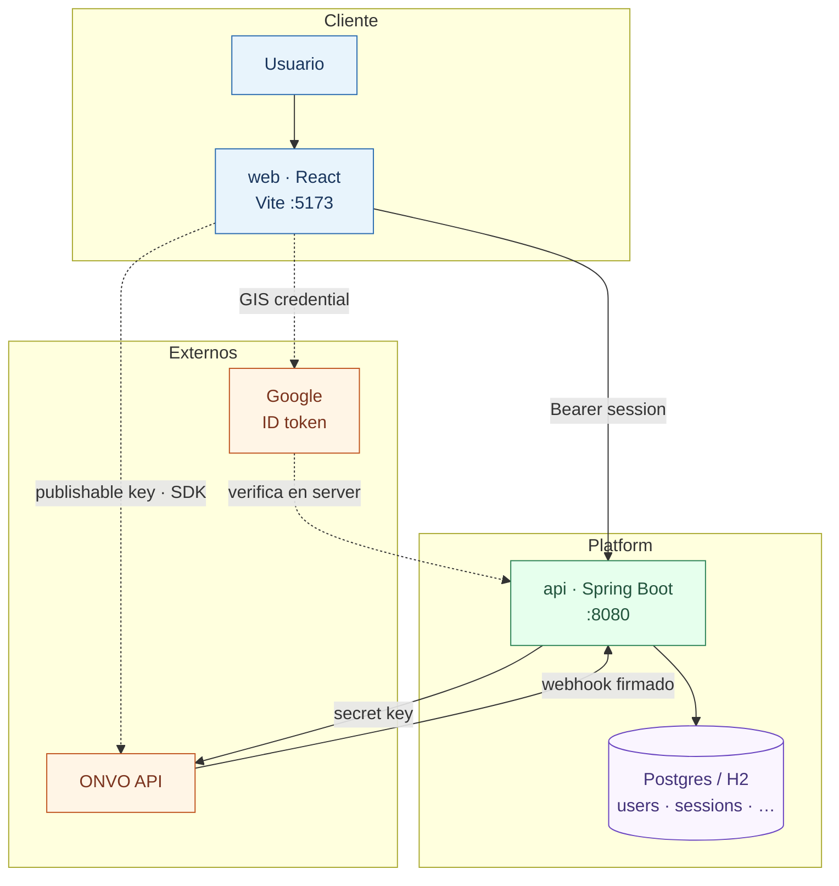
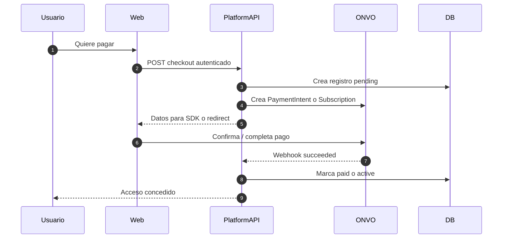

# 02 — Mapa del sistema

## Qué es Platform en este aprendizaje

Platform es un monorepo real:

| Carpeta | Rol |
|---------|-----|
| `api/` | Backend Spring Boot (REST, seguridad, DB, llamadas a ONVO) |
| `web/` | Frontend React (UI, SDK ONVO con publishable key) |
| `03-ONVO Pay/` | Docs y Postman de ONVO |
| `04-Learning Path/` | Esta guía |
| `00-Planning/` | Decisiones de producto (MVP3, membresías) |

## Diagrama de actores

## Separación de responsabilidades

| Pregunta | Quién responde |
|----------|----------------|
| ¿El usuario está logueado en Platform? | `api` (sesiones) + `web` (token) — detalle en [09-auth-y-sesiones](09-auth-y-sesiones.md) |
| ¿Cómo se ve el plan de membresía? | `web` UI + catálogo en `api` DB |
| ¿Dónde vive el número de tarjeta? | **Solo en ONVO** (tokenizado) |
| ¿Se puede cobrar? | `api` con secret key → ONVO |
| ¿La membresía está activa? | `api` DB actualizada por **webhooks** |

## Analogía con lo que ya existe

Hoy ya tenés un patrón igual con Google:

| Hoy (auth) | Mañana (ONVO) |
|------------|---------------|
| `AuthService` | `MembershipService` / `PaymentService` |
| `GoogleTokenVerifier` | `OnvoClient` |
| Session en DB | `payment_customers`, `memberships`, etc. |
| Front manda Google ID token | Front manda `paymentMethodId` / usa SDK |

**Idea clave:** el Controller no habla con Google/ONVO directo; un **adaptador** lo hace.

Tour completo del login ya implementado: [09-auth-y-sesiones.md](09-auth-y-sesiones.md).

## Flujo mental de un cobro (vista de capas)

## Qué NO hace el frontend

- No guarda `ONVO_SECRET_KEY`.
- No decide solo “el usuario pagó, dale acceso premium”.
- No llama endpoints secretos de ONVO que requieren server key (crear intents, refunds, etc.), salvo lo que el SDK documente con publishable key.

Cuando entiendas este mapa, pasá a [03-keys-y-secretos.md](03-keys-y-secretos.md).
