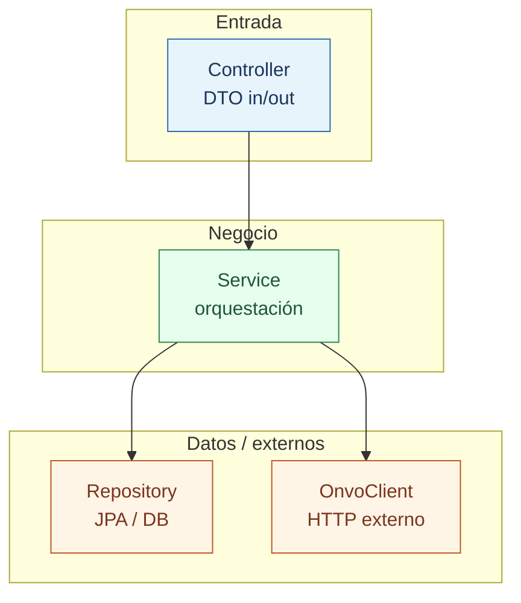

# 04 — Spring Boot para novatos

Vas a tocar Spring todo el path. Esta página es tu base. Releela cuando un spring diga “concepto nuevo: X”.

## ¿Qué es Spring Boot?

Framework Java que te da:

- un servidor HTTP embebido (Tomcat),
- inyección de dependencias,
- seguridad, JPA, validación, etc. por “starters”.

En Platform el entrypoint es `ApiApplication.java`. Al arrancar, Spring:

1. Escanea el paquete `com.platform.api`
2. Crea **beans** (`@Service`, `@RestController`, `@Repository`, `@Configuration`…)
3. Conecta dependencias por **constructor**
4. Levanta el puerto (default `8080`)

## Capas que vas a usar siempre



| Capa | Anotación típica | Responsabilidad |
|------|------------------|-----------------|
| Controller | `@RestController` | URL, status code, DTO in/out |
| Service | `@Service` | Reglas de negocio, orquestación |
| Repository | `JpaRepository` | SQL vía JPA |
| Client | `@Component` | Hablar con ONVO |

**Regla:** el Controller no llama a ONVO ni hace SQL complejo. Eso es del Service / Client.

## Dependency Injection (DI)

Mal (vos creás todo):

```java
public AuthService() {
  this.repo = new UserRepository(); // Spring no controla esto
}
```

Bien (como Platform ya hace):

```java
public AuthService(UserRepository userRepository, ...) {
  this.userRepository = userRepository;
}
```

Spring ve el constructor y **inyecta** el bean correcto. Por eso en los springs pedimos **constructor injection only**.

## Anotaciones que vas a ver

| Anotación | Para qué |
|-----------|----------|
| `@RestController` | Clase HTTP REST |
| `@RequestMapping` / `@GetMapping` / `@PostMapping` | Rutas |
| `@Valid` | Validar DTO de entrada |
| `@Service` | Lógica de negocio |
| `@Transactional` | Transacción de DB |
| `@ConfigurationProperties` | Bind de `application.yml` / env a un objeto tipado |
| `@Value` | Leer una property suelta (preferí Properties cuando crezca) |
| `@Profile("local")` | Bean solo en un profile |
| `@PreAuthorize` | Autorización por permiso/rol |

## Profiles `local` vs `prod`

| | `local` | `prod` |
|--|---------|--------|
| DB | H2 o Docker Postgres | Neon/Postgres real |
| Swagger | ON | OFF |
| Secrets | `api/.env` | Env del hosting |

Archivos: `application.yml` + `application-local.yml` + `application-prod.yml`.

## Persistencia: Entity ≠ JSON público

- **Entity:** tabla (`User`, luego `PaymentCustomer`…).
- **DTO/Record:** lo que sale por la API (`UserResponse`).

Nunca devuelvas la Entity cruda (podés filtrar passwords, lazy loads, etc.).

## Flyway

Cambios de schema = archivos SQL:

```text
api/src/main/resources/db/migration/V6__payment_customers.sql
```

Con `ddl-auto: validate`, **Hibernate no crea tablas**: Flyway es la fuente de verdad. Cada spring que necesite tablas nuevas agrega una migración.

## Cómo Platform ya autentica

Resumen (detalle + diagramas + tour de archivos → **[09-auth-y-sesiones.md](09-auth-y-sesiones.md)**):

1. Login → `AuthService` crea session + token opaco.
2. Front guarda token y manda `Authorization: Bearer …`.
3. `JwtOrSessionAuthenticationFilter` valida el token contra la tabla `sessions`.
4. Controllers protegidos exigen autenticación.

Tus endpoints de billing irán **autenticados** (excepto el webhook de ONVO, que es público pero firmado).

## Errores

Usá el mismo estilo que `GlobalExceptionHandler` / Problem Details. No inventes JSON de error distinto por feature.

## Mini-ejercicio mental

Antes de seguir, respondé:

1. ¿Qué es un bean?
2. ¿Por qué el Service existe si el Controller podría llamar al Repository?
3. ¿Dónde pondrías la llamada HTTP a ONVO?

Si podés responder, seguí a [09-auth-y-sesiones.md](09-auth-y-sesiones.md) y después [05-http-rest-y-estados.md](05-http-rest-y-estados.md).
