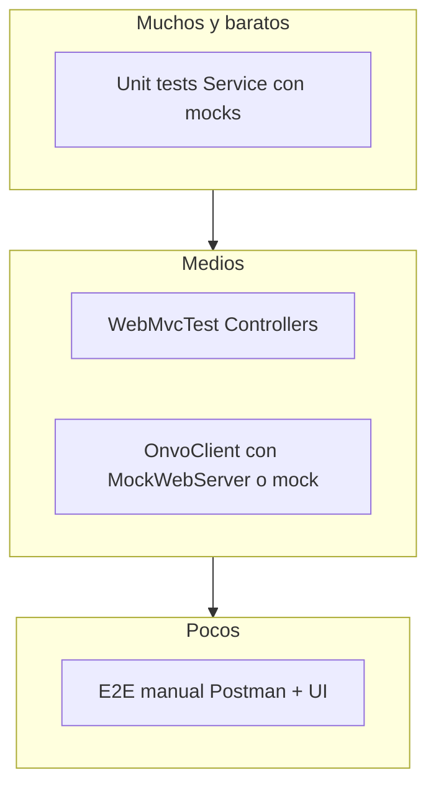

# 06 — Testing en Platform

Hoy el repo casi no tiene tests reales (`ApiApplicationTests` es placeholder). Este path te obliga a **crecer la disciplina de testing** spring a spring, sin pedirte Testcontainers el día 1.

## Pirámide práctica para este proyecto



## Qué testear por capa

| Capa | Qué assert | Herramienta |
|------|------------|-------------|
| Service | Reglas (pending→active, no duplicar customer) | JUnit + Mockito |
| Controller | Status codes, auth required, validación | `@WebMvcTest` + `spring-security-test` |
| OnvoClient | URL, headers, parseo JSON, error mapping | Mock / WireMock / MockWebServer |
| Webhook | Firma inválida → 401; evento duplicado → no side effects | Unit + slice |
| Front | Flujos críticos (checkout button disabled, error toast) | Empezá manual; luego Testing Library si te sentís listo |

## Política mínima por spring (DoD)

Cada spring de implementación debe dejar **al menos**:

1. **1 test de Service** feliz + 1 de error/regla de negocio.
2. **Smoke manual** documentado (pasos en el spring).
3. A partir de S05: test de **idempotencia de webhook**.

No hace falta cobertura 100%. Sí hace falta el hábito.

## Cómo mockear ONVO

Nunca llames ONVO real desde CI unitario.

```text
MembershipService → OnvoClient (interface)
tests → mock(OnvoClient)
```

En S01 vas a crear `OnvoClient` de forma que sea **fácil de mockear** (interfaz o clase con métodos claros).

## Datos de prueba

- Usá keys **test** de ONVO para demos manuales.
- Cards de prueba: ver docs ONVO “Pruebas” / Postman.
- En DB local: H2 o Docker; no uses prod.

## Comando típico

```bash
cd api
./mvnw test
```

(En Windows Git Bash: igual, o `mvnw.cmd test`.)

Siguiente: [07-plantilla-sdlc.md](07-plantilla-sdlc.md).
