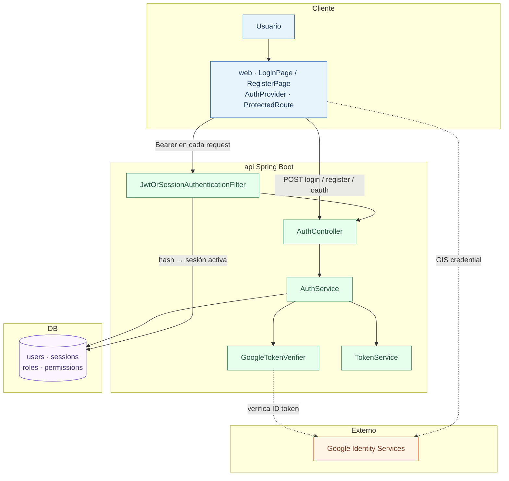
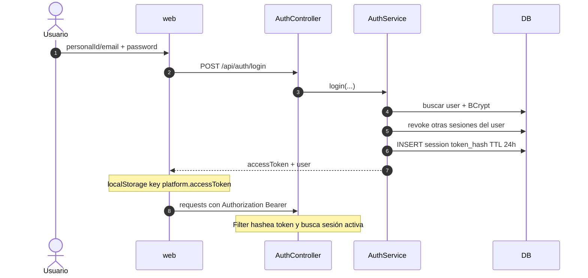
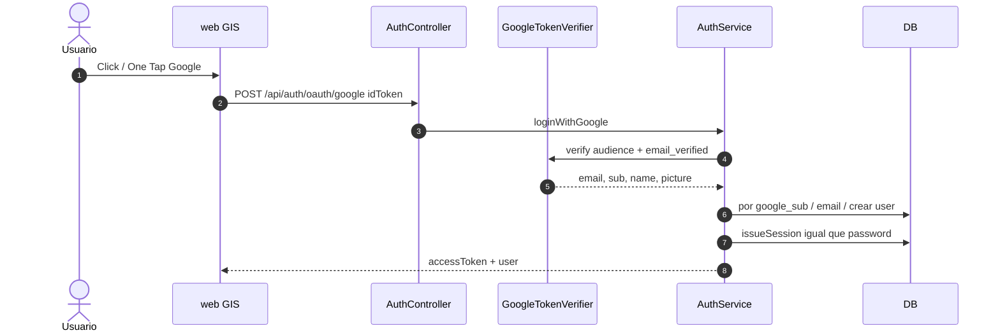

# 09 — Auth y sesiones (lo que ya existe)

Auth de Platform **ya está implementado** (MVP1 + Google SSO). Esta página no te pide codearlo de cero: te pide **entenderlo**, porque es el mismo patrón mental que vas a repetir con ONVO.

Spec canónica (inglés): [00-Planning/03-security.md](../../00-Planning/03-security.md).  
Setup Google: [GOOGLE-SSO-SETUP.md](../../01-Project%20Instructions/GOOGLE-SSO-SETUP.md).

---

## Idea clave

| Hoy (auth) | Mañana (ONVO) |
|------------|---------------|
| `AuthService` | `MembershipService` / `PaymentService` |
| `GoogleTokenVerifier` | `OnvoClient` |
| Session en DB (`sessions`) | `payment_customers`, `memberships`, … |
| Front manda password o Google ID token | Front manda `paymentMethodId` / usa SDK |

**El Controller no habla con Google/ONVO directo; un adaptador lo hace.** El token de sesión de Platform es **opaco** (random bytes), no un JWT “solo client-side”: el servidor guarda el **hash** y puede revocar.

---

## Endpoints

| Método | Path | Auth | Qué hace |
|--------|------|------|----------|
| `POST` | `/api/auth/login` | público | Password → sesión |
| `POST` | `/api/auth/register` | público | Alta USER + auto-login |
| `POST` | `/api/auth/oauth/google` | público | ID token Google → sesión |
| `POST` | `/api/auth/logout` | Bearer | Revoca sesión |
| `GET` | `/api/auth/me` | Bearer | Usuario + roles + permissions |

Respuesta típica de login/register/Google: `{ accessToken, user }`.

---

## Diagrama de capas

---

## Flujo password (secuencia)

### Reglas de sesión

1. **Una sesión activa por user** — un login nuevo revoca las anteriores.
2. **TTL 24 h** (`app.session.ttl-hours`) o logout inmediato.
3. En DB solo `token_hash` (SHA-256). El token crudo viaja al cliente una vez.
4. El filtro se llama `JwtOrSessionAuthenticationFilter`, pero hoy valida **tokens opacos de sesión**, no JWT firmados.

---

## Flujo Google SSO

- Cuenta solo-Google: `password_hash` null → no puede usar login password hasta “set password” (aún no implementado).
- Tras logout, el front marca skip de auto-login Google para no reabrir One Tap al toque.

---

## Tour de archivos (leé en este orden)

### Backend (`api/`)

| Orden | Archivo | Qué mirar |
|-------|---------|-----------|
| 1 | `auth/AuthController.java` | Rutas públicas vs Bearer |
| 2 | `auth/AuthService.java` | `login`, `register`, `loginWithGoogle`, **`issueSession`** |
| 3 | `auth/GoogleTokenVerifier.java` | Audience = `GOOGLE_CLIENT_ID` |
| 4 | `auth/Session.java` + `SessionRepository` | `tokenHash`, `expiresAt`, `revokedAt` |
| 5 | `security/JwtOrSessionAuthenticationFilter.java` | Bearer → hash → SecurityContext |
| 6 | `security/TokenService.java` | Generar opaco + SHA-256 |
| 7 | `config/SecurityConfig.java` | Allowlist: login, register, oauth, health, swagger… |

Migraciones útiles: `V1__init_schema.sql` (users/sessions), `V3__google_sso.sql`.

### Frontend (`web/`)

| Orden | Archivo | Qué mirar |
|-------|---------|-----------|
| 1 | `pages/LoginPage.tsx` / `RegisterPage.tsx` | Form + Google button |
| 2 | `auth/AuthContext.tsx` | Bootstrap con `/me`, store token |
| 3 | `api/client.ts` | `platform.accessToken`, `apiFetch` + Bearer |
| 4 | `auth/ProtectedRoute.tsx` | Sin token → `/login` |
| 5 | `ui/GoogleSignInButton.tsx` + `ui/googleIdentity.ts` | GIS |

Env: `VITE_GOOGLE_CLIENT_ID`, `GOOGLE_CLIENT_ID` (api), `VITE_API_URL`.

---

## Qué falta (no lo inventés en S00)

Planeado / fuera de alcance actual:

- Email verification, forgot/reset password, set-password para Google-only
- HttpOnly cookies / refresh tokens
- Rate limit en endpoints públicos de auth
- Otros IdPs

Cuando cobres membresías, vas a **extender** `/me` (ej. bloque `membership` en S07), no reemplazar este modelo.

---

## Teach-back (cerrá esta lectura)

Sin mirar el código, respondé:

1. ¿Por qué guardamos `token_hash` y no el token crudo en DB?
2. ¿Quién valida el Google ID token: el browser o Spring?
3. ¿Qué pasa con las otras sesiones cuando hacés login de nuevo?
4. Analogía: `GoogleTokenVerifier` es a Google lo que `OnvoClient` será a ONVO — ¿dónde vive cada uno?

Si fallás 2+, releé `AuthService.issueSession` y el Filter. Luego S00 sesión 2/2 te pide caminar el flujo en runtime.

**Siguiente en fundamentos:** [05-http-rest-y-estados.md](05-http-rest-y-estados.md) (si venís de Spring) o [S00](../springs/S00-laboratorio-y-keys.md) cuando Fase 0 esté lista.
