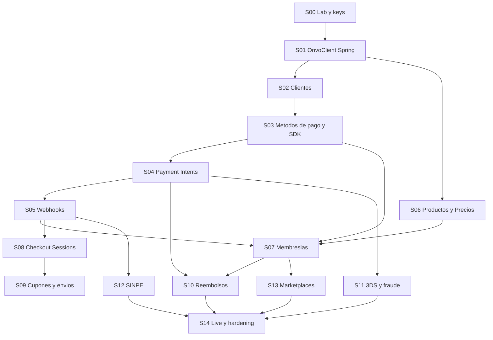

# 04 — Learning Path: ONVO + desarrollo full-stack

Guía personal para aprender **desarrollo web completo** usando Platform (Spring Boot + React) e integrando **ONVO Pay**.

No es solo documentación de pagos: cada **spring** termina una funcionalidad vertical (backend + frontend + base de datos + tests) y te obliga a entender el *por qué* de cada capa.

**Estado:** curriculum listo para estudiar e implementar spring por spring.  
**Idioma de esta guía:** español.  
**Código del repo:** inglés (como el resto de Platform).

---

## Cómo usar este path

1. Leé [00-fundamentos/](00-fundamentos/) en orden (al menos una vez).
2. Abrí el spring actual en [springs/](springs/).
3. Seguí su SDLC completo antes de pasar al siguiente.
4. Marcá el progreso en [progress.md](progress.md).
5. Cuando te trabés: releé el fundamento citado + [glossary.md](glossary.md).

**Regla de oro:** no saltees springs. Cada uno asume lo anterior.

---

## Mapa de springs

| Spring | Tema | Resultado que vas a poder demostrar |
|--------|------|-------------------------------------|
| [S00](springs/S00-laboratorio-y-keys.md) | Laboratorio y keys | Env locales + Postman autenticado |
| [S01](springs/S01-cliente-onvo-en-spring.md) | Cliente HTTP ONVO | Spring llama ONVO con secret key |
| [S02](springs/S02-clientes.md) | Clientes | CRUD Platform ↔ ONVO + UI |
| [S03](springs/S03-metodos-de-pago-y-sdk.md) | Métodos de pago + SDK | Tarjeta tokenizada sin tocar PAN |
| [S04](springs/S04-intenciones-de-pago.md) | Payment Intents | Cobro one-shot end-to-end |
| [S05](springs/S05-webhooks.md) | Webhooks | Estado de negocio confirmado por ONVO |
| [S06](springs/S06-productos-y-precios.md) | Productos y precios | Catálogo de planes |
| [S07](springs/S07-membresias-y-cargos-recurrentes.md) | Membresías | Suscripción + acceso gated |
| [S08](springs/S08-sesiones-de-checkout.md) | Checkout Sessions | Pago hosted / links |
| [S09](springs/S09-cupones-y-envios.md) | Cupones y envíos | Descuentos + shipping |
| [S10](springs/S10-reembolsos-y-cancelaciones.md) | Reembolsos / cancel | Compensar y cancelar |
| [S11](springs/S11-3ds-y-fraude.md) | 3DS y fraude | Flujos de autenticación |
| [S12](springs/S12-sinpe-movil-y-pin.md) | SINPE | Rails locales CR |
| [S13](springs/S13-marketplaces.md) | Marketplaces | Cuentas conectadas |
| [S14](springs/S14-produccion-y-hardening.md) | Producción | Live keys + hardening |

---

## Principios (no negociables)

1. **Vertical slice:** cada spring cierra back + front + DB + tests.
2. **Secret key solo en servidor** (`api/.env`). Publishable key puede ir al front.
3. **Webhooks = fuente de verdad** del “ya pagó”. El `onSuccess` del browser no basta.
4. **Un concepto nuevo por spring** — leélo antes de copiar código.
5. **SDLC completo** — usá la [plantilla](00-fundamentos/07-plantilla-sdlc.md).

---

## Referencias del monorepo

| Recurso | Para qué |
|---------|----------|
| [../api/](../api/) | Backend Spring Boot |
| [../web/](../web/) | Frontend Vite + React |
| [../03-ONVO Pay/](../03-ONVO%20Pay/) | Docs ONVO cacheadas + Postman |
| [../00-Planning/07-payments-memberships.md](../00-Planning/07-payments-memberships.md) | Diseño de membresías MVP3 |
| [../00-Planning/02-springboot.md](../00-Planning/02-springboot.md) | Convenciones Spring del proyecto |
| [../01-Project Instructions/HOW-TO-RUN.md](../01-Project%20Instructions/HOW-TO-RUN.md) | Cómo levantar el entorno |

---

## Keys (resumen)

Detalle completo: [00-fundamentos/03-keys-y-secretos.md](00-fundamentos/03-keys-y-secretos.md).

| Variable | Dónde | Quién la usa |
|----------|-------|--------------|
| `ONVO_SECRET_KEY` | `api/.env` (nunca git) | Backend → API ONVO |
| `ONVO_PUBLIC_KEY` | `web/.env` como `VITE_ONVO_PUBLIC_KEY` | Frontend / SDK |
| `ONVO_WEBHOOK_SECRET` | `api/.env` | Verificar webhooks |

Empezá siempre con llaves **`onvo_test_...`**. Live solo en S14.
