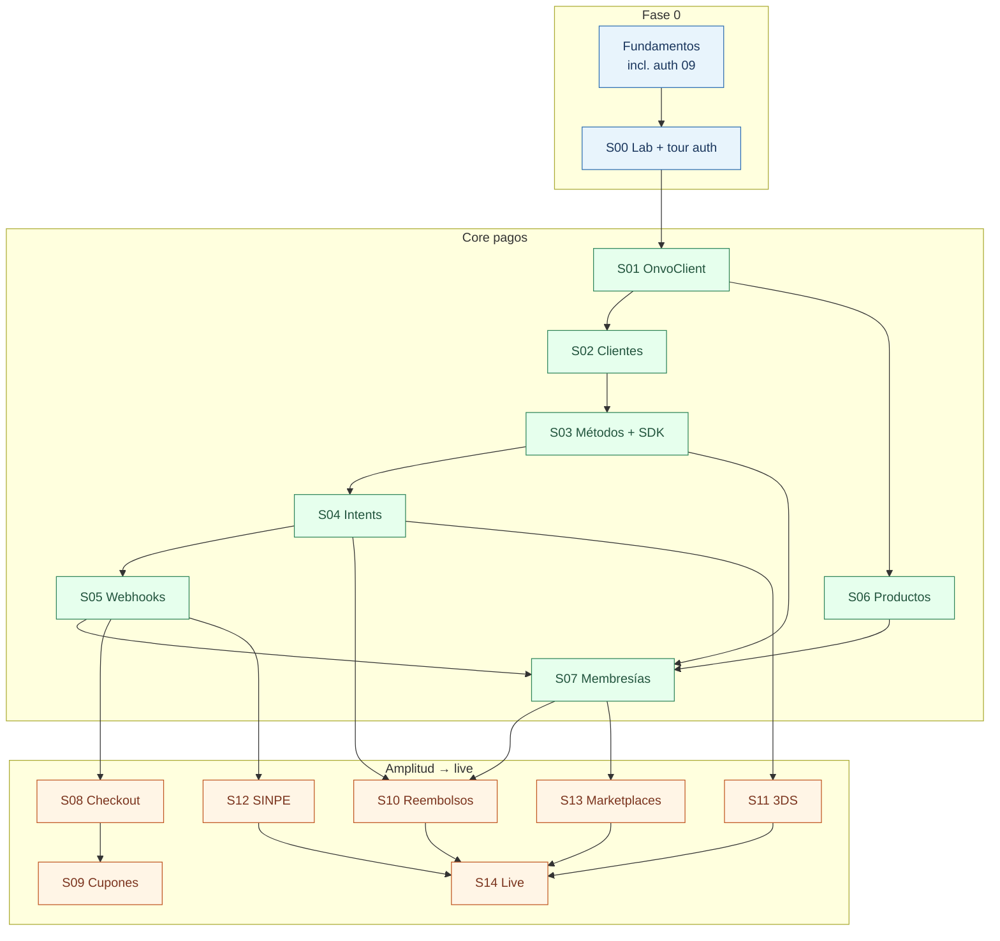

# 04 — Learning Path: ONVO + desarrollo full-stack

Guía personal para aprender **desarrollo web completo** usando Platform (Spring Boot + React) e integrando **ONVO Pay**.

No es solo documentación de pagos: cada **spring** termina una funcionalidad vertical (backend + frontend + base de datos + tests) y te obliga a entender el *por qué* de cada capa.

**Estado:** curriculum listo · ritmo calibrado a **~2 h/día**.  
**Idioma de esta guía:** español.  
**Código del repo:** inglés (como el resto de Platform).

---

## Cómo usar este path

1. Leé [00-fundamentos/](00-fundamentos/) empezando por [01](00-fundamentos/01-como-aprender.md) y **[08-ritmo-2h](00-fundamentos/08-ritmo-2h.md)** (obligatorio). Incluí [09-auth-y-sesiones](00-fundamentos/09-auth-y-sesiones.md) antes de S00.
2. Seguí el calendario por **sesiones de 2 h**, no por “terminar el spring hoy”.
3. Abrí el spring actual → sección **Sesiones (~2 h)**.
4. Teach-back al cerrar cada sesión · marcá [progress.md](progress.md).
5. Si te trabás: fundamento citado + [glossary.md](glossary.md). Día light permitido (ver ritmo).

**Regla de oro:** no saltees springs. No fusiones 3 sesiones en una noche.

**Expectativa honesta:** core S00–S07 ≈ **6 semanas**; path completo ≈ **9–11 semanas** (con buffers). Auth ya está en el repo: lo **estudiás**, no lo reescribís.

---

## Mapa de springs

| Spring | Tema | Sesiones ~2h | Resultado |
|--------|------|--------------|-----------|
| [S00](springs/S00-laboratorio-y-keys.md) | Laboratorio, keys y tour auth | 2 | Env + Postman + entender login |
| [S01](springs/S01-cliente-onvo-en-spring.md) | Cliente HTTP ONVO | 2 | Spring ↔ ONVO |
| [S02](springs/S02-clientes.md) | Clientes | 3 | Customer + UI |
| [S03](springs/S03-metodos-de-pago-y-sdk.md) | Métodos de pago + SDK | 3 | Tarjeta tokenizada |
| [S04](springs/S04-intenciones-de-pago.md) | Payment Intents | 3 | Cobro one-shot |
| [S05](springs/S05-webhooks.md) | Webhooks | 4 | Verdad del pago |
| [S06](springs/S06-productos-y-precios.md) | Productos y precios | 2 | Catálogo planes |
| [S07](springs/S07-membresias-y-cargos-recurrentes.md) | Membresías | 6 | Sub + gate |
| [S08](springs/S08-sesiones-de-checkout.md) | Checkout Sessions | 2 | Hosted pay |
| [S09](springs/S09-cupones-y-envios.md) | Cupones y envíos | 2 | Discount/ship |
| [S10](springs/S10-reembolsos-y-cancelaciones.md) | Reembolsos / cancel | 3 | Compensar |
| [S11](springs/S11-3ds-y-fraude.md) | 3DS y fraude | 2 | Challenge |
| [S12](springs/S12-sinpe-movil-y-pin.md) | SINPE | 2 | Rails CR |
| [S13](springs/S13-marketplaces.md) | Marketplaces | 3 | Connected accts |
| [S14](springs/S14-produccion-y-hardening.md) | Producción | 2–3 | Live checklist |

---

## Principios (no negociables)

1. **Vertical slice por spring** — pero **partido en sesiones diarias**.
2. **Secret key solo en servidor** (`api/.env`). Publishable key puede ir al front.
3. **Webhooks = fuente de verdad** del “ya pagó”.
4. **Un concepto nuevo por sesión** cuando el spring es denso.
5. **SDLC** — [plantilla](00-fundamentos/07-plantilla-sdlc.md); el diseño puede ser una sesión entera.
6. **Teach-back** al cerrar cada sesión de 2 h.

---

## Referencias del monorepo

| Recurso | Para qué |
|---------|----------|
| [../api/](../api/) | Backend Spring Boot |
| [../web/](../web/) | Frontend Vite + React |
| [../03-ONVO Pay/](../03-ONVO%20Pay/) | Docs ONVO cacheadas + Postman |
| [../00-Planning/07-payments-memberships.md](../00-Planning/07-payments-memberships.md) | Diseño de membresías MVP3 |
| [../00-Planning/03-security.md](../00-Planning/03-security.md) | Spec de sesiones / auth |
| [../00-Planning/02-springboot.md](../00-Planning/02-springboot.md) | Convenciones Spring del proyecto |
| [../01-Project Instructions/HOW-TO-RUN.md](../01-Project%20Instructions/HOW-TO-RUN.md) | Cómo levantar el entorno |
| [00-fundamentos/09-auth-y-sesiones.md](00-fundamentos/09-auth-y-sesiones.md) | Tour del login ya implementado |

---

## Keys (resumen)

Detalle: [00-fundamentos/03-keys-y-secretos.md](00-fundamentos/03-keys-y-secretos.md).

| Variable | Dónde | Quién la usa |
|----------|-------|--------------|
| `ONVO_SECRET_KEY` | `api/.env` (nunca git) | Backend → API ONVO |
| `ONVO_PUBLIC_KEY` | `web/.env` → `VITE_ONVO_PUBLIC_KEY` | Frontend / SDK |
| `ONVO_WEBHOOK_SECRET` | `api/.env` | Verificar webhooks |

Empezá con **`onvo_test_...`**. Live solo en S14.
