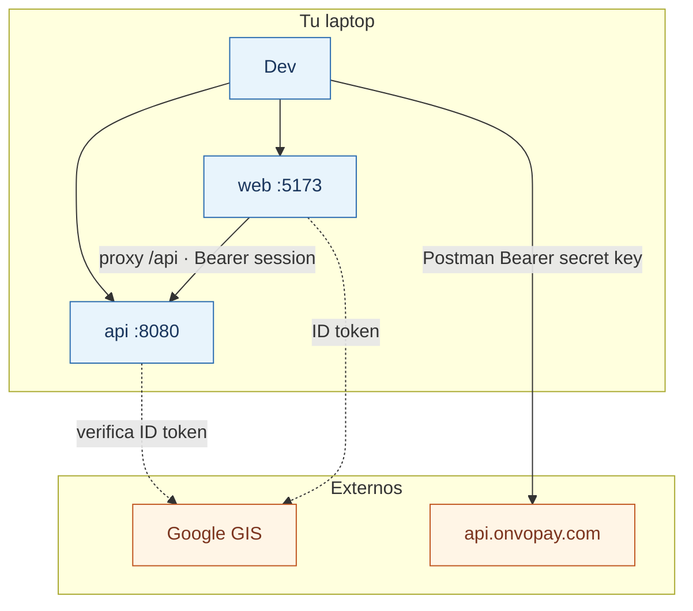

# S00 — Laboratorio y keys

**Objetivo:** dejar el entorno listo y **entender el login que ya existe**, antes de tocar ONVO en código.

**Conceptos nuevos:** profiles Spring, `.env`, CORS, proxy Vite, test vs live keys, sesión opaca Bearer.

**Prerequisitos:** [fundamentos 01–04 + 09 auth](../00-fundamentos/01-como-aprender.md), [08-ritmo-2h](../00-fundamentos/08-ritmo-2h.md), [HOW-TO-RUN](../../01-Project%20Instructions/HOW-TO-RUN.md).

---

## Sesiones (~2 h)

| # | Meta de la sesión | Al cerrar debés poder… |
|---|-------------------|------------------------|
| **1/2** | Cuenta ONVO + env + Postman + Platform up | Autenticar Postman y decir qué key usaste |
| **2/2** | Tour auth (password + Google + Filter) | Explicar `issueSession` y por qué hay `token_hash` |

**Base:** checklist Implement del spring.  
**Reto:** sin mirar docs, dibujá el flujo Dev → Postman → ONVO **y** User → login → Bearer → `/me`.  
**Boss:** escribí tu propia checklist de “día 0 en una laptop nueva” incluyendo Google Client ID.

---

## 1. Requirements

- Poder levantar `api` + `web` local.
- Tener cuenta ONVO sandbox y keys test.
- Importar Postman y listar un recurso (ej. customers o products) con secret key.
- Entender dónde vive cada secreto.
- Poder narrar el flujo de login (código ya escrito; no lo reimplementés).

**Fuera de alcance:** código de integración ONVO en Spring (eso es S01). No inventar reset-password ni cookies HttpOnly.

## 2. Design



## 3. Implement (checklist guiado)

### Sesión 1/2 — Lab

#### A. Platform

1. Seguí [HOW-TO-RUN.md](../../01-Project%20Instructions/HOW-TO-RUN.md).
2. Confirmá login en `http://localhost:5173` (password o Google).
3. Abrí Swagger local si está activo (`/swagger-ui`).

#### B. ONVO Dashboard

1. Creá / entró a cuenta en [onvopay.com](https://onvopay.com).
2. Copiá:
   - Secret test key
   - Publishable test key
   - Webhook signing secret (si ya podés crearlo; si no, en S05)
3. Dejalas en un password manager o notas **privadas**, no en git.

#### C. Env files

`api/.env` (gitignored):

```env
GOOGLE_CLIENT_ID=...
ONVO_SECRET_KEY=onvo_test_secret_key_...
ONVO_WEBHOOK_SECRET=...
```

`web/.env`:

```env
VITE_API_URL=http://localhost:8080
VITE_GOOGLE_CLIENT_ID=...
VITE_ONVO_PUBLIC_KEY=onvo_test_publishable_key_...
```

Actualizá también los `.env.example` con **nombres de variables vacíos** (sin valores reales) cuando implementes S01.

#### D. Postman

1. Importá [`03-ONVO Pay/postman.json`](../../03-ONVO%20Pay/postman.json).
2. Variable `secretApiKey` = tu secret test.
3. Probá un GET simple (ej. listar customers o products según exista data).

### Sesión 2/2 — Tour auth

Leé primero [09-auth-y-sesiones.md](../00-fundamentos/09-auth-y-sesiones.md) si no lo cerraste en Fase 0.

1. Abrí `AuthService.issueSession` y seguí: revoke → token opaco → hash → TTL.
2. En DevTools → Network: login → copiá que la respuesta trae `accessToken`; un request a `/api/auth/me` manda `Authorization: Bearer …`.
3. Abrí `JwtOrSessionAuthenticationFilter` y ubicá dónde hashea el Bearer.
4. (Opcional) Login password + logout + login Google; notá One Tap / skip post-logout.
5. Teach-back de los 4 puntos del fundamento 09.

## 4. Test / verificación

### Sesión 1/2

- [ ] `api` health OK
- [ ] `web` login OK
- [ ] Postman 401 sin key / 200 o lista vacía con key
- [ ] `git status` no muestra `.env` con secrets

### Sesión 2/2

- [ ] Podés señalar en código `issueSession` y el Filter
- [ ] Sabés diferenciar Bearer de **sesión Platform** vs Bearer **secret ONVO**
- [ ] Teach-back 09 pasado (sin mirar)

## 5. DoD

- [ ] Entorno documentado en tus notas (qué comandos usaste)
- [ ] Keys test listas
- [ ] Postman funciona
- [ ] Leíste [03-keys-y-secretos](../00-fundamentos/03-keys-y-secretos.md) y [09-auth-y-sesiones](../00-fundamentos/09-auth-y-sesiones.md)
- [ ] Sesiones 1/2 y 2/2 con teach-back

## 6. Lecturas

- [Autenticación ONVO](https://docs.onvopay.com/authentication) (keys de ONVO — distinto a tu login)
- [03-ONVO Pay/README](../../03-ONVO%20Pay/README.md)
- [09-auth-y-sesiones](../00-fundamentos/09-auth-y-sesiones.md)
- [00-Planning/03-security.md](../../00-Planning/03-security.md) (si querés profundidad)

## 7. Demo (3–5 min)

Mostrá: login Platform + Network con Bearer de sesión + un request Postman exitoso a ONVO (secret key). Decí en voz alta la diferencia entre los dos Bearers.

---

**Siguiente:** [S01 — Cliente ONVO en Spring](S01-cliente-onvo-en-spring.md)
