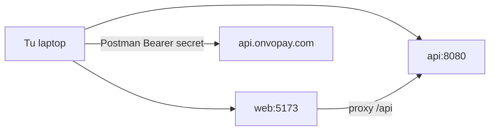

# S00 — Laboratorio y keys

**Objetivo:** dejar el entorno listo para aprender: Platform corriendo, keys ONVO test configuradas, Postman autenticado.

**Conceptos nuevos:** profiles Spring, `.env`, CORS, proxy Vite, test vs live keys.

**Prerequisitos:** [fundamentos 01–03](../00-fundamentos/01-como-aprender.md), [HOW-TO-RUN](../../01-Project%20Instructions/HOW-TO-RUN.md).

---

## Sesiones (~2 h)

| # | Meta de la sesión | Al cerrar debés poder… |
|---|-------------------|------------------------|
| **1/1** | Cuenta ONVO + env + Postman + Platform up | Autenticar Postman y decir qué key usaste |

**Base:** checklist Implement del spring.  
**Reto:** sin mirar docs, dibujá el flujo Dev → Postman → ONVO.  
**Boss:** escribí tu propia checklist de “día 0 en una laptop nueva”.

---

## 1. Requirements

- Poder levantar `api` + `web` local.
- Tener cuenta ONVO sandbox y keys test.
- Importar Postman y listar un recurso (ej. customers o products) con secret key.
- Entender dónde vive cada secreto.

**Fuera de alcance:** código de integración ONVO en Spring (eso es S01).

## 2. Design



## 3. Implement (checklist guiado)

### A. Platform

1. Seguí [HOW-TO-RUN.md](../../01-Project%20Instructions/HOW-TO-RUN.md).
2. Confirmá login en `http://localhost:5173`.
3. Abrí Swagger local si está activo (`/swagger-ui`).

### B. ONVO Dashboard

1. Creá / entró a cuenta en [onvopay.com](https://onvopay.com).
2. Copiá:
   - Secret test key
   - Publishable test key
   - Webhook signing secret (si ya podés crearlo; si no, en S05)
3. Dejalas en un password manager o notas **privadas**, no en git.

### C. Env files

`api/.env` (gitignored):

```env
GOOGLE_CLIENT_ID=...
ONVO_SECRET_KEY=onvo_test_secret_key_...
ONVO_WEBHOOK_SECRET=...
```

`web/.env`:

```env
VITE_API_URL=http://localhost:8080
VITE_GOOGLE_CLIENT_ID=...
VITE_ONVO_PUBLIC_KEY=onvo_test_publishable_key_...
```

Actualizá también los `.env.example` con **nombres de variables vacíos** (sin valores reales) cuando implementes S01.

### D. Postman

1. Importá [`03-ONVO Pay/postman.json`](../../03-ONVO%20Pay/postman.json).
2. Variable `secretApiKey` = tu secret test.
3. Probá un GET simple (ej. listar customers o products según exista data).

## 4. Test / verificación

- [ ] `api` health OK
- [ ] `web` login OK
- [ ] Postman 401 sin key / 200 o lista vacía con key
- [ ] `git status` no muestra `.env` con secrets

## 5. DoD

- [ ] Entorno documentado en tus notas (qué comandos usaste)
- [ ] Keys test listas
- [ ] Postman funciona
- [ ] Leíste [03-keys-y-secretos](../00-fundamentos/03-keys-y-secretos.md)

## 6. Lecturas

- [Autenticación ONVO](https://docs.onvopay.com/authentication)
- [03-ONVO Pay/README](../../03-ONVO%20Pay/README.md)

## 7. Demo (3 min)

Mostrá: login Platform + un request Postman exitoso a ONVO.

---

**Siguiente:** [S01 — Cliente ONVO en Spring](S01-cliente-onvo-en-spring.md)
