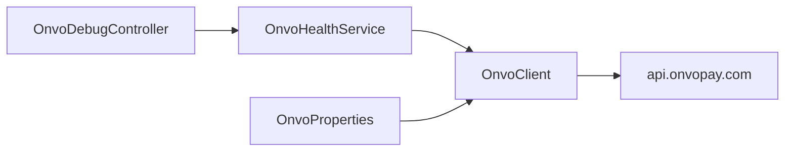

# S01 — Cliente ONVO en Spring

**Objetivo:** que el backend Platform pueda llamar a ONVO de forma limpia, configurable y testeable.

**Conceptos nuevos:** `@ConfigurationProperties`, `RestClient`, mapeo de errores HTTP externos, interfaz cliente.

**Prerequisitos:** S00 done.

---

## Sesiones (~2 h)

| # | Meta | Al cerrar… |
|---|------|------------|
| **1/2** | Diseño + `OnvoProperties` + `.env.example` | Explicás por qué no va `@Value` suelto por todos lados |
| **2/2** | `OnvoClient` + ping autenticado + test mínimo | Spring pega a ONVO; sabés dónde vive el Bearer |

**Base:** DoD del spring.  
**Reto:** mapeá un error 401 de ONVO a un Problem Detail claro.  
**Boss:** interfaz `OnvoClient` + impl, para mockear en tests sin reflexionar.

---

## 1. Requirements

- Config `app.onvo.base-url`, `secret-key` desde env.
- Componente `OnvoClient` (paquete sugerido `com.platform.api.onvo`).
- Endpoint interno de smoke **protegido** (solo autenticado), ej. `GET /api/onvo/health` o `GET /api/onvo/ping` que haga un GET simple a ONVO y devuelva un resumen seguro (sin filtrar la key).
- Test unitario del client con HTTP mockeado o service mock.

**Fuera de alcance:** UI de pagos, customers de negocio.

## 2. Design



### Archivos sugeridos

```text
api/src/main/java/com/platform/api/onvo/
  OnvoProperties.java
  OnvoClient.java
  OnvoException.java
  OnvoHealthController.java   # opcional nombre
api/src/main/resources/application.yml  # app.onvo.*
api/.env.example  # ONVO_SECRET_KEY=
```

## 3. Implement (guía)

1. Agregá properties:

```yaml
app:
  onvo:
    base-url: https://api.onvopay.com
    secret-key: ${ONVO_SECRET_KEY:}
```

2. `@EnableConfigurationProperties(OnvoProperties.class)`.
3. `RestClient.builder().baseUrl(...).defaultHeader(AUTHORIZATION, "Bearer " + secret)`.
4. Método `get(String path)` / luego métodos tipados en springs siguientes.
5. Si secret vacío en `local`, fallá claro al usar el client (mensaje útil).
6. Registrá la ruta en `SecurityConfig` como autenticada.
7. **No** loguees la key.

### Concepto: ¿por qué un Client aparte?

Porque mañana `MembershipService` y `RefundService` reutilizan el mismo HTTP + auth + errores. El Controller no debe saber URLs de ONVO.

## 4. Test

- [ ] Unit: client agrega Bearer (mock request factory) **o** service con `OnvoClient` mockeado
- [ ] Manual: login Platform → `GET /api/onvo/ping` → OK
- [ ] Sin login → 401

## 5. DoD

- [ ] Properties + client en el repo
- [ ] `.env.example` actualizado (sin secretos)
- [ ] Smoke endpoint funciona
- [ ] Podés explicar DI de `OnvoClient` en voz alta

## 6. Lecturas

- [02-springboot.md](../../00-Planning/02-springboot.md) — config y DI
- [04-spring-boot-para-novatos](../00-fundamentos/04-spring-boot-para-novatos.md)
- Postman collection auth header

## 7. Demo

Swagger o curl: llamada autenticada que demuestra round-trip a ONVO.

---

**Siguiente:** [S02 — Clientes](S02-clientes.md)
