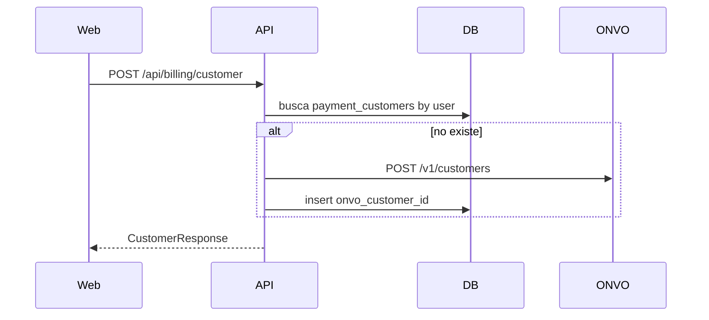

# S02 — Clientes (Customer)

**Objetivo:** crear y listar clientes de pago: fila en Platform + objeto Customer en ONVO.

**Conceptos nuevos:** Entity + Flyway, Repository, `@Valid`, mapear IDs externos (`onvo_customer_id`).

**Prerequisitos:** S01.

---

## Sesiones (~2 h)

| # | Meta | Al cerrar… |
|---|------|------------|
| **1/3** | Flyway + Entity + Repository | Tabla existe; sabés qué columna es el id de ONVO |
| **2/3** | Service ensure + OnvoClient create + Controller | Customer creado una sola vez |
| **3/3** | UI `/billing` + test service | Demo login → ver `onvo_customer_id` |

**Base:** DoD.  
**Reto:** segundo ensure no llama create (assert con mock).  
**Boss:** endpoint admin `GET` lista customers (permiso).

---

## 1. Requirements

- Tabla `payment_customers` (`user_id` único, `onvo_customer_id`, timestamps).
- Al primer uso: si el user no tiene customer, crearlo en ONVO y guardar id.
- Endpoints autenticados:
  - `GET /api/billing/customer` — el customer del usuario actual (o 404)
  - `POST /api/billing/customer` — ensure/create
- UI: página `/billing` (o sección en Home) que muestre email/nombre ONVO + id (no datos sensibles).
- Tests de service: create once / no duplicar.

**Fuera de alcance:** payment methods, cobros.

## 2. Design

### Flyway sugerido

`V6__payment_customers.sql` — ver también diseño en [07-payments-memberships.md](../../00-Planning/07-payments-memberships.md).

### ONVO

- Postman folder: **Clientes**
- Docs: crear/listar/obtener customer

## 3. Implement

1. Migración + entity `PaymentCustomer`.
2. `OnvoClient.createCustomer(...)` / `getCustomer`.
3. `BillingCustomerService.ensureForCurrentUser()`.
4. Controller bajo `/api/billing/...`.
5. Front: método en `web/src/api/client.ts` + página simple.
6. Link en sidebar “Billing”.

### Concepto: ¿por qué guardar `onvo_customer_id`?

ONVO es la fuente del vault de pagos. Platform necesita el id para crear intents/subs **sin recrear** el customer cada vez.

## 4. Test

- [ ] Service: primer ensure crea; segundo reusa
- [ ] Controller: 401 sin auth
- [ ] UI: botón “Crear / sincronizar cliente” muestra id

## 5. DoD

- [ ] Back + front + migración + test mínimo
- [ ] Customer visible en dashboard ONVO test
- [ ] Progress marcado

## 6. Lecturas

- Postman: Clientes
- [llms-full](../../03-ONVO%20Pay/llms-full.md) sección clientes / API

## 7. Demo

Login → Billing → create customer → refrescar → mismo id.

---

**Siguiente:** [S03 — Métodos de pago y SDK](S03-metodos-de-pago-y-sdk.md)
