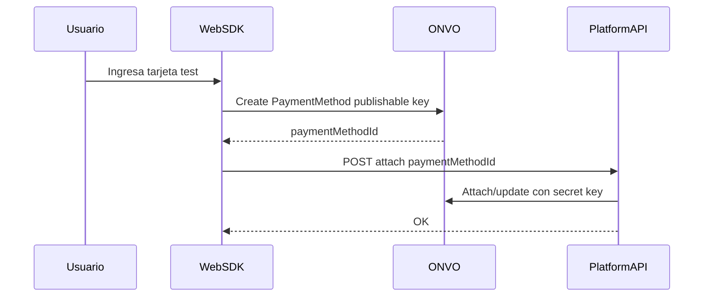

# S03 — Métodos de pago y SDK

**Objetivo:** tokenizar un método de pago en el browser y asociarlo al customer, **sin** que Platform vea el PAN.

**Conceptos nuevos:** publishable key en front, frontera PCI, SDK ONVO, `paymentMethodId` como moneda de cambio.

**Prerequisitos:** S02.

---

## 1. Requirements

- Front carga SDK ONVO con `VITE_ONVO_PUBLIC_KEY`.
- Flujo: usuario agrega tarjeta de **prueba** → obtiene `paymentMethodId`.
- Backend endpoint autenticado, ej. `POST /api/billing/payment-methods/attach` con `{ paymentMethodId }` que:
  - verifica/asegura customer,
  - adjunta o registra el PM en ONVO al customer (según docs),
  - guarda referencia local opcional (`payment_methods` table o solo último id en customer).
- UI lista métodos (últimos 4 / brand si ONVO lo devuelve).
- Nunca enviar secret key al front.

**Fuera de alcance:** cobrar (S04).

## 2. Design

## 3. Implement

1. Leé [SDK web](https://docs.onvopay.com/integrations/sdk) + docs payment methods.
2. Página `/billing/payment-methods`.
3. Service backend delgado: confía en id tokenizado, no en datos de tarjeta.
4. Cards de prueba: docs ONVO “Pruebas”.

### Concepto: PCI en una frase

Si el número de tarjeta pasa por tu servidor, tu compliance se complica muchísimo. Por eso el SDK + publishable key existen.

## 4. Test

- [ ] Service reject si `paymentMethodId` blank
- [ ] Manual: tarjeta test → aparece en UI / dashboard ONVO
- [ ] Grep del repo: secret key no aparece en `web/`

## 5. DoD

- [ ] Attach end-to-end en test mode
- [ ] Sidebar link
- [ ] Notas: qué campos nunca se loguean

## 6. Lecturas

- Postman: **Métodos de pago**
- [Pruebas ONVO](https://docs.onvopay.com/payments/testing)
- Fundamento keys

## 7. Demo

Agregar tarjeta test y mostrar método listado.

---

**Siguiente:** [S04 — Intenciones de pago](S04-intenciones-de-pago.md)
