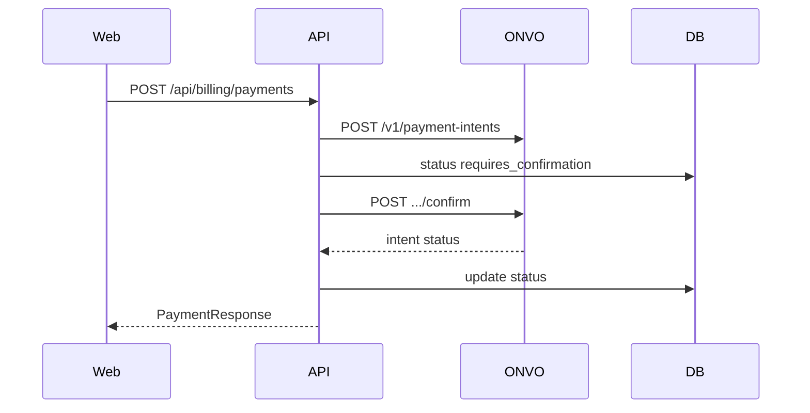

# S04 — Intenciones de pago (Payment Intents)

**Objetivo:** cobrar un monto one-shot de punta a punta (crear → confirmar → ver estado), con registro local.

**Conceptos nuevos:** máquina de estados del intent, orquestación en Service, no cumplir acceso solo con 200 del create.

**Prerequisitos:** S03.

---

## 1. Requirements

- Tabla `payments` o `payment_intents` local: `id`, `user_id`, `onvo_payment_intent_id`, `amount`, `currency`, `status`, timestamps.
- `POST /api/billing/payments` — crea intent en ONVO (amount fijo de demo, ej. 1000 CRC o 100 USD centavos según docs) asociado al customer.
- Confirmar con `paymentMethodId` (body o último PM del user) vía ONVO confirm.
- UI: botón “Pagar demo”, muestra status (`requires_confirmation`, `succeeded`, `failed`…).
- **Importante:** en este spring el status “final” puede ser polling o respuesta de confirm; en S05 lo endurecés con webhooks.

**Fuera de alcance:** membresías recurrentes (S07), webhooks formales (S05).

## 2. Design

### ONVO

- Postman folder: **Intenciones de pago**
- Docs: [payment-intents](https://docs.onvopay.com/payments/payment-intents)

## 3. Implement

1. Extender `OnvoClient`: `createPaymentIntent`, `confirmPaymentIntent`.
2. Service valida customer + PM.
3. Montos en **unidad menor** (centavos). Documentalo en el UI (“CRC 10.00 → 1000”).
4. Mapear errores ONVO a Problem Details legibles.

### Concepto: create ≠ paid

Crear el intent reserva/prepara el cobro. El dinero se confirma después (confirm + posibles async rails). Por eso S05 existe.

## 4. Test

- [ ] Service: sin customer → error claro
- [ ] Manual Postman ONVO paralelo al flujo Platform
- [ ] UI muestra status final del confirm en test card

## 5. DoD

- [ ] Cobro test exitoso visible en dashboard ONVO
- [ ] Fila local con `onvo_payment_intent_id`
- [ ] Sabés nombrar 3 status posibles

## 6. Lecturas

- [Pagos overview](https://docs.onvopay.com/payments/overview)
- Fundamento HTTP/estados

## 7. Demo

Pagar demo → status succeeded (o el equivalente ONVO) en UI + dashboard.

---

**Siguiente:** [S05 — Webhooks](S05-webhooks.md)
