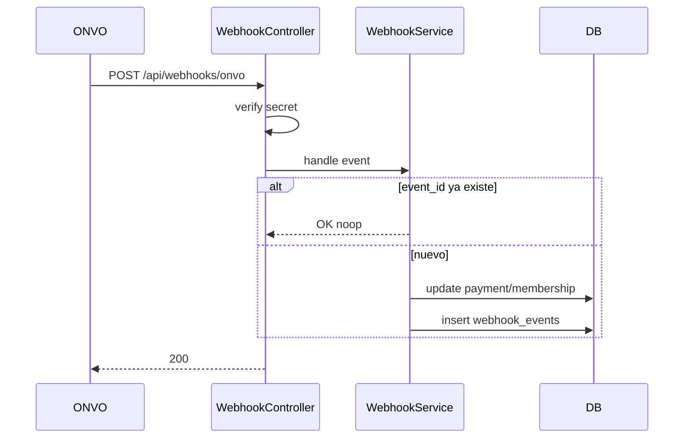

# S05 — Webhooks

**Objetivo:** recibir eventos de ONVO, verificar firma, actualizar tu DB de forma **idempotente**. Fuente de verdad del “pagó”.

**Conceptos nuevos:** endpoint público excepcional, verificación de secreto, idempotencia, ngrok/túnel local.

**Prerequisitos:** S04 (tener intents que disparen eventos).

---

## 1. Requirements

- `POST /api/webhooks/onvo` **sin** session auth, pero con validación `X-Webhook-Secret` (o el mecanismo que documente ONVO).
- Tabla `webhook_events` (`event_id` unique, `type`, `processed_at`, payload opcional).
- Handlers mínimos:
  - `payment-intent.succeeded` → marca payment local `succeeded`
  - `payment-intent.failed` → marca `failed`
- Responder `2xx` solo si procesaste OK (o idempotente OK).
- Tests: secreto inválido; evento duplicado no duplica side effects.
- Documentar cómo exponer localhost (ngrok / cloudflared) al dashboard ONVO.

**Fuera de alcance:** todos los event types (iren agregando en S07+).

## 2. Design

### SecurityConfig

Permití `POST /api/webhooks/onvo` en la allowlist pública (como login), **después** de tener verificación de secreto.

## 3. Implement

1. Leé [Webhooks ONVO](https://docs.onvopay.com/webhooks).
2. Parseá JSON a un DTO flexible (`type` + `data`).
3. Switch/strategy por `type`.
4. No hagas trabajo pesado síncrono innecesario; para aprender, síncrono está OK.
5. Logs: type + id, **sin** PII de más.

### Concepto: por qué público + secreto

ONVO no tiene tu session cookie. El endpoint debe ser alcanzable en internet, pero **solo** ONVO (o quien tenga el secreto) debe poder usarlo.

## 4. Test

- [ ] Unit idempotencia
- [ ] Unit secret fail → 401/403
- [ ] Manual: disparar pago test → evento llega → DB updated

## 5. DoD

- [ ] Webhook configurado en dashboard test apuntando a tu túnel
- [ ] Payment local se actualiza aunque ignores la respuesta del confirm en UI
- [ ] Progress + notas de túnel

## 6. Lecturas

- Docs webhooks + eventos `payment-intent.*`
- [07-payments §3.5 Security](../../00-Planning/07-payments-memberships.md)

## 7. Demo

Cobrá → mostrá log del webhook → mostrá fila DB `succeeded`.

---

**Siguiente:** [S06 — Productos y precios](S06-productos-y-precios.md)
