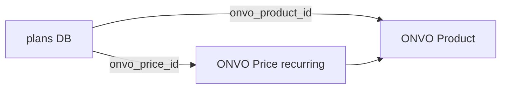

# S06 — Productos y precios

**Objetivo:** catálogo de planes en Platform sincronizado con Product + Price (recurring) en ONVO.

**Conceptos nuevos:** seed/admin data, mirror de catálogo PSP, `onvo_price_id` como vínculo.

**Prerequisitos:** S01 (client). Ideal S05 listo para S07.

---

## 1. Requirements

- Tablas `plans` (code, name, interval, amount_cents, currency, `onvo_product_id`, `onvo_price_id`, active).
- Seed de al menos 1 plan mensual (Flyway o seeder `local`).
- Endpoint `GET /api/plans` (autenticado o público de solo lectura — elegí autenticado para aprender).
- Proceso (admin o seeder) que crea Product+Price en ONVO si faltan ids.
- UI `/plans` lista planes con precio legible.

**Fuera de alcance:** suscribirse (S07).

## 2. Design

Alineado a [07-payments-memberships.md](../../00-Planning/07-payments-memberships.md) §3.3.

### ONVO

- Postman: **Productos**, **Precios**
- Price `type: "recurring"` + interval

## 3. Implement

1. Flyway `V7__plans.sql` (ajusta número según migraciones reales).
2. `OnvoClient.createProduct` / `createPrice`.
3. `PlanSyncService` idempotente.
4. Front página planes (solo lectura + CTA “Próximamente suscribirse” o ya link a S07).

### Concepto: catálogo dual

Platform controla **qué mostrar** (nombre, features). ONVO controla **cómo cobrar**. Los ids unen ambos mundos.

## 4. Test

- [ ] Sync dos veces no crea 10 products
- [ ] GET plans devuelve el seed
- [ ] UI muestra monto formateado

## 5. DoD

- [ ] Plan visible en ONVO dashboard + Platform UI
- [ ] `onvo_price_id` persistido

## 6. Lecturas

- Docs productos/precios + subscriptions overview
- Postman folders Productos / Precios

## 7. Demo

Mostrar plan en UI y el price id en Swagger/DB.

---

**Siguiente:** [S07 — Membresías](S07-membresias-y-cargos-recurrentes.md)
