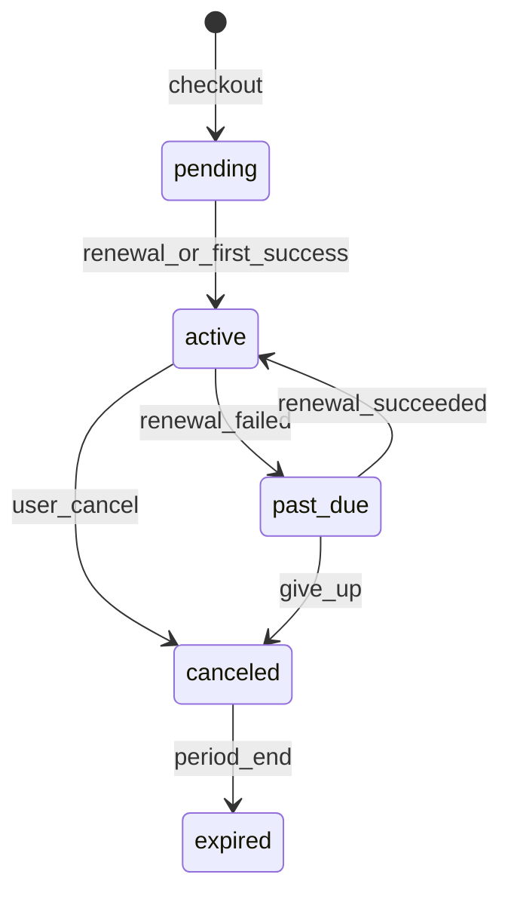

# S07 — Membresías y cargos recurrentes

**Objetivo:** el corazón de MVP3 — suscribirse a un plan, pagar con SDK, activar membresía por webhook, gatear una feature.

**Conceptos nuevos:** máquina de estados de membresía, renovaciones, entitlement (permiso o flag).

**Prerequisitos:** S03 + S05 + S06.

---

## Sesiones (~2 h) — hito del path

| # | Meta | Al cerrar… |
|---|------|------------|
| **1/6** | Diseño estados + Flyway memberships | Diagrama state machine propio |
| **2/6** | `POST checkout` → subscription ONVO | Membership `pending` + id ONVO |
| **3/6** | Webhooks renewal success/fail | Transiciones active / past_due |
| **4/6** | UI planes + flujo pagar (SDK) | Usuario puede iniciar checkout |
| **5/6** | Gate feature + `/me.membership` | Pending no ve premium |
| **6/6** | Tests + **demo hito** 3 min | Grabás o anotáis la demo completa |

**Base:** DoD + hito demo.  
**Reto:** teach-back de 3 minutos en voz alta (grabate).  
**Boss:** grace days simples en `past_due` (constante configurable).

---

## 1. Requirements

- Tabla `memberships` (`user_id`, `plan_id`, `status`, `onvo_subscription_id`, period start/end, canceled_at).
- Estados: `pending` | `active` | `past_due` | `canceled` | `expired` (como planning).
- `POST /api/memberships/checkout` → crea subscription ONVO (`allow_incomplete` / flujo docs) + membership pending.
- Front: `/plans` → pagar con SDK (`paymentType: subscription` según docs).
- Webhooks:
  - `subscription.renewal.succeeded` → `active` + extender período
  - `subscription.renewal.failed` → `past_due`
- Gate: una ruta o sección `/home` premium solo si membership `active` (permission `membership.active` **y/o** objeto en `/me`).
- Regla: a lo sumo una membership active/past_due por usuario (core).

**Fuera de alcance:** cambio de plan complejo, trials (salvo que quieras extender).

## 2. Design

Usá el sequence diagram de [07-payments-memberships.md](../../00-Planning/07-payments-memberships.md) §3.2.

## 3. Implement

1. Flyway memberships (+ events audit opcional).
2. `OnvoClient` subscriptions: create, confirm, cancel, get.
3. `MembershipService.checkout`, `applyWebhook`.
4. Extender `/api/auth/me` con bloque `membership`.
5. Front: checkout UI + mensaje past_due.
6. Tests de transición de estados.

### Concepto: entitlement

Cobrar ≠ acceso. El acceso lo da **tu** status machine alimentada por webhooks.

## 4. Test

- [ ] Checkout sin PM → error
- [ ] Webhook success idempotente
- [ ] UI: usuario active ve premium; pending no

## 5. DoD

- [ ] Suscripción test creada en ONVO
- [ ] Membership active tras pago
- [ ] Feature gated funciona
- [ ] Notas de aprendizaje en progress

## 6. Lecturas

- [Cargos recurrentes](https://docs.onvopay.com/payments/subscriptions)
- Postman: **Cargos recurrentes**, **Renovaciones**
- MVP3.md objetivos

## 7. Demo

Elegir plan → pagar → webhook → ver contenido premium.

---

**Siguiente:** [S08 — Checkout Sessions](S08-sesiones-de-checkout.md)
