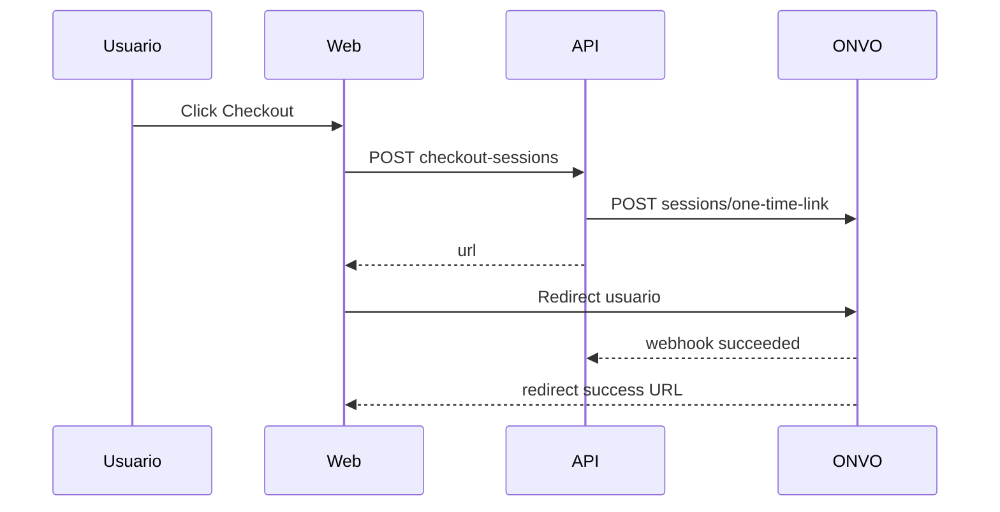

# S08 — Sesiones de Checkout

**Objetivo:** aprender el camino **hosted**: ONVO renderiza la página de pago (one-time link / session) y vos redirigís al usuario.

**Conceptos nuevos:** redirect URLs, `checkout-session.succeeded`, cuándo preferir Checkout vs SDK propio.

**Prerequisitos:** S05 (webhooks). S01.

---

## Sesiones (~2 h)

| # | Meta | Al cerrar… |
|---|------|------------|
| **1/2** | Create session + redirect URLs | Abrís URL de ONVO desde Platform |
| **2/2** | Webhook succeeded + success/cancel pages | Notas: SDK vs Checkout (5 líneas) |

**Base:** DoD.  
**Reto:** cancel URL no marca paid (test o demo).  
**Boss:** one-time link con metadata `orderId` redonda.

---

## 1. Requirements

- `POST /api/billing/checkout-sessions` crea sesión one-time (monto demo o line items).
- Response incluye `url` → front redirige.
- `success`/`cancel` URLs de Platform (`/billing/checkout/success`, `.../cancel`).
- Webhook `checkout-session.succeeded` marca pago/orden local.
- UI botón “Pagar con Checkout ONVO”.

**Comparación pedagógica:** documentá en notas 5 líneas: Checkout vs Intent+SDK (pros/contras).

## 2. Design

## 3. Implement

- Postman folder: **Sesiones de Checkout**
- Docs: [Checkout overview](https://docs.onvopay.com/checkout/overview), one-time links

## 4. Test

- [ ] Create session returns url
- [ ] Webhook actualiza estado
- [ ] Cancel URL no marca paid

## 5. DoD

- [ ] Flujo hosted completo en test
- [ ] Notas comparación SDK vs Checkout

## 6. Demo

Pagar con redirect a ONVO y volver a Platform success.

---

**Siguiente:** [S09 — Cupones y envíos](S09-cupones-y-envios.md)
