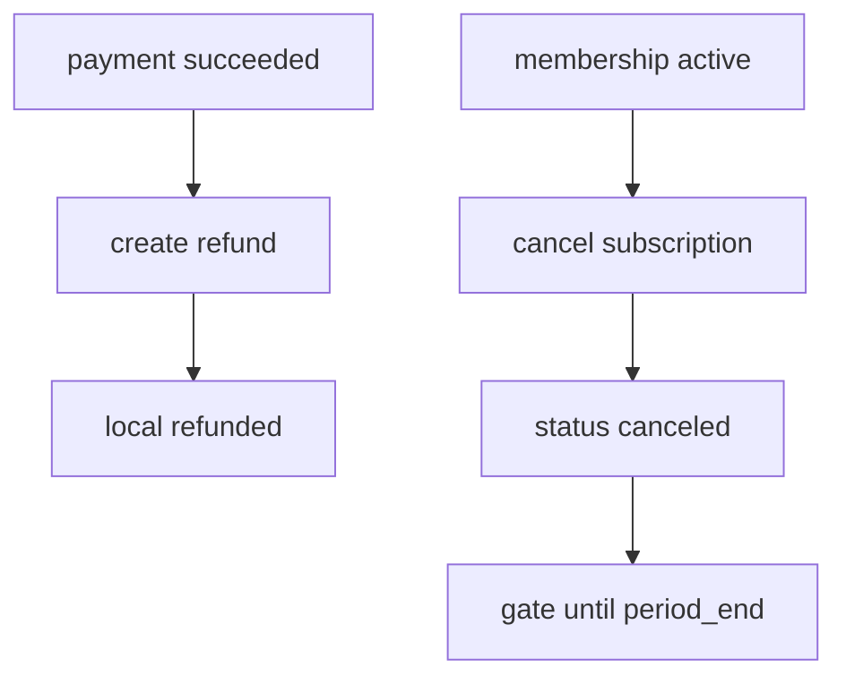

# S10 — Reembolsos y cancelaciones

**Objetivo:** operaciones de compensación — refund de un pago y cancelación de membresía/suscripción.

**Conceptos nuevos:** compensating transactions, cancel at period end vs immediate (elegí una y documentala).

**Prerequisitos:** S04 + S07.

---

## 1. Requirements

- `POST /api/billing/payments/{id}/refunds` → ONVO refund + estado local `refunded`/`partially_refunded`.
- `POST /api/memberships/cancel` → cancela subscription ONVO + status `canceled` (acceso hasta `current_period_end` **o** inmediato — **decisión fija:** acceso hasta fin de período).
- UI: botones con confirmación (“¿Seguro?”).
- Tests de reglas: no refund duplicado total; no cancel si ya canceled.

## 2. Design

## 3. Implement

- Postman: **Reembolsos**, cancel en **Cargos recurrentes**
- Webhooks: si ONVO emite eventos de cancel/refund, manejalos; si no, actualizá por respuesta síncrona + reconciliación

## 4. Test / DoD

- [ ] Refund test de un payment succeeded
- [ ] Cancel membership + UI refleja estado
- [ ] Decisión period-end documentada en notas

## 5. Demo

Cobrar → refund; suscribir → cancelar.

---

**Siguiente:** [S11 — 3DS y fraude](S11-3ds-y-fraude.md)
