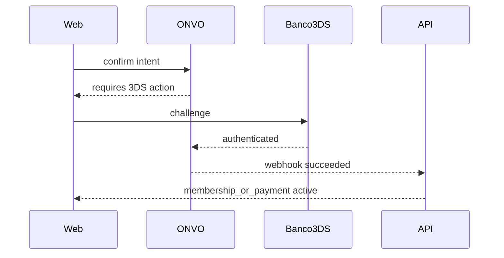

# S11 — Autenticación 3DS y monitoreo de fraude

**Objetivo:** entender cobros que requieren autenticación adicional del banco y señales anti-fraude del browser.

**Conceptos nuevos:** flujos async / redirect challenge, `next_action`, fraud signals.

**Prerequisitos:** S04 (intents) + S03 (SDK).

---

## Sesiones (~2 h)

| # | Meta | Al cerrar… |
|---|------|------------|
| **1/2** | Leer 3DS + fraud + diseñar UX | Notas: qué ve el usuario en challenge |
| **2/2** | Implementar manejo SDK / no paid prematuro | Entitlement solo post-webhook |

**Base:** DoD.  
**Reto:** checklist “antes/después 3DS” en UI.  
**Boss:** card de test que force 3DS (si existe) documentada paso a paso.

---

## 1. Requirements

- Leer docs [3DS](https://docs.onvopay.com/payments/three-ds) y [fraud monitoring](https://docs.onvopay.com/payments/fraud-monitoring).
- Implementar en el front el manejo de challenge 3DS que indique el SDK/API (redirect o component).
- Backend: no marcar paid hasta webhook `succeeded` (refuerzo de S05).
- Enviar señales de fraude del browser si el SDK lo requiere.
- Documento corto en el spring notes: “qué cambia en UX cuando hay 3DS”.

**Mínimo full-stack:** un pago test que force 3DS (si ONVO test cards lo permiten) + UI no asume éxito prematuro.

## 2. Design

## 3. Test / DoD

- [ ] Flujo 3DS de prueba documentado (card / steps)
- [ ] Sin webhook no hay entitlement
- [ ] Fraud signals enviados o N/A justificado

## 4. Lecturas

- Docs 3DS + fraude + testing cards
- OpenAPI tags relacionados

## 5. Demo

Cobro con challenge → éxito solo tras webhook.

---

**Siguiente:** [S12 — SINPE](S12-sinpe-movil-y-pin.md)
